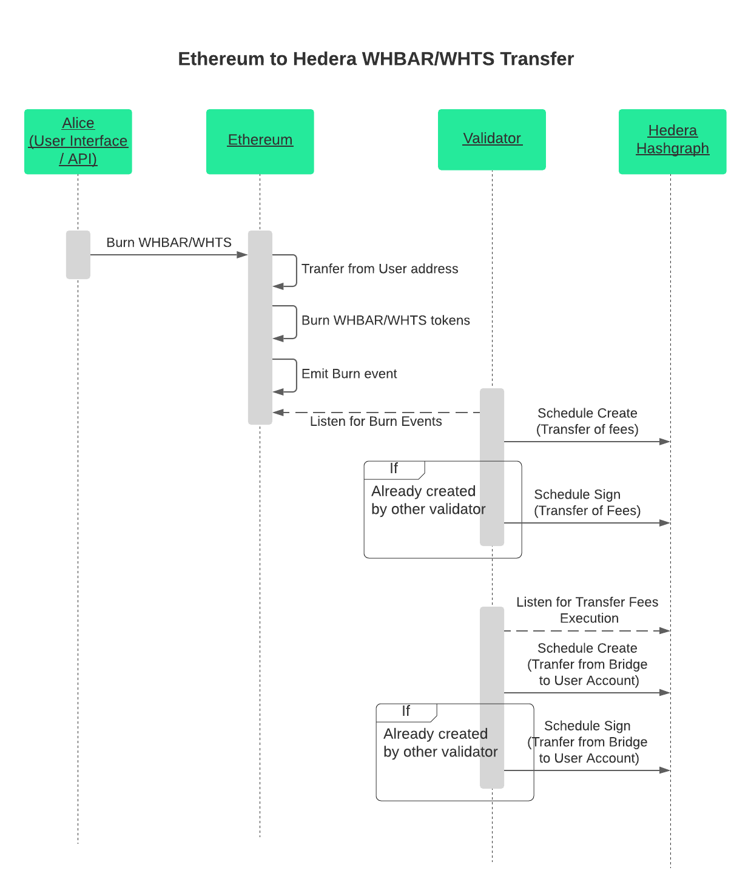

## Abstract

The HIP defines an application network run by set of parties in order to faciliate HBAR and HTS token transfers from Hedera to Ethereum and vice-versa.

## Motivation 

With the recent release of HTS and the growing growth in the Ethereum ecosystem, it seems that a Bridge Network between Hedera and Ethereum will be highly beneficial to the community. The current value stored on Hedera (HBARs/HTS) would become available on Ethereum.

On the other hand, tokens on Ethereum can be transferred to Hedera to utilise the high-troughput and low-fees that the network provides. The effect will be net positive for both Hedera and Ethereum native assets and their communities.

Bridges are inherently untrusted, since there are no efficient and completely trustless setups. In one way or another, users must have trust assumptions on the entities/parties operating the Bridge. 

The best way to successfully integrate a bridge network would be through the community and that is why this HIP is inteded for. Using this HIP, the community will have full transperency in both the design and the operations of the bridge.

## Rationale

The level of decentralisation in a bridge network is highly important. In the specification described below we have tailored our trade-offs so that we are achieving maximum decentralisation possible. Bridge operators (validators) have a setup on both Ethereum and Hedera networks. On Hedera, a threshold account with `n / m` signatures is to be used and on Ethereum, the set of validators are defined in a `Router` smart contract that requires supermajority for a given `mint` operation.

HCS topics are used for publishing authorisation signatures by the validators. This way anyone is able to trustlessly audit the authorisation messages used to mint wrapped tokens on Ethereum. This mechanism provides full transperancy and auditability on the bridge operations.

## Specification

### Terminology
- **Users** - end-users that want to transfer HBARs or HTS tokens from Hedera to Ethereum or Wrapped HBARs and Wrapped Tokens from Ethereum to Hedera
- **Token Developers** - the developers of HTS tokens
- **Validators** - parties/entities that are running the Validator node. They are providing authorisation for the minting and burning of wrapped tokens on Ethereum as-well as transferring wrapped tokens back to Hedera.
- **WHBAR** - ERC20 token issued and operated by Bridge validators. The token represents "wrapped" hbars on Ethereum. In other words we can say that Hbar is the `native` asset and `WHBAR` is the `non-native` asset.
- **WHTS** - ERC20 token issued and operated by Bridge validators. The token represents "wrapped" HTS token on Ethereum. In this case, `HTS` token is a `native` one and `WHTS` token is `non-native`.

### Governance
There are 2 setups for both of the Networks. On one side, there are 2 Hedera Bridge Accounts which are `n/m` threshold acccounts. Each validator has a Hedera compatible private key - 1 out of `m` that has `1/m` controll over those threshold accounts.
From now on, we will refer to them as `Bridge` and `Fee` accounts.

The setup on Ethereum would be the same - Gnosis MultiSig is to be used with the same `n/m` threshold configuration. Each validator has an Ethereum compatible private key - 1 out of `m` that as `1/m` controll over the threshold account.
The Gnosis Multisig is configured as owner of:
- Wrapped tokens deployed on Ethereum (f.e WHBAR / WHTS tokens)
- The Router  smart contract

#### Adding / Removing Members
Validators can add new members or remove members from the validator set. We expect validators to have an off-chain communication channel using which validators can discuss the current setup, vote on removing validators or adding new ones.

Two transactions must be executed in order for the Validator set to change.
1. On Hedera, `Crypto Update` transaction that modifies the `n/m` threshold accounts (`Bridge` and `Fees`)
2. On Ethereum, `updateMember` transaction that modifies the list of members in the `Router` contract (it may add or remove a member)

### Fees
The main incentive for becoming a Validator is the service fee paid by users. The fee is a percentage of the transferred amount, paid on the native asset.
For example transferring 100 HBARs from Hedera to Ethereum (WHBARs) is going to have 1% service fee (1 HBAR) transferred to the Bridge Validators.

*Note: The Service fee is yet to be determined by the validators and is subject to change*

### Transferring HBAR/HTS from Hedera to Ethereum

The transfer of assets from Hedera to Ethereum is described in the following sequence diagram.

  

#### Steps
1. **Initiating the transfer**
Alice wants to transfer `HBARs` from Hedera to Ethereum. She opens any UI that integrates the Bridge and sends the `HBARs` to the `Bridge` Account. The memo of the transfer contains the `ethereum-address` which is going to be the receiver of the `WHBARs` on Ethereum.
2. **Picking up the Transfer**
The Bridge validator nodes listen for new incoming transfers to the `Bridge` Account. Once they pick up the new transaction, they verify the `state proof` and validate that the `memo` conatins a valid Ethereum address configured as receiver of the `WHBARs`
3. **Paying out fees**
3.1 Each of the Validators creates a Schedule Create transaction transferring the `service fee` amount from the `Bridge` account to the list of validators equally *(f.e if the service fee is `7 HBar` and there are `7` validators, the Schedule Create Transfer will contain Transfer list crediting `1 Hbar` to each of the validators.)* 
3.2 Due to the nature of Scheduled Transactions, only one will be successfully executed, creating a scheduled Entity and all of the others will fail with `TRANSACTION_ALREADY_SCHEDULED` error and pointer to the ID of the created Scheduled TX.
All validators, except the one that successfully created the Transaction execute `ScheduleSign` and once `n out of m` validators execute the Sign operation, the  transfer of the fees will be executed.

4. **Providing Authorisation Signature**
Each of the Validators sign the following authorisation message:
`{hedera-tx-id}{native-token}{receiver}{amount}` using their Ethereum-compatible private key.
The authorisation is then submitted to a topic in Hedera Consensus Service

5. **Waiting for Supermajority**
Alice's UI or API waits for a supermajority of the signatures. She can either watch the topic messages stream or fetch the data directly from Validator nodes.

6. **Submitting the Etherum Transaction**
Once supermajority is reached, Alice submits an Ethereum transaction claiming her `WHbars`. The signature contains the raw data signed in the message: `hedera-tx`, `native-token-address`, `receiver` and the `amount` as well as the set of signatures from the Validators.

7. **Mint Operation**
The smart contract verifies that no reply attack is being executed (by checking the `hedera-tx-id` and verifies the provided signatures against the raw data that was signed. If supermajority is reached, the `Router` contract `mint`s the `WHBar` token to the `receiving` address.

### Transferring WHBAR/WHTS from Ethereum to Hedera

The transfer of assets from Ethereum to Hedera is described in the following sequence diagram.

  

#### Steps
1. **Initiating the Transfer**
Alice wants to transfer her `WHBARs` from Ethereum to Hedera. She opens any UI that integrates the Bridge and sends `burn` transaction to the `Router` contract. As parameter of the `burn` function, she specifies the Hedera account to receive the `HBAR`s
2. **Burn Operation**
The smart contract transfers the `WHBAR`s from Alice's address and burns them. At the end of the process a `Burn` event is emitted containing the information about the burned token, the amount and the receiver.
3. **Picking up the Transfer**
Validator nodes watch for `Burn` events and once such occurs, they prepare and submit `ScheduleCreate` operation that transfers the `service fee` amount from the `Bridge` account to the list of validators equally. Due to the nature of Scheduled Transactions, only one will be successfully executed, creating a scheduled Entity in the process, and all of the others will fail with `TRANSACTION_ALREADY_SCHEDULED` error and pointer to the ID of the created Scheduled TX.
All validators, except the one that successfully created the Transaction execute `ScheduleSign` and once `n out of m` validators execute the Sign operation, the  transfer of the fees are executed.
4. **Unlocking the Asset**
Each Validator perofrms a `ScheduleCreate` operation that transfers `amount-serviceFee` `Hbar` to the receiving Hedera Account. All validators that got their `ScheduleCreate` rejected, submit an equivalent `ScheduleSign`. Once `n out of m` validators execute the Sign operation, the transfer is completed.

### Operating Costs for Validators

There are 2 types of costs for validators:
- IT/Infrastructure costs
- Transaction costs

#### IT/Infrastructure costs
Validators are required to run one container image for the validating node and a `postgres` database. Both of them can run on a VM with `2vCPUs` and `4GB RAM`

#### Transaction Costs
Validators are required to hold `Hbars` in order to pay for their Hedera transactions.

Hedera to Ethereum transfers require the following transactions per validator:
 - 1x`ScheduleCreate` -> transfer of fees (`n-1` will fail, one will be successful)
 - 1x `ScheduleSign` -> transfer of fees (if the `ScheduleCreate` failed)
 - 1x `ConsensusMessageSubmit` -> Submitting the authorisation signature

Calculating the fees per validator per Hedera to Ethereum transfer:
`0.0105+0.01+0.0001=$0.0206`
*Assumption: there are `7` validators*

Ethereum to Hedera transfers require the following transactions per validator:

 - 2x`ScheduleCreate` -> transfer of fees; transfer of funds to receiver (`n-1` will fail, one will be successful)
 - 2x`ScheduleSign` -> transfer of fees; transfer of funds to receiver (if the `ScheduleCreate` failed)

Calculating the fees per validator per Ethereum to Hedera transfer:
`0.0105+0.01+0.01+0.01=$0.0405`
*Assumption: there are `7` validators* 

*Note: Scheduled Transaction are still under development and the fee schedule is not yet confirmed. The numbers are retrieved from the current Fee calculator at: https://hedera.com/fees 
## Backwards Compatibility

## Security Implications

## Hot to Teach This

## Refernce Implementation

## Rejected Ideas

## Open Issues

## Reference

## Copyright
This document is licensed under the Apache License, Version 2.0 -- see [LICENSE](../LICENSE) or (https://www.apache.org/licenses/LICENSE-2.0)
