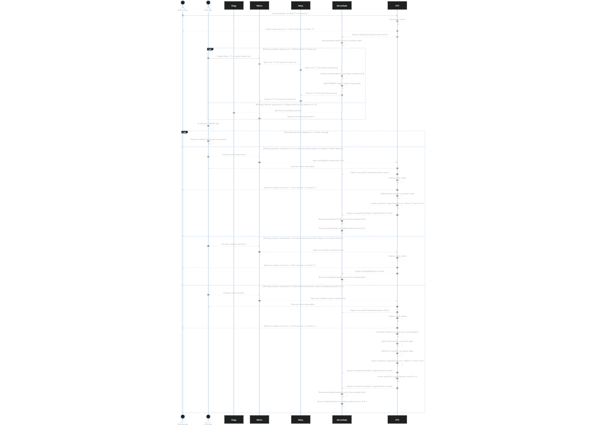

## Abstract

Users on the Hedera network have the ability to control the token classes that can be added to their balance. A user must first associate with a token class before they may receive token value from others. This differs from other networks where users may receive token value with no restrictions - in short, airdrops are currently not supported on the Hedera network. For some, this serves as a fundamental account protection feature, for others, this serves as an extra user step required before receiving desired token. 

[HIP 655](https://github.com/hashgraph/hedera-improvement-proposal/pull/655) provides a suggestion for a token outbox concept that tracks a sending users intent to airdrop tokens to a receiving account (EOA or contract) that has not yet associated with the token class.

This outbox gives a mapping that may be used to enable the simulation of the airdrop transfer concept that web3 users are familiar with. A network can communicate a senders commitment to transfer a token to a potential recipient, the intended recipient maintains account sovereignty as the network enforces the association requirement before a receiver takes ownership of the tokens. Tokens in an outbox are conceptually pending token transfers or offers to the desired recipient until they accept or reject the intent. Upon acceptance the intended token value will be added to the recipients balance. Additionally, support for association and transfer of tokens in an atomic operation will allow the seamless ability to take ownership and transfer from your pending balance.

## Motivation

Retail users from other EVM chains do not have a concept of token association. As such, many are used to receiving unsolicited tokens and viewing them in their balance collection. Similarly, senders are not used to coordinating token association in advance. This currently provides friction and may serve as a blocker to retail user adoption of users coming from other chains. The challenges for EVM native users is made more challenging as EVM native wallets and tools are unable to surface up the additional complexity and details offered by the Hedera network.

Notably, the Hedera network offers an established paradigm to transparently and securely associate with HTS tokens prior to receiving token value. This ensures sovereignty of accounts and allows them to take explicit actions of token ownership which may have financial and legal consequences. 

To support the desired seamless transferability of HTS tokens in DeFi scenarios and maintain account sovereignty the network could capture the transfer intent from a sender to any account without prior association. 

- The sending accounts outbox would hold the token until an accept action is carried out by the intended receiving account.
    - Rent payments continue to be captured by a sender for a period long enough to allow for future design of the entity expiry feature.
- Querying logic will support displaying tokens both owned and pending transfer completion.
- Similarly, token transfers would support picking up tokens in an outbox intended for the transferring account. In this case with the action authorized the network should be able to associate and then transfer atomically, as the user submitted action conveys the desire for these 2 actions

## Rationale

To achieve EVM equivalence on Hedera it's necessary to reduce the frictions EVM native users face in adopting the network. Token association though a user protective feature offers an extra step in a users journey to take part in token scenarios. Additionally, the inability to expose advanced Hedera features in EVM tools such as EVM native wallets makes the Hedera feature prohibitive to users who are limited to ERC token functionality.
By providing a pathway to maintain ERC like token behviour and Hedera account soveriegnty, users from EVM chains may more easily adopt the Hedera network for the decentralized token scearios they are accustomed to.

## User stories

1. As a token holder I want to be able to send tokens to any account on the network without their prior association with the token (i.e. airdrop).
2. As the sender of an attempted airdrop I want to be able to query my account for all unaccepted airdrops.
3. As the recipient of an attempted airdrop I do not want to receive airdropped tokens before I have associated with the token class, the network should hold airdropped tokens in state outside of my balance for liability reasons.
4. As the recipient of an attempted airdrop I want to be able to query all the pending transfers targetting my account.
5. As a recipient of an attempted airdrop I want to be able to accept the intent by issuing a TokenAssociate transaction.
6. As the recipient of an attempted airdrop I want to be able to reject a pending token transfer.
7. As a recipient of an attempted airdrop I want to be able to transfer tokens immediately without having to associate and transfer individually. In transferring I want to both accept and transfer value in one transaction.
8. As the recipient of multiple attempted airdrops of a single token class I want to be able to accept all airdrops in one operation without having to accept multiple sender transfer intents.
  
## Specification

An end to end airdrop flow would take the following form in an EVM native scenario.

1. A Hedera account `A` with a balance of an HTS token with symbol `ESWT` initiates a transfer to account `B` 
2. Account `A` will receive a successful confirmation from the network. Accounts `A`’s outbox will store the intended transfer and account `B`’s balance will see no change.
3. Account `B` using an EVM native (JSON RPC API consuming) tool to query for Token `ESWT` balance will observe a pending token listing they can act upon (Accept or Transfer). 
    - An airdrop token transfer may surface up to a user in a manner similar to the following illustration, indicating a “PENDING” status to the token.

        
    - From here account `B` could take standard steps to view token details on an explorer of choice. Explorers can then take the step to showcase TokenAssociate functionality to allow a user to accept or reject the token thus removing the PENDING nature of the listing.
4. Account `B` may 
    1. do nothing, in which case the token remains in account `A`’s outbox
    2. reject the airdrop in which case account `A`’s outbox entry will be cleared and the pending note on Account `B`’s will also be removed
    3. accept the airdrop by associating at which point the network carries out the intended transfer debiting account `A`’s balance and crediting account `B`’s balance
    4. transfer a value up to the intending airdrop value of token `A`, at which point the network carries out the intended transfer debiting account `A`’s balance and crediting account B’s balance and recipient of account B’s transfer

A similar flow with Hedera native tools would have the benefit of being able to expose the pending nature of the transfer in a users wallet. A Hedera wallet would also be able to carry out association in app.

To ensure the integrity of accounts and feature behaviour some requirements emerge from the above

1. A senders balance must remain the same even after the transfer attempt, as the transfer results in a promise and not yet an actual transfer
2. A sender cannot withdraw the airdrop once sent. 
3. A sender commits to paying token rent for the period of time in which it is promised to the recipient.
4. An intended recipients balance must not increase until the transfer is accepted
5. An intended recipients perception on the token must not change unless they accept, reject the token or if the token expires. Doing otherwise may inadvertently give the concept of lost value should a user see a pending transfer that is later removed.
6. Associating with a token accepts all the airdrops of that token type from applicable outboxes

To achieve the user stories, requirements and desired  easy UX, a cross product approach between the consensus node, mirror node, SDKs, explorers and relay is required to ensure a good end to end UX for developers and DeFi DApp users


### Protobuf

Airdrop transfers will resemble normal transfers and are therefore already supported by the network. However, recipients of airdrop transfers need to be able to accept, reject or immediately transfer.

- Accept: Associating with a token is essentially the same as accepting as it captures the intent to maintain a balance of the token. In the airdrop case this will bring the token balance into the receiving accounts balance. Therefore it makes sense that the act of associating implies acceptance.
- Reject: A new `TokenAirdropReject` HAPI transaction is suggested
    
    ```protobuf
    message TokenAirdropRejectTransactionBody {
        /**
         * The intended recipient of the token airdrop
         */
        AccountID sender = 1;
    
        /**
         * The account to be associated with the provided tokens
         * Tokens with no airdrop will be ignored with a no-op
         */
    		repeated TokenId = 2;
    }
    ```
    
- Transfer - The existing `CryptoTransfer` HAPI transaction will support airdrop transfer transactions

To expose an intended airdrop the TransactionRecord proto can be expanded

```protobuf
message TransactionRecord {
	/**
   * The crypto transfer was an airdrop. With this flag mirror nodes can capture the intended transfer in the transaction body and update the users outbox detail
   */
  bool airdrop = 22;
}
```

To expose a rejected airdrop a CryptoTransfer may be labelled with the new response code 

```protobuf
enum ResponseCodeEnum {
	...

  /**
   * An attempted airdrop was rejected by the network.
   */
  REJECTED_AIRDROP = 333;
}
```

Should an account reach the max outbox capacity the sender will receive a new response code
```protobuf
enum ResponseCodeEnum {
	...

  /**
   * The senders outbox size has reached its capacity
   */
  MAX_OUTBOX_SIZE = 334;
}
```


### Consensus Node

#### Transfer

On transfer of an airdrop the network must charge enough HBAR to cover the rent of a token for the standard rent periods (currently 3 months), however, in initiating an airdrop a sender will be liable for all rent until the user accepts or rejects. This ensures that senders are periodically charged rent appropriately but also that recipients don’t have tokens disappear prior to acceptance or rejection.

A sending account may only initiate a single pending transfer per recipient account. Subsequent attempts to transfer to a receiving account you already have a pending transfer with will be rejected.

Notably, the network nodes will have the additonal task of ensuring a sender maintains enough balance to honour the transfer in the future. To accomplish this on debit the service logic must confirm

- The remaining FT balance is enough to cover all FT pending transfers in the senders outbox
- The NFT serial is not one of the NFT pending transfers in the senders outbox

#### Outbox State

The consensus node will have to add into state the concept of an outbox per sender.
A collection of outboxes with a single outbox per sender will be necessary to capture intended airdrops.
The outbox must also capture the intended recipients and the token (FT or NFT) value intended for transfer.

Potential Structure
- `Map <AccountId, Collection<TokenTransferList>>`
or
- `Map <AccountId, TokenOutbox>`  where `TokenOutbox` is composed of `Collection<TokenTransferList>` amongst other  properties

An initial max capacity of 255 entries per sending account in the outbox may be set. This is a merkle tree optimization until further data informs greater size.

The HBAR fee for a tansfer should include a component to factor the cost of maintaining a the pending transfer in the outbox.

Upon handling
- an airdrop transfer, a node would add an entry from the sender mapped to the recipient with the intended token and its balance.
- an airdrop acceptance, a node would remove the entry and emit a synthetic success `CryptoTransfer` from the sender to the recipient with the token amount.
- an airdrop rejection, a node would remove the entry and emit a synthetic failed `CryptoTransfer` from the sender to the recipient with the token amounts and an error of `REJECTED_AIRDROP`

#### Token Associate

The `TokenAssocaite` transaction on the network signifies a user is willing to maintain a balance for a token class and accept transfers of that token value from then on. With this logic, any pending transfers for an associated account that has not set `receiverSigRequired` will no longer be held in outbox and will be executed by the network.

To ensure fair execution the pendings transfer transactions will be executed by the system over time. By carrying out a token associate a user will enable the execution of all the pending transfers for a token class across sending accounts. If a user had 2 pending transfers for a token class from different senders, a token association will schedule the execution of both pending transfers.

To take ownership of a token an account can issue a `HRC719.associate()` execution initiated by a DApp or an explicit `TokenAssociate` via an SDK.

#### System Contracts

HTS system contracts will need to support the new `TokenAirdropReject` transaction to ensure the feature is exposed via smart contract functions

| selector      | function                                      |
| ------------- | --------------------------------------------- |
| 0x1023653d    | rejectAirDrops(address[] memory tokenClasses) |

Note, the ability to query for any users pending transfers is not made available at the consensus level. Instead, developers must query the Mirror Node or DApp for the aggregated information. For smart contracts this highlights the opportunity for an oracle or better yet potential DApp explorer features to enable web3 users.

*Synthetic state*

For HTS token contract queries using IERC interface methods, additional logic will be needed to present the pending transfer state. Should the method selector match `IERC20.name()` or `IERC721.name()` and `tx.origin` be an intended reciever of a pending transfer, the call query logic will append an `(PENDING)` suffix. This is intended to inform users that the token was airdropped and requires further action to add it to their balance.

Notably, the consensus node HAPI will not support the ability to query the network outbox of senders. All outbox details will be exposed to the mirror node where queries should be pointed.


### SDK

The SDKs must support the new HAPI transaction to reject an airdrop

- `TokenAirdropReject` transaction - exposes  `TokenAirdropRejectTransactionBody` proto

### Mirror Node

In line with its role as the historical source the Mirror Node will serve as the main source of outbox details. To provide visibility to pending transfer details the Mirror Node will require extensions to existing token tables, and APIs

#### Database Tables
*New Tables*
- `token_airdrop` - captures the current state of token outboxes
    - consensus_timestamp
    - sender_entity_id
    - recipient_entity_id
    - token_class
    - token_amount_or_serial - fungible amount or NFT serial
    - status - PENDING, ACCEPTED, REJECTED
- `token_airdrop_history` - captures accepted and rejected airdrops

Suggested indexes: 

- consensus_timestamp, sender_entity_id - outbox query by sender
- consensus_timestamp, sender_entity_id, recipient_entity - outbox query by sender and recipient
- consensus_timestamp, recipient_entity, (status=PENDING) - recipient airdrop query (pending by default)
- consensus_timestamp, recipient_entity, token_class, (status=PENDING) - recipient token airdrop balance query

*Existing table*

- token_account
    
    ```sql
    -- capture outstanding pending transfers
    create table if not exists token_account
    (
        ...
        pending_transfers  bool null,
    )
    ```
    
#### REST APIs
*New Endpoints*
- `api/v1/accounts/{senderIdOrEvmAddress}/outbox` - getOutboxList
    - potential query filters - `token`, `recipientIdOrEvmAddress`, (`status` - if support for rejected)
- `api/v1/accounts/{senderIdOrEvmAddress}/outbox/{recipientIdOrEvmAddress}` - getOutboxByRecipientId
    - potential query filters - `token`, `recipientIdOrEvmAddress`, (`status` - if support for rejected)
- `api/v1/accounts/{recipientIdOrEvmAddress}/airdrops` - getPendingTransferList
    - potential query filters - token

*Existing Endpoints*
- `api/v1/accounts/{senderIdOrEvmAddress}/tokens` - It may be possible to extend the API to display a users pending airdrops
    - potential query filters - pending = (true|false). Entries with `airdrop_status is not null` would be filtered out from normal queries and users would have to explicitly set `airdrop_status = PENDING` to get their airdrops

#### Web3 Module
*ERC Balance Queries*
To close the gap on the market web3 token experience the existing `contract/call` query support for `IERC20.balanceOf()` and `IERC721.balanceOf()` functions can be extended to support tokens that are in pending transfer status in a senders outbox. Therefore, on appropriate contract state query functions the `token_airdrop` table should be queried in addition to report balance.

The nanosecond level accuracy of outbox change and exposure via APIs will facilitate rich outbox management DApps and wallets.

*ERC Name Queries*
To ensure that users are made aware of the pending nature of an airdropped token, the existing `contract/call` query support for `IERC20.name()` and `IERC721.name()` functions must be extended with consideration of the outbox. If a token is in an outbox an extra postFix text must be added to the token name

For token queries where `tx.from` is an intended receiver in an outbox entry the `IERC20.name()` and `IERC721.name()` logic will append a ` (PENDING)` suffix to inform wallet users that the airdropped token they see listed is not in their wallet but is pending and requires action.

### Hedera Native Explorer & Wallets

Hedera native tools may consume the Mirror Node APIs and SDK methods to bring visibility and support to accounts

Some notable operations include
- Display a user outbox
- Display a users pending Transfers
- Support a users ability to reject an airdrop
- Support a user ability to accept an airdrop

 
### DApps
Additional steps may be taken by DApps to more easily settle pending token transfers

In an account page or section a DApp may 
- query tokens and display to the user pending tokens.
- token association - `HRC719.associate()`
- token airdrop rejection via `HRC.rejectAirDrops(address[])`
- token listing in a compatible wallet e.g. **[wallet_watchAsset](https://docs.metamask.io/wallet/reference/wallet_watchasset/)** if supported

***
The following sequence diagram shows an end to end flow illustration how multiple components are involved in a pending transfer creation and completion.


## Backwards Compatibility

This approach makes no modifications to existing state or transactions. Rather, it extends functionality allowing `TokenAssociate` to serve the acceptance purpose and `CryptoTransfer` to be used for airdrops

## Security Implications

This flow adds manageable complexity to the network but complexity nonetheless.

### Storage

The addition of a Token outbox for all airdrops increases the memory footprint and work to be done by nodes. 
Howeer, the outbox capacity and restrictions on the number of entreis per sender and reciever serve to limit the potential bloat of the outbox.

### Fees

- Airdrops must factor in the cost of outbox state modifications
- Token association must factor in the cost of outbox state modifications
- Atomic transfers must factor in the cost of outbox state modifications and association in addition to the transfer

### Throttles

- A per second airdrop throttle across the network may be considerd for addition
- A per second token associate across the network must factor in associates that may modify outbox state

System transactions
- The automatic acceptance of all pending airdrops will have to be done in a scalable and manageable manner. That is, if a user has 100 airdrops of 1 token type and associates with the token, the automated transfers of the other 99 must be spread out across system transactions.

## How to Teach This

- Additional documentation
- Doc site tutorials

## Reference Implementation

The reference implementation must be complete before any HIP is given the status of “Final”. The final implementation must include test code and documentation.

## Rejected Ideas

1. Open all token slots for accounts created via the auto-account creation path
2. Auto associate tokens upon transfer for account created via auto account creation
3. Remote token assocaiton limitation ont he network with the abilityt to opt-in for restricted association
4. Open a small number of slots by default at the time of account creation and disable rent fo tokens until we reach a bigger threshold on account
5. Token inbox / token airdrop HIP 655


## Open Issues

- [ ] Have all token name query scenarios of a pending token tranasfer been covered for consistency.

## References

- [HIP 655](https://github.com/hashgraph/hedera-improvement-proposal/pull/655)
- [ERC20](https://github.com/OpenZeppelin/openzeppelin-contracts/blob/master/contracts/token/ERC20/ERC20.sol)
- [ERC721](https://github.com/OpenZeppelin/openzeppelin-contracts/blob/master/contracts/token/ERC721/ERC721.sol)
- [IHederaTokenService](https://github.com/hashgraph/hedera-smart-contracts/blob/main/contracts/hts-precompile/IHederaTokenService.sol)
- https://docs.metamask.io/wallet/reference/wallet_watchasset/

## Copyright/license

This document is licensed under the Apache License, Version 2.0 -- see [LICENSE](../LICENSE) or (https://www.apache.org/licenses/LICENSE-2.0)
