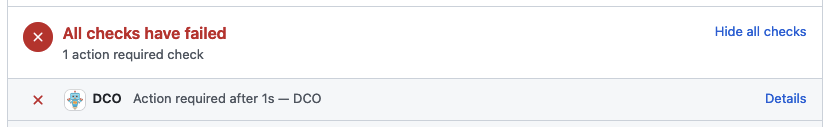
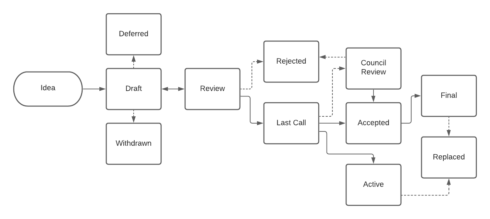

## What is a HIP?

HIP stands for Hiero Improvement Proposal. A HIP is intended to provide information or initiate engineering efforts to update Hiero functionality. The HIP should be technically clear and concise. HIPs should be as granular as possible. Small targeted HIPs are more likely to reach consensus and result in a reference implementation. This may require breaking a bigger idea into smaller components.

HIPs are intended to be the primary mechanism for proposing new features, collecting community input, and documenting the design decisions that have gone into Hiero. The HIP author is responsible for building consensus within the community and documenting dissenting opinions.

Because the HIPs are maintained as text files in a versioned repository, their revision history is the historical record of the feature proposal.

HIPs are not meant to address bugs in implemented code. Bugs should be addressed using issues in the implementation's repository.

## HIP Types

There are three kinds of HIP:

1. A **Standards Track** HIP describes a new feature or implementation for Hiero. It may also describe an interoperability standard that will be supported outside of the official Hiero node software stack. The Standards Track HIP abstract should include which part of the Hiero ecosystem it addresses. Standards Track HIPs require a specification and a reference implementation:
    **a. Core:** This includes proposals addressing the Hashgraph algorithm, peer-to-peer networking, and other features implemented on Hiero consensus nodes.
    **b. Service:** Hiero services sit on top of the Core node software and provide the functionalities that users access. These currently include the File Service, Consensus Service, Token Service, and Smart Contract Service. This type of proposal should be used to add to or improve Hiero's service layer. These features are implemented on Hiero consensus nodes.
    **c. Mirror:** A mirror node runs software designed to retrieve all or some of the records generated by the Hiero consensus nodes and make those records available to users in a way that is meaningful, reliable, and trustworthy.
    **d. Application:** Application standards may be used to standardize software in the Hiero ecosystem that does not affect Mirror or Consensus nodes. This includes application network software, external contract consensus nodes, multi-sig oracles, persistence mechanisms, enterprise software plugins, etc. An example of an Application standard would be the Stablecoin Contract and Non-fungible Token Contract written in Java as a layer-2 solution using the Hiero Consensus service to maintain trust.

2. An **Informational** HIP describes a Hiero design issue or provides general guidelines or information to the Hiero community but does not propose a new feature. Informational HIPs do not necessarily represent a Hiero community consensus or recommendation, so users and implementers are free to ignore Informational HIPs or follow their directions.

3. A **Process** HIP describes a process surrounding Hiero or proposes a change to a process. Process HIPs are like Standards Track HIPs but apply to areas other than the node and ecosystem software codebases. They may propose an implementation but not to Hiero's codebase; they often require community consensus; unlike Informational HIPs, they are more than recommendations, and users are typically not free to ignore them. Examples include procedures, guidelines, and changes to the decision-making process. Any meta-HIP is also considered a Process HIP.

## HIP Workflow

### Hiero Technical Steering Committee

The Hiero Technical Steering Committee (the “Hiero TSC”) is responsible for all technical oversight of the Hiero codebase. It has the final say on whether a HIP is accepted into the codebase. You can read more about Hiero and the Hiero TSC here: [Hiero Technical Charter](https://github.com/hiero-ledger/governance/blob/main/Hiero%20Technical%20Charter%20Final%209-16-2024.md).

### Hiero Governing Council

The Hedera Governing Council runs the Hedera mainnet and has the final say on whether any Hiero accepted HIP gets approved to be deployed on mainnet.

### Hedera Core Developers

Hedera Core Developers or "core developers" include those who are tasked with the development of any part of the Hedera platform or ecosystem; this includes employees of Hedera, contractors hired by Hedera directly, and community developers who have received grants to develop and maintain a project.

### HIP Editors

The HIP editors or "editors" are individuals responsible for managing the administrative and editorial aspects of the HIP workflow. HIP editorship is by invitation of the current editors or by assignment by the Hiero TSC.

### Start with an idea for Hiero

The HIP process begins with a new idea for Hiero. It is highly recommended that a single HIP contain a single key proposal or new idea. The more focused the HIP, the more successful it tends to be. Hiero collaborators and maintainers reserve the right to reject a HIP if it appears too unfocused or too broad. If in doubt, split your HIP into several well-focused ones.

Each HIP must have a champion -- someone who writes the HIP using the style and format described below, shepherds the discussions in the appropriate forums, and attempts to build community consensus around the idea. The HIP champion (a.k.a. Author) should first attempt to ascertain whether the idea is HIP-able. Circulating the idea in Hiero's Discord server (https://hedera.com/discord) or in an issue in the Hiero HIP GitHub Repository (https://github.com/hashgraph/hedera-improvement-proposal) is the best way to do so.

Vetting an idea publicly before writing a HIP is meant to save the potential author time. Asking the community first if an idea is original helps avoid spending too much time on something that may be rejected based on prior discussions. It also helps to make sure the idea is applicable to the entire community and not just the author. The ideal place to vet ideas is in the GitHub Discussions "Ideas" category (https://github.com/hashgraph/hedera-improvement-proposal/discussions/categories/ideas).

Authors should:

1. Create a new discussion with the category of "Ideas."
2. Ensure that the title of the Idea is your proposed title for the HIP.
3. Fill out as much of the HIP template as the initial discussion comment.
4. Update the initial comment with any updates that have received consensus.

The goal is that once the Idea has been fully vetted, submitting a formal HIP should be relatively trivial.

Once the champion has discovered with the Hiero community the idea's acceptability, the proposal should be submitted as a draft HIP via a GitHub pull request. The draft must be written in HIP style as described below; otherwise, it will fail review immediately (although minor errors may be corrected by the editors).

### ⚠️ Setting up DCO

The Hedera Improvement Proposals repository inherits security practices of the wider `hashgraph` GitHub org and requires the Developer Certificate of Origin (DCO) on Pull Requests.

Make sure you set up your DCO before working on a new HIP or contributing to existing HIPs. You can read about DCO in more detail here: [https://www.secondstate.io/articles/dco/](https://www.secondstate.io/articles/dco/) and here: [https://github.com/apps/dco](https://github.com/apps/dco). If you don't set your DCO correctly, editors will not be able to merge your PR until the DCO dependency is resolved.

If your DCO checks fail, your PR will not pass automatic tests, and you will see an error similar to the one below on the PR page on GitHub:

If you have set everything up correctly, your PR will pass automatic DCO tests, and you will get a green checkmark:

### Submitting a HIP

The standard HIP workflow is:

- You, the HIP author, fork the HIP repository and create a file named `hip-0000-my-feature.md` (where "my-feature" is descriptive) that contains your new HIP. Use 0000 as your draft HIP number. This file should be created from the HIP template.

- In the "Type" header field, enter "Standards Track," "Informational," or "Process" as appropriate.

- For the "Status" field, enter `Draft.`

- Push this to your GitHub fork and submit a draft pull request ([https://github.blog/2019-02-14-introducing-draft-pull-requests/](https://github.blog/2019-02-14-introducing-draft-pull-requests/)).

- As you iterate through the community feedback, you add changes to the HIP, which will be reflected in the draft pull request.

- Once you finalize the changes related to the feedback, convert the pull request from `Draft` to `Review.` This will signal an editor to review your HIP.

- The HIP editors review your PR for structure, formatting, and other errors. Approval criteria are:

  - It is sound and complete. The ideas must make technical sense. The editors do not consider whether they seem likely to be accepted.

  - The title accurately describes the content.

  - The HIP's language (spelling, grammar, sentence structure, etc.) and code style should be correct and conformant.

    Editors are generally quite lenient about this initial review, expecting that the reviewing process will correct problems.

    If the HIP isn't ready for approval, an editor will send it back to the author for revision with specific instructions and change its status to "Draft."

- Once approved, editors will assign your HIP a number, change the status to "Draft," and merge your PR into the main branch.

HIP editors will not unreasonably deny the publication of a HIP. Reasons for denying HIP status include duplication of effort, being technically unsound, or not providing proper motivation.

Developers with git push privileges for the HIP repository may claim HIP numbers directly by creating and committing a new HIP. When doing so, the developer must handle the tasks that would normally be taken care of by the HIP editors. This includes ensuring the initial version meets the expected standards for submitting a HIP. Alternatively, even developers should submit HIPs via pull request.

After a HIP number has been assigned, a draft HIP may be discussed further in referenced HIP discussions.

HIP authors are responsible for collecting community feedback on a HIP before submitting it for review.

### HIP Review & Resolution

Once authors have completed a HIP, they may request a style and consistency review from the HIP editors. They can signal this by changing the status of the HIP in the HIP header from `Draft` to `Review.`

However, content review and final acceptance of the HIP must be requested of the core developers, which may include community developers responsible for the codebase being proposed for improvement.

For a HIP to be accepted, it must meet certain minimum criteria. It must be a clear and complete description of the proposed improvement, which must represent a net value-add. The proposed implementation, if applicable, must be solid and not unduly complicate the network.

A HIP will be marked as a `Last Call` to allow additional design and interface feedback to be gathered before committing to long-term stability. This indicates that the proposal has been accepted for inclusion, but additional user feedback is needed before the full design can be considered `Accepted.` A HIP in the `Last Call` status may still be `Rejected` or `Withdrawn` even after the related changes have been implemented.

This `Last Call` status stays in effect until the `DateTime` specified in the `last-call-date-time` preamble field. The editor specifies this field and usually sets it to 14 days from the moment a pull request is reviewed.

An accepted HIP is one that went through the `Last Call` period without changes and whose status was converted to `Accepted` by an editor at the end of the `last-call-date-time` period.

Once a Standards Track HIP has been `Accepted` by the Hiero TSC, the reference implementation must be completed. When the reference implementation is complete and incorporated into the main source code repository, the status will be changed to `Final.` A Standards Track HIP must include a specification and a reference implementation in order to be considered for a `Final` status.

A HIP can also be assigned the status of `Deferred.` The HIP author or an editor can assign this status when no progress is being made on the HIP. Once a HIP is deferred, an editor can re-assign it to draft status.

A HIP can also be `Rejected.` Perhaps, after all is said and done, it was not a good idea. It is still important to have a record of this fact. The `Withdrawn` status is similar - it means that the HIP authors themselves have decided that the HIP is actually a bad idea or have accepted that a competing proposal is a better alternative.

When a HIP is `Accepted,` `Rejected,` or `Withdrawn,` it should be updated accordingly.

HIPs can also be superseded by a different HIP, rendering the original obsolete. This is intended for Informational HIPs, where version 2 of an API can replace version 1.

Some HIPs will have to be reviewed by the Hiero Technical Steering Committee (TSC) before getting an `Accepted` status. This is usually the case for HIPs in the `Standards Track` type and `Core`, `Service`, and `Mirror` categories, but can expand to other HIPs as well, including `Process` HIPs. The HIP editors will double-check if the `Yes` flag on the `needs-tsc-approval` header field needs to be set. If a HIP needs TSC approval, it will have to go through a `TSC Review` status and be reviewed by the Hiero TSC.

The Hiero TSC reviews and accepts HIPs for inclusion into the codebase. The TSC ensures that the HIP aligns with the project's technical goals and standards.

After the TSC accepts the HIP, the HIP authors can add more details (like a more detailed API definition) to the HIP before it is implemented. Adding these details does not require re-approval from the TSC. However, if the HIP deviates from its core design, it requires re-approval from the TSC.

The possible paths of the status of HIPs are as follows:

### HIP Status Titles

- **Idea** - An idea that is pre-draft. This is not tracked within the HIP Repository.
- **Draft** - The first formally tracked stage of a HIP in development. A HIP is merged by a HIP Editor into the HIP repository when properly formatted.
- **Review** - A HIP Author marks a HIP as ready for and requesting Editorial Review.
- **Deferred** - A HIP under consideration for future implementation, but not set for immediate action.
- **Withdrawn** - The HIP Author(s) have withdrawn the proposed HIP. This state has finality and can no longer be resurrected using this HIP number. If the idea is pursued at a later date—it is considered a new proposal.
- **Stagnant** - Any HIP in `Draft` or `Review,` if inactive for a period of 6 months or greater, is moved to Stagnant. A HIP may be resurrected from this state by Authors or HIP Editors by moving it back to Draft.
- **Rejected** - Throughout the discussion of a HIP, various ideas will be proposed that are not accepted. Those rejected ideas should be recorded along with the reasoning as to why they were rejected. This helps record the thought process behind the final version of the HIP and prevents people from bringing up the same rejected idea again in subsequent discussions.
- **Last Call** - This is the final review window for a HIP before moving to "Accepted." A HIP editor will assign the `Last Call` status and set a review end date (`last-call-date-time`), typically 14 days later. If this period results in necessary normative changes, it will revert the HIP to Review.
- **TSC Review** - Some HIPs will have to be accepted by the Hiero Technical Steering Committee before getting an `Accepted` status. This is usually the case for HIPs in the `Standards Track` type and `Core`, `Service`, and `Mirror` categories, but can expand to other HIPs as well, including `Process` HIPs.
- **Accepted** - An accepted HIP is a HIP that went through the "Last Call" status period without changes to the content and is considered ready for implementation in the codebase.
- **Final** - This HIP represents the final standard implemented in code. A `Final` HIP exists in a state of finality and should only be updated to correct errata and add non-normative clarifications.
- **Active** - Some Informational or Process HIPs may also have a status of `Active` if they are never meant to be completed. An `Active` HIP may be `Withdrawn` or `Replaced` by another HIP. If the idea is pursued at a later date—it is considered a new proposal.
- **Replaced** - `Replaced` HIPs are overwritten by a newer standard or implementation.

### HIP Maintenance

In general, Standards Track HIPs are no longer modified after they have reached the `Final` state. Once a HIP has been completed, the Hiero codebase becomes the formal documentation of the expected behavior.

If changes based on implementation experience and user feedback are made to Standards Track HIPs while in the `Accepted` state, those changes should be noted in the HIP, such that the HIP accurately describes the state of the implementation at the point where it is marked `Final`.

Informational and Process HIPs may be updated over time to reflect changes to the development practices and other details. The precise process followed in these cases will depend on the nature and purpose of the HIP being updated. **Process HIP changes must be reviewed by the Hiero TSC in the same manner as Core, Service, and Mirror HIPs.**

## What belongs in a successful HIP?

Each HIP should have the following parts/sections:

1. **Preamble**-RFC 822 style headers containing meta-data about the HIP, including the HIP number, a short descriptive title (limited to a maximum of 44 characters), the names, and, optionally, the contact info for each author, etc. The header items each should start with a new line and be wrapped in `---` symbols to format the preamble as a table and allow static site generators such as Jekyll to use it as parameters for the page generation.

2. **Abstract**—a short (~200 word) description of the technical issue being addressed.

3. **Motivation**—motivation is critical for HIPs that want to change the Hiero codebase or ecosystem. It should clearly explain why the existing specification is inadequate to address the problem that the HIP solves. HIP submissions without sufficient motivation may be rejected outright.

4. **Rationale**—The rationale fleshes out the specification by describing why particular design decisions were made. It should describe alternate designs that were considered and related work, e.g., how the feature is supported in other languages.

   The rationale should provide evidence of consensus within the community and discuss important objections or concerns raised during the discussion.

5. **User stories**—Provide a list of "user stories" to express how the end user will use this feature, functionality, improvement, or tool. Template for user story: "As (user persona), I want (to perform this action) so that (I can accomplish this goal)."

6. **Specification**—The technical specification should describe the syntax and semantics of any new features. The specification should be detailed enough to allow competing, interoperable implementations for at least the current Hiero ecosystem.

7. **Backwards Compatibility**—All HIPs that introduce backward incompatibilities must include a section describing these incompatibilities and their severity. The HIP must explain how the author proposes to deal with these incompatibilities. HIP submissions without a sufficient backward compatibility treatise may be rejected outright.

8. **Security Implications**—If there are security concerns related to the HIP, those concerns should be explicitly addressed to ensure that the HIP's reviewers are aware of them.

9. **How to Teach This**—For a HIP that adds new functionality or changes interface behaviors, it is helpful to include a section on how to teach new and experienced users how to apply the HIP to their work.

10. **Reference Implementation**—The reference implementation must be complete before any HIP is given the status of `Final`. The final implementation must include test code and documentation.

11. **Rejected Ideas**—Throughout the discussion of a HIP, various ideas will be proposed that are not accepted. Those rejected ideas should be recorded along with the reasoning behind their rejection. This helps record the thought process behind the final version of the HIP and prevents people from bringing up the same rejected idea again in subsequent discussions.

    In a way, this section can be thought of as a breakout section of the Rationale section that focuses specifically on why certain ideas were not ultimately pursued.

12. **Open Issues**—While a HIP is in draft, ideas can come up that warrant further discussion. Those ideas should be recorded so people know that they are being thought about but do not have a concrete resolution. This helps make sure all issues required for the HIP to be ready for consideration are complete and reduces people duplicating prior discussions.

13. **References**—A collection of URLs used as references through the HIP.

14. **Copyright/license**—Each new HIP must be placed under the Apache License, Version 2.0—see [LICENSE](../LICENSE) or (https://www.apache.org/licenses/LICENSE-2.0)

## HIP Formats and Templates

HIPs should be written in markdown format. There is a template to follow.

### HIP Header Preamble

Each HIP must begin with a header preamble in a table format. The headers must appear in the following order. Headers marked with "*" are optional and are described below. All other headers are required.

| Field | Description |
|-------|-------------|
| hip | HIP number (determined by PR number and set by editor) |
| title | HIP title |  
| author | List of authors' names/usernames or names/emails |
| working-group* | List of stakeholders' names/usernames or names/emails |
| requested-by | Names/usernames or names/emails of requesters |
| type | Standards Track, Informational, or Process |
| category* | Core, Service, API, Mirror, or Application |
| needs-tsc-approval | Yes or No |
| status | Current status |
| created | Creation date |
| last-call-date-time | Expected Last Call status date/time |
| discussions-to | URL of discussion thread |
| updated* | Comma-separated dates list |  
| requires* | Required HIP numbers |
| replaces* | Replaced HIP numbers |
| superseded-by* | Superseding HIP numbers |
| release* | Implementation version |

Headers that permit lists must separate elements with commas.

Headers requiring dates will always do so in the format of ISO 8601 (`yyyy-mm-dd`).

#### `author` header

The author header lists the names, email addresses or GitHub usernames of the authors/owners of the HIP. Those who prefer anonymity may use a username only, or a first name and a username. The format of the author header value must be:

Random J. User <address@dom.ain>

or

Random J. User (@username)

if the email address or GitHub username is included, and Random J. User

if email or username is not given.

It is not possible to use both an email and a GitHub username at the same time. If important to include both, one could include their name twice, once with the GitHub username and once with the email.

At least one author must use a GitHub username in order to be notified on change requests and have the capability to approve or reject them.

#### `working-group` header

If the HIP includes multiple stakeholders, including technical and/or business stakeholders, that can address questions and discussions about the HIP, they should be listed in this section.

Those who prefer anonymity may use a username only, or a first name and a username. The format of the `working-group` header value must be:

Random J. User <address@dom.ain>

or

Random J. User (@username)

if the email address or GitHub username is included, and Random J. User

if email or username are not given.

It is not possible to use both an email and a GitHub username at the same time. If important to include both, one could include their name twice, once with the GitHub username and once with the email.

At least one member must use a GitHub username in order to be notified on change requests and have the capability to approve or reject them.

#### `discussions-to` header

While a HIP is a draft, a discussions-to header will indicate the URL where the HIP is being discussed. Examples of places to discuss your HIP include an issue in this repo or in a fork of this repo, the Hiero Developer Discord, or Reddit r/hashgraph.

No discussions-to header is necessary if the HIP is being discussed privately with the author.

As a single exception, discussions-to cannot point to GitHub pull requests.

#### `type` header

The Type header specifies the type of HIP: Standards Track, Informational, or Process. If the type is Standards Track, the HIP must include the category header.

#### `category` header

The category header specifies the HIP category (Core, Service, API, Mirror, Application). This is required for Standards Track HIPs only.

#### `needs-tsc-approval` header

This field specifies if the HIP needs to be reviewed and approved by the Hiero Technical Steering Committee before getting an `Accepted` status. This is usually the case for HIPs in the `Standards Track` type and `Core`, `Service`, and `Mirror` categories, but can expand to other HIPs as well, including `Process` HIPs. The HIP author should set it based on their judgment of whether the HIP modifies any of the Hiero Core, Service, or Mirror code, but the HIP editors will double-check if the `Yes` flag needs to be set.

Note: This supercedes the old field `needs-council-approval`. While HIPs prior to Hiero migration maintain this old field for historical referencing; it is no longer used in new HIP headers. Hiero Governing Council TechComm maintains a separate decision-making process on which HIPs to integrate on the Hedera network.

#### `created` header

The `created` header records the date that the HIP was assigned a number. This header should be in ISO 8601 format (`yyyy-mm-dd`), e.g., `2019-09-16`.

#### `last-call-date-time` header

The anticipated date and time when this HIP will change status to `Last Call`. This header should be in ISO 8601 format expressed in UTC (`yyyy-mm-ddThh:mm:ssZ`), e.g. `2019-09-16T13:15:30Z`. This field is usually set as 14 days from the moment a pull request is reviewed.

#### `updated` header

The updated header records the date(s) when the HIP was updated with "substantial" changes. It is only valid for HIPs in `Draft` and `Active` status. This header should be in ISO 8601 format (`yyyy-mm-dd`), e.g., `2019-09-16`.

#### `requires` header

HIPs may have a `requires` header, indicating the HIP numbers that this HIP depends on.

#### `superseded-by` and `replaces` headers

HIPs may also have a `superseded-by` header indicating that a HIP has been rendered obsolete by a later document; the value is the number of the HIP that replaces the current document. The current document must change status to `Replaced` once the superseding HIP is changed to `Final` status. The newer HIP must have a `replaces` header containing the number of the HIP that it rendered obsolete.

#### `release` header

The `release` header indicates when the HIP was implemented in the codebase (vX.Y.Z), e.g., `v0.29.0`.

### Linking to other HIPs

References to other HIPs should follow the format HIP-N where N is the HIP number you are referring to. Each HIP that is referenced in a HIP MUST be accompanied by a relative markdown link the first time it is referenced and MAY be accompanied by a link on subsequent references. The link MUST always be done via relative paths so that the links work in this GitHub repository, forks of this repository, the main HIPs site, mirrors of the main HIP site, etc. For example, you would link to this HIP with [HIP-1](./hip-1.md).

### Auxiliary Files

Images, diagrams, and auxiliary files should be included in a subdirectory of the assets folder for that HIP, such as `assets/hip-N` (where N is to be replaced with the HIP number). When linking to an image in the HIP, use relative links such as `../assets/hip-1/image.png`.

## Reporting HIP Bugs, or Submitting HIP Updates

How you report a bug or submit a HIP update depends on several factors, such as the maturity of the HIP, the preferences of the HIP author, and the nature of your comments. For the early draft stages of the HIP, it's probably best to send your comments and changes directly to the HIP author. For more mature or finished HIPs, you may want to submit corrections as a GitHub issue or GitHub pull request so that your changes don't get lost.

When in doubt about where to send your changes, please check first with the HIP author and/or a HIP editor.

## Transferring HIP Ownership

It occasionally becomes necessary to transfer ownership of HIPs to a new champion. In general, it is preferable to retain the original author as a co-author of the transferred HIP, but that's really up to the original author. A good reason to transfer ownership is that the original author no longer has the time or interest in updating it or following through with the HIP process or has fallen off the face of the ‘net. A bad reason to transfer ownership is because the author doesn't agree with the direction of the HIP. One aim of the HIP process is to try to build consensus around a HIP, but if that's not possible, an author can always submit a competing HIP.

If you are interested in assuming ownership of a HIP, you can also do this via pull request. Fork the HIP repository, make your ownership modification, and submit a pull request. You should mention both the original author and the HIP editors in a comment on the pull request. If the original author doesn't respond in a timely manner, the HIP editors will make a unilateral decision.

## HIP Editor Responsibilities

For each new HIP that comes in, an editor does the following:

- Read the HIP to check if it is ready: sound and complete. The ideas must make technical sense, even if they don't seem likely to get to Final status.
- The title should accurately describe the content.
- Check the HIP for language (spelling, grammar, sentence structure, etc.), markup (GitHub-flavored Markdown), and code style.

    If the HIP isn't ready, the editor will send it back to the author for revision with specific instructions.

Once the HIP is ready for the repository, the HIP editor will:

- Assign a HIP number (generally the PR number)
- Merge the corresponding pull request
- Send a message back to the HIP author with the next step.

   Editors don't pass judgment on the HIPs. We merely do the administrative & editorial part.

## Style Guide

When referring to a HIP by number, it should be written in the hyphenated form HIP-X where X is the HIP number.

## History

This document was derived from Bitcoin's BIP-0001 written by Amir Taaki, Ethereum's EIP-1 written by Martin Becze and Hudson Jameson, and Python's PEP-0001 written by Barry Warsaw, Jeremy Hylton, David Goodger, and Nick Coghlan. In many places text was simply copied and modified. The authors of the text from which this document was derived are not responsible for this document's use in the Hiero Improvement Proposal process, and should not be bothered with technical questions specific to Hedera or the HIP.

## Copyright
This document is licensed under the Apache License, Version 2.0 -- see [LICENSE](../LICENSE) or (https://www.apache.org/licenses/LICENSE-2.0)
