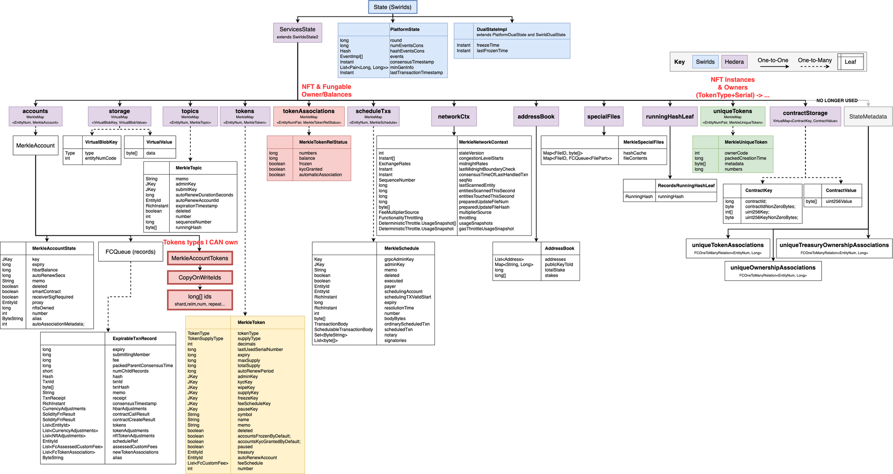

---
hip:1000
title: HIP Unlimited token associations per Account
author: Anirudh Ghanta <anirudh.ghanta@hedera.com>
working-group: a list of the technical and business stakeholders' name(s) and/or username(s), or name(s) and email(s).
type: Standards Track
category: Service
needs-council-approval: Yes
status: Draft <Draft | Review | Last Call | Active | Inactive | Deferred | Rejected | Withdrawn | Accepted | Final | Replaced>
created: 2022-02-17
discussions-to: <a URL pointing to the official discussion thread>
updated: <comma separated list of dates>
requires: <HIP number(s)>
replaces: <HIP number(s)>
superseded-by: <HIP number(s)>
---

## Abstract

Describes the removal of the limit [1000] on the number of tokens an account can be associated to and the refactor of 
how we store this **unlimited** list of associated tokens on the Account state. 


## Motivation

The current Services API allows the user to only have upto 1000 tokens associated at a time.
For users that need more associations :
- one can create multiple accounts to hold 1000 token associations each.
- user can create a smartContract and manage the mapping of multiple accounts with 1000 token associations each.

and a few others which are mentioned [here](https://www.notion.so/hedera/Increase-1000-associations-account-limit-95e882c6954443c6bc6502ad2818d15b#e8d1f192f620414c88a5ae18dfcca69b)

## Rationale

Rather, we should remove the limit we put in place for the token associations per account.

And as the array of tokenIds that are associated to an account on the Account state grow, hashing/re-hashing every time
we modify this array becomes expensive. A refactor of how we handle these associated tokenIds is needed.

## User stories
- As a primary creator of an NFT collection, I should be able to mint a large number of NFT serials in a single collection
- As a secondary NFT marketplace dApp, I should be able to create many thousands of collections (created by multiple primary creators of the collections), such that each collection can hold a large number of NFTs
- As a NFT creator, I should be able to set custom fees for my NFTs
    - Is it a must-have requirement to be able to do this on per-serial number? or is it sufficient to specify this fee at the token-type level?
- As an avid collector of NFT, I want to manage my entire collection within the same account.

## Specification
 Currently, we have a limit of 1000 token associations per Account put in place which is dictated by the bootstrap property `tokens.maxPerAccount`.
This is enforced everytime we associate token/tokens to an account. 

When using the HederaTokenStore :
```java
     public ResponseCodeEnum associate(AccountID aId, List<TokenID> tokens, boolean automaticAssociation) {
      ...
          if ((accountTokens.numAssociations() + tokenIds.size()) > properties.maxTokensPerAccount()) {
              validity = TOKENS_PER_ACCOUNT_LIMIT_EXCEEDED;
          }
      ...
    }
```

When using the Account model:
```java
    public void associateWith(List<Token> tokens, int maxAllowed, boolean automaticAssociation){
        final var alreadyAssociated=associatedTokens.size();
        final var proposedNewAssociations=tokens.size()+alreadyAssociated;
        validateTrue(proposedNewAssociations<=maxAllowed,TOKENS_PER_ACCOUNT_LIMIT_EXCEEDED);
        ...
    }
```

This limit enforcement needs to be removed. This limit is also enforced when creating and updating an account with maxAutomaticAssociations described by this [HIP-23](https://github.com/anighanta/hedera-improvement-proposal/blob/master/HIP/hip-23.md)
That enforcement also has to be removed.

We currently store the list of tokens associated to an account on the state using a MerkleLeaf node which hold the array of Ids of the token and each MerkleAccount will have this as a child.
So as the array grows it will be very costly to operate on this array. 



We propose a new way of efficiently doing this using a `MapValueLinkedList` which will store the Account-Token relationship as a Map of <EntityNum pair of accountID and tokenID> to <MerkleTokenRelStatus>
where the keys will be linked by a linkedList. And only the latest account-token association key is saved on the MerkleAccount state.


## Backwards Compatibility

There are no known backwards compatibility issues.

## Security Implications

This shouldn’t necessarily change security implications not already known by Hedera,
but could introduce denial of service ? Which can be controlled by throttling and increasing fee as the associations grow. 

## How to Teach This

N/A

## Reference Implementation

## Rejected Ideas

## Open Issues
[`MapValueLinkedList`](https://github.com/hashgraph/hedera-services/issues/2842)
[Increase token association limit](https://github.com/hashgraph/roadmap/issues/81)
## References

A collections of URLs used as references through the HIP.

## Copyright/license

This document is licensed under the Apache License, Version 2.0 -- see [LICENSE](../LICENSE) or (https://www.apache.org/licenses/LICENSE-2.0)
