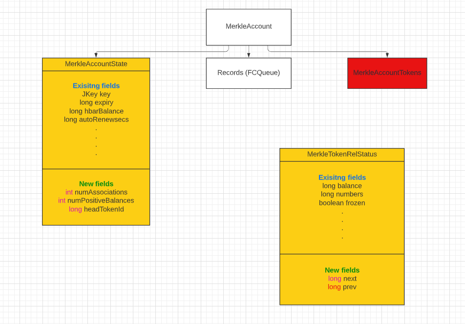

## Abstract

Permits every account to hold an unlimited number of token associations. Retains the current pricing for each token
association. Deprecates the return of token associations from the `getAccountInfo`, `getContractInfo`, and 
`getAccountBalance` queries and modifies the specification of the returned results during the deprecation period. 
Changes the criteria for the `cryptoDelete` transaction to require all token balances to be zero before successfully 
marking the account as `deleted`.

## Motivation

The current Services API permits the user to have at most 1,000 token associations per account. This limitation was
imposed because the current implementation becomes prohibitively expensive with large numbers of associations. In
addition, processing and returning the `getAccountBalance` query becomes more expensive linearly as the number of
associations increases. A user can work around this limitation by creating multiple accounts, each of which is also
limited to 1,000 token associations, but several use cases become difficult or awkward to support in this way.

## User stories

### 1. A User can associate with 1,001 tokens

I have an account with 1,000 tokens already associated with it. After the update to the release with the limit removed,
I can add another token association, putting my account at 1,001 associations.

### 2. A User can configure auto association to more than 1,000

I am a user who loves receiving airdrops. I configure my account to have 10,000 "slots" for auto associated tokens.
I pay for all these up front. I can then actually receive up to 10,000 auto associated tokens. An attempt to send
me a 10,001st auto associated token would fail, but if I manually associated a 10,001st token, it would succeed.

I can only auto-associate a maximum of 2^(32-1) tokens (a little more than 2.15 billion).

### 3. An NFT Creator can mint thousands of NFTs in a single collection

I love creating NFTs. As a primary creator of an NFT collection, I am able to mint thousands of NFT serials in a
single collection.

### 4. A secondary NFT Marketplace dApp can have thousands of collections

As a secondary NFT marketplace dApp, I should be able to create thousands of collections (created by multiple primary
creators of the collections), such that each collection can hold thousands of NFTs.

### 5. A User can get the full set of tokens and balances from the mirror node

I have a large collection of thousands of tokens. I can query a mirror node to get the full set of tokens and their
current balances.

### 6. A User can delete an account with associated tokens if there are no balances

I have thousands of token associations. Several thousand of these were manually associated and several thousand
were auto-associated. But none of them have any balance. I can delete my account.

### 7. A User's account has expired while they have associated tokens with balances

I have an account with tens of thousands of associated tokens and some of those tokens have balances. But I no
longer want this account, and it has no `HBAR` in it, and I let it expire. The system will clean this up for me.

## Specification

### Consensus Nodes

#### Current Implementation

The current implementation of token associations involves several data structures stored in the merkle tree.
There is a `MerkleAccount` node in the tree for each account. It has three leaf nodes hanging off it, two of which
are `MerkleAccountState` and `MerkleAccountTokens`. The `MerkleAccountState` contains information like the `key`,
`hbarBalance`, and other information about the account. The `MerkleAccountTokens` is an array of token IDs, one for
each token that is associated with the account. The more tokens associated with the account, the larger the array.

Every time a new token association is made, it is added to the array, the array is sorted, and the entire array is
hashed. Every time a token association is removed, we walk the array to find the token ID and remove it from the array,
and the array is hashed. When we query for the account balance, then for each token ID in the array we make a separate
map lookup in `tokenAssociations` to get the balance.

Separate from `accounts` is the `tokenAssociations` map in the merkle tree. This maps from `EntityNumPair` (the pair
of account ID and token ID) to `MerkleTokenRelStatus`. It is this `MerkleTokenRelStatus` that contains information
for the association, such as the `balance` or whether it was an `automaticAssociation`.

An unbounded array of associations per account is undesirable with this design because the amount of time it takes to
hash the `MerkleAccountTokens` leaf becomes excessive as the number of associations grows, and any state proof involving
that leaf requires passing the entire array along, making the state proof very large. It also means the
`getAccountBalance` query becomes arbitrarily expensive since it requires reading a `MerkleTokenRelStatus` from
`tokenAssociations` for each token ID in the account's `MerkleAccountTokens` array!

Thus, we set the boostrap property `tokens.maxPerAccount` to 1000 in testnet and mainnet to limit the maximum number of
associations per account.

##### Enforcing the limit

`HederaTokenStore.associate` is called when auto-associating an account with a token during a token transfer. In this
method we verify that the new auto association will not increase the number of tokens for this account past the limit
defined by `tokens.maxPerAccount`.

`Account.associateWith` is called when manually associating with a `TokenAssociate` transaction. In this method we also
verify that the account does not get associated with more tokens than specified by `tokens.maxPerAccount`.

We also verify that the value for `maxAutomaticAssociations` on the account (as described by
[HIP-23](https://github.com/anighanta/hedera-improvement-proposal/blob/master/HIP/hip-23.md)) does not exceed
`tokens.maxPerAccount`.

#### New Implementation

The weakness in the current design is in the `MerkleAccountTokens`. Rather than having an array of token IDs in the
account state and a map of token associations, we will modify the `tokenAssociations` map to be combination map and
linked list. Each `MerkleTokenRelStatus` will have a `prev` and `next` containing the token ID of the
previous association and the next association. The previous association must be `0` if the `MerkleTokenRelStatus`
represents the first in the list for the account, and the next association must be `0` if the `MerkleTokenRelStatus`
is the last in the list for the account.

Thus, to follow the chain, you start at the first `MerkleTokenRelStatus` for the account, and follow the `next`
links one after another. For each, you create a temporary `EntityNumPair` with the account ID and the token ID
contained in `next` to look up the next entry in the list. The `prev` link exists to allow us to efficiently
delete an item from the list, as with any standard doubly-linked-list implementation.

The `MerkleAccountState` will receive a new fields, integer `numPositiveBalances`, another integer `numAssociations`, 
and one long, `headTokenId`. The linked list always pushes the most recent addition to the head of the list, 
referred to by `headTokenId`. Walking the list from first to last would list the tokens in order from most recently 
added to the least recently added to the list (however, due to migration, the position in the list 
**may not be ordered by when the token was associated**).

 TODO Image needs to be updated to include new / proper names

The `headTokenId` is updated whenever a new token associates with the account (either explicitly or through auto
associations), or when the first association is removed, or during migration.

The `numPositiveBalances` field is updated whenever one of the balances of the token list for the account is changed
from being a zero balance to a non-zero balance or vice-versa. This can happen:
1. `tokenWipe` operation is performed with the account's token balance becoming zero
2. `tokenBurn` operation is performed with treasury's balance becoming zero
3. `tokenMint` operation is performed with treasury balance becoming non-zero
4. `cryptoTransfer` where either sender or receiver balances toggle between zero and non-zero

When a user tries to delete an account, if `numPositiveBalances` is greater than 0, then we will not allow the account
to be deleted. The user **must** first transfer balances out for all tokens.

The `numAssociations` field is needed so we can efficiently compute a renewal price.

##### Migration

During migration, nodes will load an older state containing `MerkleAccountTokens`. We will continue to host this leaf
until migration completes, after which we will remove it. During migration, we will iterate over all accounts. For each
account, we will iterate over each token ID in `MerkleAccountTokens`. For each token ID, we will construct an
`EntityNumPair` from the account ID and token ID and look up the associated `MerkleTokenRelStatus`. The first token ID
we handle will become the end of the list. So for each subsequent token ID we handle, it will become the `prev` of
the previous `MerkleTokenRelStatus`. The very last token ID will be the `headTokenId` for the account.

1. For each account in the accounts map fetch the list of token IDs from `MerkleAccountTokens`
2. For each token on this list, use the account id and token id to build `EntityNumPair` and fetch the
   `MerkleTokenRelStatus` from the `tokenAssociations` map.
3. Update the `next` and `prev` for each of these associations and persist the changes
5. If the balance on the association is non-zero, then increment the `numPositiveBalances` on the account by 1.
6. Set the account's `headTokenId` to the last token ID from the above loop
7. Finally, remove the `MerkleAccountTokens` from the account

#### Token Association

Token association can occur either explicitly or automatically. In either case, the same algorithm is used, except
that in the case of automatic association we process that `maxAutomaticAssociations` will not be exceeded by this
association. Management of `alreadyUsedAutomaticAssociations` remains as it does today and is not altered by this HIP.

1. For each token that is to be associated to the Account, build an `EntityNumPair` from the token ID and account ID
2. Create a new `MerkleTokenRelStatus` object and set the `next` as the current `headTokenId`
3. Update the account's `headTokenId` to the new token ID
4. Persist all created or modified `MerkleTokenRelStatus` objects and the account.

#### Token Dissociation

Token disassociation requires maintenance of the linked list. Management of `alreadyUsedAutomaticAssociations` remains
as it does today and is not altered by this HIP.

1. Look up the `MerkleTokenRelStatus` for the token ID we are removing. We will call it the `removedEntry`
2. If the balance on the token association is not 0, then fail
3. Remove `removedEntry` from `tokenAssocations`
4. If `removedEntry.tokenId` is `headTokenId` then:
   1. If `numAssociations` is 1 then this was the last association. Set `headTokenId` to `0`.
   2. Else look up the `MerkleTokenRelStatus` for `removedEntry.next` and call it `nextEntry`. Set `nextEntry.prev` to
      `0` and set `headTokenId` to `nextEntry.tokenId`
5. Else get the `MerkleTokenRelStatus` for `removedEntry.next` called `nextEntry` and the `MerkleTokenRelStatus` for
   `removedEntry.prev` called `prevEntry`. Set `prevEntry.next` to `nextEntry.tokenId` and `nextEntry.prev` to
   `prevEntry.tokenId`
6. Decrement `numAssociations` by 1.
7. Persist all updated `MerkleTokenRelStatus` objects and the account.

#### Association lists in query responses

Three queries return token association data: `getAccountInfo`, `getAccountInfo`, and `getAccountBalance`.

> This HIP formally deprecates the token association lists returned by these three queries. Within 6 months 
> this information will no longer be retrieved from consensus nodes. Instead, clients must query mirror nodes
> for this information.

Please follow [this issue](https://github.com/hiero-ledger/hiero-mirror-node/issues/4142) to track progress
on the Mirror Node replacement API. 

The challenge with these queries is that they require numerous uncharged map look-ups to find and retrieve the
token information, and when token limits are removed, these queries may take an arbitrary amount of time to complete.
For this reason, and to maintain compatibility during the deprecation period, we will continue to return **at most**
1000 (`tokens.maxRelsPerInfoQuery`) results. The order of these results is explicitly **not specified**. Thus, if you
have 1001 token associations, we will only return 1,000 of them, and are free to return any 1,000. Instead, clients are
strongly encouraged to query this information from mirror nodes.

1. Get the latest token association from the account's `headTokenId`
2. Fetch the `MerkleTokenRelStatus` using the combination of the account ID and token ID from `tokenAssociations`
3. Add the token information to the list of information to return from the query
4. Get the `next` token ID from this `MerkleTokenRelStatus` object and repeat step 2 and 3 until the `next` equals
   `0` which means we reached the end of the linked list, or until we reach the limit specified by
   `tokens.maxRelsPerInfoQuery`.

#### CryptoTransfer

When transferring any token units (Fungible or Non-Fungible) we have to update the `numPositiveBalances` on each of
those accounts respectively.

On every `tryAdjustment` and `updateLedgers` calls when adjusting token units:

1. If the sender is left with no more token units, then decrement the `numPositiveBalances` by 1
2. If the receiver's initial balance for this token type is 0, then increment the `numPositiveBalances` by 1.

#### TokenWipe

When a `TokenWipe` operation is performed on an account, we have to update the `numPositiveBalances` accordingly. When
wiping either Fungible token units or NFT units on an account:

1. If the remaining units on that token for that account is 0, then decrement the `numPositiveBalances` by 1.

#### TokenBurn

When a TokenBurn operation is performed, we burn the asked amount off the treasury account and update the total supply.
Update the `numPositiveBalances` of the treasury if the burn left the treasury with zero balance on that token. When
burning either Fungible token units or NFT units of a token:

1. If the treasury has no more units left, then decrement the `numPositiveBalances` by 1.

#### TokenMint

When a TokenMint operation is performed, we mint the asked amount of token units, by adding to the treasury account's
token balance, and we update the total supply of that token. We increment the `numPositiveBalances` of the treasury if
the original balance for treasury on that token is 0. When minting either Fungible token units or NFT units of a token:

1. If the treasury has 0 units of that token before minting, then increment the `numPositiveBalances` by 1.

#### Crypto Account Deletion

Currently, we return `TRANSACTION_REQUIRES_ZERO_TOKEN_BALANCES` when a `cryptoDelete` transaction is submitted on an
account with non-zero balances on the tokens [ not `deleted`] that it is associated with.

Checking if the associated token is not `deleted` and then processing the balance on that association gets very costly
when the association limit is removed as we would have to traverse the whole list of associations. Instead, we will
include the deleted tokens as well when checking if the account has any non-zero token balances and use the field
`numPositiveBalances` to match if all the associations have zero balances so that we can avoid traversing the list of
unlimited token associations.

> An account must dissociate from deleted tokens if it has any token balances left pertaining to that token to be
> eligible for deletion

#### Balance exporter

Balance exporter would need all the token associations without the limitation enforced by `tokens.maxPerAccount`.

#### AutoRenew

AutoRenew fee calculations require the `numAssociations` on the renewing account.

### Mirror Node

#### Accounts REST API

The `/api/v1/accounts` and `/api/v1/accounts/{id}` REST APIs will remain unchanged except limits will be put in place
on the nested list of token balances. This will ensure that the token data returned won't grow unbounded and increase
API response times. Currently `/api/v1/accounts/{id}` will be limited to 1000 token balances in its response and 
`/api/v1/accounts` will be limited to at most 50 token balances per account. These limits may be adjusted as
necessary in the future to ensure API stability. Users should use the new [Token Relationships REST API](token-relationships-rest-api)
to retrieve more tokens than the limits provide.

#### Balances REST API

For the same reasons as the accounts REST API, the `/api/v1/balances` API will limit the nested list of token balances
to at most 50 token balances per account. Users should use the new [Token Relationships REST API](token-relationships-rest-api)
to retrieve more tokens than the limits provide.

#### Token Relationships REST API

A new `/api/v1/accounts/{id}/tokens` REST API will be [added](https://github.com/hiero-ledger/hiero-mirror-node/issues/4142)
to show the tokens associated with a specific account ID.

```json
{
  "tokens": [{
    "automatic_association": true,
    "balance": 5,
    "created_timestamp": "123456789.000000001",
    "freeze_status": "UNFROZEN",
    "kyc_status": "GRANTED",
    "symbol": "F",
    "token_id": "0.0.27335"
  }],
  "links": {
    "next": null
  }
}
```

It will support the following query parameters:

* `limit` -  The maximum number of results to return. Defaults to 25 and max 100 allowed.
* `order` - Sort by token ID. Value of `asc` or `desc` with a default of `asc`.
* `token.id` - The token IDs to filter by. Supports `eq`, `gt`, `gte`, `lt`, `lte` operators. Used for pagination in next link.

## Backwards Compatibility

There are two functional changes required by this move to unlimited token associations.

First, when an account has more than 1000 tokens associated to it, the `getAccountInfo`, `getContractInfo`, 
and `getAccountBalance` queries will not support fetching all of those associations. Rather the number of token 
associations that will be fetched from the queries will be dictated by the dynamic property 
`tokens.maxRelsPerInfoQuery`. The token associations returned by these queries will have at most 1000 
associations. They may come in any particular order. (As noted above, this HIP officially deprecates the 
token association data in these three queries.  Clients should plan migration strategies to begin getting 
this information from mirror nodes, c.f. [this issue](https://github.com/hiero-ledger/hiero-mirror-node/issues/4142).)

Second, accounts can no longer deleted via a `CryptoDelete` while holding units of any token type, even if that 
token type is deleted. *All* balances must be cleared before deletion.

## Security Implications
With the removal of the limit on number of token associations on an account, an account can potentially have millions of
token associations. We must be sure that all code paths are ready to deal with millions of associations in the list
and do not expose us to a DOS attack.

## How to Teach This

N/A

## Reference Implementation

## Rejected Ideas
1. Users can create multiple accounts and hold 1000 tokens in each
2. Users can create a smart contract and manage around the current 1000 token limit by creating multiple accounts each with 1000 tokens and use smart contract logic to manage the mapping
3. Users can opt to create tokens on the EVM layer, which is not subjected to the 1000 token limit but this doesn't use Hedera’s native tokenization
4. Create an `exchange-account` type of account where we charge more to create, but they have a higher association limit

## Open Issues
[`MapValueLinkedList`](https://github.com/hashgraph/hedera-services/issues/2842)
[Increase token association limit](https://github.com/hashgraph/roadmap/issues/81)
[HIP - 367 : Remove limit on the number of tokens that can be associated to an account](https://github.com/hashgraph/hedera-services/issues/2917)
[Services-PR](https://github.com/hashgraph/hedera-services/pull/2934)

## References

N/A

## Copyright/license

This document is licensed under the Apache License, Version 2.0 -- see [LICENSE](../LICENSE) or (https://www.apache.org/licenses/LICENSE-2.0)
