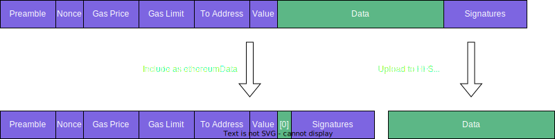

## Abstract

Add a new transaction type that will hold signed Ethereum transactions and
execute them as Hedera transactions in a prescribed manner. An Ethereum
transaction can transfer HBAR, create a smart contract, or invoke a smart
contract. This HIP supports all three use cases. 

## Motivation

With [HIP-26 (Besu EVM)](https://hips.hedera.com/hip/hip-26), the Hedera network
is EVM-compatible with Ethereum. This means the Hedera network accepts and
executes the same EVM bytecodes as any other Ethereum network. Transactions sent
to the Hedera network are Hedera transactions and use the Hedera API (HAPI). The
HAPI is based on gRPC and Google's protocol buffers (protobuf). Clients of
Hedera must use the HAPI for creating contracts and invoking contracts.

Standard Ethereum networks use JSON-RPC instead of gRPC, and they take Ethereum
transactions encoded as RLP rather than HAPI transactions encoded in protobuf.
The Ethereum ecosystem has a large and growing collection of tools and libraries
that is becoming a de facto standard development stack. These tools and
libraries work with RLP transactions only.

This HIP specifies a new HAPI transaction body that holds standard, Ethereum
encoded and signed transactions along with the specification for how to execute
those transactions. The program that prepares the Ethereum transaction, and
signs it, may be different from the program that submits that transaction to the
Hedera network. This would allow arbitrary Ethereum tools and libraries to
prepare and sign Ethereum transactions, and then using a small amount of code
the application could wrap those transactions and send them directly to the
Hedera network for execution, opening Hedera for more broad adoption by the
Ethereum development community.

## User Stories

### 1. As a web3 app I want to use web3.js and an Ethereum compatible wallet to create and sign transactions that execute in the Hedera network

I am a web3 developer, and I have created a web application that currently works
with Ethereum. In my application, I create transactions and send them to a
browser wallet such as Brave or MetaMask for the user to sign. Using the Hedera
JS SDK, I am able to take that signed transaction and submit it to the Hedera
network for execution. Instead of web3.js, I might also use ethers.js.

### 2. As a web3 app I want to be able to pay transaction fees so my users can use zero-gas Ethereum transactions

I am a web3 developer, and I have created an application, however I do not want
my users to have to hold HBAR to use my application. I will have the dApp create
an Ethereum transaction with a zero gas price. My server receives that
transaction and wraps it in a Hedera transaction, and my server pays for all or
part of the Hedera fees needed for that transaction.

### 3. As a smart contract operator I want to be able to add authorizing signatures when transactions are relayed

I am a smart contract operator, and I have some transactions that require
multiple approvals in the same transaction. I want to operate a server that will
take an Ethereum transaction from a user, and then the relay server will decide
based on its own logic if I will approve the transaction and relay it with one
or more signatures. The keys for these signatures are only available to the
relay service and users have to use the relay service to get authorization from
those keys.

### 4. As a user, I want to use MetaMask to create a transaction to transfer HBAR to another account

I am a user, and I have an account with Hedera. I also use MetaMask as my
wallet. By setting up a relay as my "network", I can transfer HBAR to another
account.

### 5. As a user, I want to use MetaMask to transfer HBAR to a contract account

I am a user, and I have an account with Hedera. I also use MetaMask as my
wallet. By setting up a relay as my "network", I can transfer HBAR to a smart
contract account.

### 6. Operating a relay for community good or profit

I decide to operate a relay and suggest dApp developers to use my relay for
sending Ethereum transactions to the Hedera network. I can operate this relay
as a public service at no charge. Or, I may set up an out-of-band payment system
with user accounts and credit cards, or crypto, or other means to fund the
hosting of the relay. I know nothing about the contents of the transactions. I
have to pay for submitting the transaction to Hedera.

## Specification

A "relay" takes an Ethereum transaction created by a "sender" and submits it to
the Hedera network. This is done by wrapping the Ethereum transaction with a
HAPI protobuf object called an `EthereumTransactionBody`. The relay can be the
client app itself, a backend server, or it can be any third party relay. Special
care is taken to account for payment of transaction submission separately from
payment of transaction execution to be consistent with the Hedera security
model. The relay pays for transaction submission, while the sender pays for the
execution of the transaction.

The sender key that signs the Ethereum transaction must have a public key (ECDSA
secp256K1) registered as an alias to an account on the Hedera network, and the
relay must also have an account on the Hedera network.


The above diagram provides a flow where the app itself is the relay. In this
flow, the app creates the Ethereum transaction and sends it to MetaMask or
another wallet for signing (1), retrieves those signed bytes (2), and using the
JS SDK creates a HAPI transaction in which the Ethereum transaction is wrapped
and sent to the Hedera network for execution. The user that signed the
transaction has an account on Hedera, and the application itself has an account
on Hedera.


The above diagram proposes an alternative flow where the application itself does
not know about Hedera and the transaction is submitted by the wallet to the
relay directly, assuming that the relay implements the necessary Ethereum
JSON-RPC APIs. The user that signs the transaction has an account on Hedera, and
the relay has an account on Hedera, but the application itself does not. The
relay may charge the application or client out-of-band, supporting a variety of
economic models. The structure and form of a relay, and its relationship to any
wallets or other software, is not specified by this HIP.

### Economics

Fees in the Hedera network are charged to the "payer" account in the
transaction. In a simple crypto transfer case where Alice sends money to Bob,
Alice is usually the payer and the sender -- she creates the transaction, signs
the transaction, and pays for all fees associated with the transaction.

Likewise, when invoking a smart contract, the client that invokes the smart
contract pays fees, including gas fees. Gas is used and then converted into
HBAR and charged to the payer account.

Fees in Hedera are predictable and computed based on fiat (USD). This HIP
preserves this invariant.

There are two actors defined by this HIP: the "sender" which is the account that
signed the Ethereum transaction, and the "relay" which is the account that
wrapped the Ethereum transaction with a Hedera transaction. Every such wrapped
transaction thus has two signatures -- one on the Hedera transaction and one on
the Ethereum transaction.

The relay is responsible for paying the fees for submitting a transaction to the
network. The sender is responsible for paying the fees for executing the
transaction. The relay may have an out-of-band relationship with the sender and
receive reimbursement for submitting transactions.

The relay creates a standard Hedera transaction and signs it in the standard
way and pays fees in the standard way. The fee prices are determined by the
governing council and not set by this HIP.

The sender pays for fees using the mechanisms defined by Ethereum in the
Ethereum transaction, which was signed by the user. **The total cost of
executing the transaction, including all gas fees and other fees, are paid for
by the account signing the Ethereum transaction and as authorized by that
transaction**.

There is one exception. The relay may specify a `maxGasAllowance` which is used
to cover the costs of executing the transaction if, and only if, the Ethereum
transaction cannot cover the costs itself. The value by default is 0, meaning
that the relay will not pay any of the execution cost.

The only mechanism Ethereum provides for paying for a transaction is *gas*.
Therefore, all fees related to executing an Ethereum transaction on Hedera must
be denoted by gas. The minimum gas used by any transaction is 21,000. Bytes
transferred as part of the contract create or contract call increase the amount
of gas used. The price per unit of gas in US dollars will be fixed to a value
determined by the Governing Council. The price per unit of gas in HBAR will
float based on the HBAR <-> USD exchange rate, as it does today. The current
price per unit of gas in HBAR will be made available in mirror nodes, so an
application can determine the amount of HBAR to be used in a transaction.

Ethereum defines two different payment models, one for "Type 1" and legacy
transactions, and one for "Type 2" transactions defined in the London hard fork.
In both models there is the concept of a maximum price the caller is willing to
pay.

#### Type 2 Payments

EIP-1559 introduced a major revision to the pricing scheme for Ethereum
transactions. The following table defines the different variables that are used
for computing the charges associated with a transaction.

| Field                      | Defined By  | Notes                               |
|----------------------------|-------------|-------------------------------------|
| `base_fee_per_gas`         | Block       | Base per gas price in wei           |
| `max_priority_fee_per_gas` | Transaction | Tip per gas to pay the miner in wei |
| `max_fee_per_gas`          | Transaction | Max per gas willing to pay in wei   |
| `gas_limit`                | Transaction | Max gas willing to use              |
| `gas_used`                 | Miner       | Amount of gas actually              |

In Ethereum, the absolute most that a single transaction is willing to pay can
be computed by `max_fee_per_gas * gas_limit`. If less gas is used, then less is
paid. The miner earns `max_priority_fee_per_gas * gas_used`. The
`base_fee_per_gas` is variable depending on congestion pricing (the price is
higher when the network is busy and lower when it is quieter).

When submitted to Hedera, the `max_priority_fee_per_gas` is ignored because
nodes are not miners and are not rewarded in this way. The `max_fee_per_gas`
is used in exactly the same way for Hedera as for Ethereum, as are `gas_limit`
and `gas_used`. The `base_fee_per_gas` is determined by the Hedera network by
taking the fixed price per gas in USD and converting it to the price per gas
in HBAR. This value can be read from mirror nodes. The user is only charged
for `base_fee_per_gas * gas_used`.

#### Type 1 Payments

The legacy, or Type 1 transaction, has a `gas_price` and `gas_limit`. The
application creates a transaction with values for `gas_price` and `gas_limit`
and the user signs that transaction. The maximum they will pay will
be `gas_price * gas_limit`. There is no right or wrong answer for `gas_price`,
it is literally an auction, where each transaction says what it is willing to
pay and the miner collects all of `gas_price * gas_used`.

When Hedera handles a Type 1 transaction, it verifies that `gas_price` is
greater than or equal to the network's `base_fee_per_gas`, and that the
`gas_limit` is at least 21,000. Unlike Ethereum, Hedera will only collect
`base_fee_per_gas * gas_used`. If `gas_price` was higher than
`base_fee_per_gas` then the user keeps the extra.

### Protobuf changes

#### Ethereum Transaction

A new transaction body `EthereumTransactionBody` will be introduced to hold the
Ethereum transaction data.

```protobuf
message EthereumTransactionBody {

  // required 
  bytes ethereumData = 1;

  // optional 
  FileID callData = 2;

  // optional
  int64 maxGasAllowance = 3;
}
```

The Ethereum transaction data will be converted into a `ByteString`. If the
Ethereum transaction is small enough to fit into a Hedera transaction body then
`ethereumData` will be the entire raw and unmodified Ethereum transaction.
Hedera transactions are limited to a total of 6KB.

To support larger Ethereum transactions we will allow the `data`
section of the transaction (also referred to as callData or inputData) to be
stored as a Hedera file. In these instances the transaction body contains an
edited version of the Ethereum transaction, replacing the `data` field in the
RLP with a zero length string and storing the call data in a Hedera File as a
hex string. When the transaction is executed and before the signatures are
extracted the Ethereum transaction bytes will be reconstituted to include the
bytes from the reference file.

Some Ethereum transactions will be too large for a single Hedera transaction.
The `relay` will receive the full raw Ethereum transaction and remove the
`callData` or `inputData` (the `data` section of the Ethereum transaction) and
upload it separately as a Hedera file in the Hedera File System (HFS) as a hex
encoded string. The remaining bytes will be set as the `ethereumData` with a
zero-length string where the `data` had been, and the File ID of the uploaded
data will be set as the `callData` field in the protobuf object.



When the transaction is executed, and before the signatures are extracted, the
Ethereum transaction bytes will be restored to include the bytes from the
reference file.

Some further minor additions are needed to some protobuf objects (as detailed
below). The `ethereumNonce` will be reported in the `AccountInfo` message in the
response to `CrytpoGetInfoQuery`. The `ContractCallLocalQuery` will also get
a `senderId` so that the sender account of the view calls can be set. Similarly,
the `senderId` will be added to `ContractFunctionResults` recording the account
that the Ethereum signature resolved to.

```protobuf
// basic_types.proto 
enum HederaFunctionality {
  //... 
  EthereumTransaction = 84; // enum number may be different once finalized 
}

// smart_contract_service.proto 
service SmartContractService {
  //... 
  rpc contractCallEthereum (Transaction) returns (TransactionResponse);
}

// transaction_body.proto 
message TransactionBody {
  //... 
  oneof data {
    //...
    EthereumTransactionBody ethereumTransaction = 51; // field number may change
    //... 
  }
  //... 
}

// transaction_record.proto
message TransactionRecord {
  //...
  bytes ethereum_hash = 19;
}

// crypto_get_info.proto
message CryptoGetInfoResponse {
  //...
  message AccountInfo {
    //...
    int64 ethereumNonce = 24;
  }
  //...
}

// contract_call_local.proto
//...
message ContractFunctionResult {
  //...
  AccountID senderID = 13;
}

//...
message ContractCallLocalQuery {
  //...
  AccountID senderID = 6;
}

// crypto_get_info.proto
message CryptoGetInfoResponse {
  //...
  message AccountInfo {
    //...
    int64 ethereumNonce = 24;
  }
  //...
}
```

#### ContractCreateTransaction

An Ethereum transaction can be used to create a new smart contract. When
used in this way, an `EthereumTransactionBody` is used, just as with HBAR
transfers and contract call invocations. When the contract is created, a
corresponding record must be created in the record stream. This requires some
modifications to the `ContractCreateTransactionBody`. These modifications 
**also** permit an optimization in traditional HAPI contract create calls,
detailed here.

In the network today, contracts are first uploaded as files in the Hedera File
Service and then linked with the Smart Contract in a
`ContractCreateTransaction`. This HIP extends the
`ContractCreateTransactionBody` to support sending the contract code inline
if the size of the contract is small enough to fit in a single Hedera
transaction. The field `initcode` will be added to
`ContractCreateTransactionBody`. Instead of uploading a file and then supplying
a `fileID`, you can instead supply the contract code directly in the
`ContractCreateTransaction`.

```protobuf
message ContractCreateTransactionBody {
  oneof initcodeSource {
    FileID fileID = 1;
    bytes initcode = 7; // field number may change in final draft 
  }
  // ... 
}
```

### Value of gas price and value fields

For Ethereum transactions, we introduce the concept of “WeiBars”, which are 1 to
10^-18th the value of a HBAR. This is to maximize compatibility with third party
tools that expect ether units to be operated on in fractions of 10^18, also
known as a Wei. Thus, 1 tinyBar is 10^10 weiBars or 10 gWei. When calculating
gas prices and transferred value the fractional parts below a tiny bar are
dropped when converted to tinyBars.

### Ethereum Requirements

The replay protection specified in EIP-155 will be required for legacy
transactions. The Type 1 / EIP-2930 and Type 2 / EIP-1559 transactions also
require a `chainId` field. Non-restricted `chainID`s (where `chainID` is less
than or equal to zero) are not supported.

For all transaction types the `chainID` specified must match the `chainID` of
the network as specified in [HIP-26](https://hips.hedera.com/hip/hip-26)
(`0x127` for mainnet, `0x128` for testnet, `0x129` for devnet, and `0x12a` for
local networks).

### Transaction Signing Requirements

The sender of an Ethereum transaction body will be the account with an account
alias that is an ECDSA(secp256K1) public key. To identify the account the public
key will be recovered from the Ethereum transaction, and converted to an
Ethereum address. The transaction sender will then be set to the account whose
Ethereum address of the alias key has the same Ethereum address.

This HIP does **not** support multiple signatures for the Ethereum transaction.
If the account associated with the Ethereum transaction requires multiple
signatures, then the transaction will fail.

The Hedera transaction is signed by the relay using the relay's key. It is
possible for the Hedera transaction to require multiple signatures, based on
the configuration of the relay's account.

### Paying for the Transaction

In addition to the account signing the Ethereum transaction (the sender account)
each Hedera transaction containing the Ethereum transaction will also need to be
signed by a Hedera account (the relay account). These may be the same account
or different accounts.

If the relay and sender account are the same account there are no limitations
on HBAR transfers.

When the relay and sender accounts are different the following restrictions
apply to HBAR transfers. There are three components to consider, first is the
total amount of fees Hedera will charge the transaction. The second amount is
the amount of fees the sender has processed to be spent, which is the `gasLimit`
of the transaction multiplied by either the `gasPrice` for Legacy and Type 1
transactions and the `max_fee_per_gas` field for Type 2 transactions. These are
the sender authorized fees, and the total transaction amount charged to the
sender must be between the `value` authorized in the transaction and the `value`
plus the sender authorized fees. The third portion is either paid by or credited
to the relay.

- When the Hedera charged fees matches the sender authorized fees then the
  sender will neither send nor receive HBAR. This is a rare case.
- When the Hedera charged fees exceeds the sender authorized fees then the relay
  must make up the difference and will pay HBAR for the transaction.
- When the Hedera charged fees are less than the sender authorized fees, then
  some fees authorized by the sender may be received by the relay such that the
  sender does not pay more HBAR than they authorized. The relay may not need to
  receive all the excess HBAR, this depends on the transaction format that the
  transaction was sent in.
- For Legacy and Type 1 Ethereum transactions when the sender authorized fees
  exceeds the fees that Hedera charges then the relay receives the HBAR beyond
  the Hedera fees. There is no mechanism for the relay to receive less than the
  excess amount.
- For Type 2 Ethereum transactions the amount received by the relay must not be
  greater than the `max_priority_fee_per_gas` multiplied by the `gasLimit`. This
  will often result in charging the sender less than the authorized amount. Note
  that the `gasLimit` is used instead of the calculated `gasUsed` to make relay
  calculations easier. The relay may receive less than the full amount of the
  priority fee if the total authorized amount does not provide enough HBAR.
- If there is `value` set to be transferred, then the entire amount must come
  from the sender. The relay must not subsidise the transaction to the point it
  pays for value transfers.

Finally, if an Ethereum transaction reaches consensus and is invalid and cannot
be processed (for critical failures such as a bad ECDSA signature, an account
not matching the sender, an invalid Ethereum transaction, an incorrect nonce,
insufficient balance, or any other such error) the relay is responsible for all
fees relating to bringing the transaction to consensus.

### Account Nonce

Ethereum transactions have a different deconfliction and transaction enablement
mechanism than Hedera, but it is an inseparable part of Ethereum toolchains. To
that end we will support transaction sequence numbers as an additional
transaction validity check.

Each Hedera account will track a new value `ethereumNonce`, defaulting to zero.

When an Ethereum transaction is processed during pre-check the transaction
will fail if the account's `ethereumNonce` is not equal to the nonce in the
Ethereum transaction bytes.

If the transaction passes all validations and EVM execution (or equivalent
processing) starts then the `ethereumNonce` in the user account is incremented
by one. If the transaction fails for any reason prior to EVM execution the nonce
is not incremented.

#### Nonce Management

Using Ethereum nonces introduces the nonce management issue for clients wishing
to use Ethereum Transactions. Most ecosystem tools already have nonce management
built in using JSON-RPC APIs. JSON-RPC Bridges and other tools utilizing this
feature will need to keep a few considerations in mind.

First, Hedera has no memory pool. The notion of cancelling transactions out of
the memory pool with a higher priced transaction of the same nonce won't work.
Once submitted to a node and accepted by that node the transaction will be
executed and cannot be cancelled. Fast finality helps alleviate this problem as
a whole.

Nonces only increase and never go down. Thus, when relays are presented with a
transaction that has a nonce that is lower than the accounts current nonce
it should always reject that transaction and not relay it.

Gaps in nonce are not accepted. If a transaction comes to consensus with a nonce
greater than the expected nonce it will fail execution. The Ethereum transaction
may be resubmitted in the future when the nonce in the transaction is the same
as the nonce expected by the account.

### Executing the Transaction

Ethereum transactions can have a number of possible handling routes. All of them
are driven by the `to` field in the Ethereum transaction.

If the `to` field is empty, zero length, or all zeros, it will be converted into
a `ContractCreate` transaction. If the transaction has a `callData` value in the
transaction it will be placed in the `ContractCreate`s `fileID` field, otherwise
the data goes in the `initcode` field.

For non-zero non-empty `to` fields the address will first be decoded as a
standard Hedera mapping (bytes 1-4 are shard, bytes 5-12 are realm, bytes
13-20 are id, big endian encoded). If this does not map to an exiting entity
then the `to` address will be processed as an alias, which currently can map to
Crypto Accounts and Smart Contract Accounts.

If the `to` field still does not map to an entity the transaction fails with a
Hedera specific error. The relay will be charged for this transaction.

If the `to` address points to a Contract account the body of the Ethereum
transaction will be converted into a `ContractCall` and executed.

If the `to` address corresponds to a Token ID the call will initially be handled
as a crypto or token transfer. The implementation may choose to stand up the
EVM to execute these operations, or have a fast-path to use the layer-1
call paths.

If the `to` address points to a Topic ID or File ID the call will be handled as
an EVM, and converted into a `ContractCall`. If precompile support for the
consensus and file service is developed then there may be similar handling as
token calls.

### Mirror Node

Mirror nodes will require a number of changes to expose Ethereum transaction
information via its APIs.

#### Accounts REST API

The `/api/v1/accounts/{idOrAlias}` REST API will be updated to also accept an
EVM address as a path parameter in lieu of an ID or alias that will be calculated
and stored on account creation. An `ethereum_nonce` and `evm_address` will be
added to the response of `/api/v1/accounts/{idOrAliasOrAddress}` and `/api/v1/accounts`.
`ethereum_nonce` will be extracted from the `ethereumData` RLP bytes in the
`EthereumTransactionBody` and associated with the account in the mirror
node.

#### Contract Logs by Address REST API

The existing `/api/v1/contracts/{address}/results/logs` API will be enhanced to
support pagination. The existing `index` and `transaction` parameters will be
used as the multi-column key and be set for subsequent requests in the `next`
link. The `index` parameter cannot be present without the `timestamp` parameter.
The index only applies within a given timestamp, not across timestamps.

The REST API currently supports logical `AND` for topics by passing multiple
topic query parameters (e.g. `topic0=0x01&topic01=0x02`). To support logical
`OR` operations, the API will be enhanced to allow repeated parameters so that
`topic0=0x01&topic0=0x02&topic1=0x03` means “(topic 0 is 0x01 or 0x02) and
(topic 1 is 0x03)”.

#### Contract Logs REST API

A new `/api/v1/contracts/results/logs` API will be added with the same query
parameters and response as `/api/v1/contracts/{address}/results/logs` but with
the ability to search across contracts. It will not support `address` as it’s
expected users use the existing API if they need logs for a specific address.
The same rules around not exceeding `maxTimestampRange` will still apply and
allow it to stay performant. Pagination will be possible using a combination of
the `timestamp` and `index` query parameters.

#### Contract Results REST API

The existing `/api/v1/contracts/results/{transactionId}` will be updated to
accept the 32 byte Ethereum transaction hash as a path parameter in addition to
the transaction ID that it supports now.

Its response, as well as the similar
`/api/v1/contracts/{idOrAddress}/results/{timestamp}`, will be updated to add
the following new `EthereumTransaction` fields:

```json
{
  "access_list": "0xabcd...",
  "block_gas_used": 564684,
  "chain_id": "0x0127",
  "gas_price": "0xabcd...",
  "max_fee_per_gas": "0xabcd...",
  "max_priority_fee_per_gas": "0xabcd...",
  "nonce": 1,
  "r": "0x84f0...",
  "s": "0x5e03...",
  "transaction_index": 1,
  "type": 2,
  "v": 0
}
```

Note: Existing fields omitted for brevity.

#### Network Fee Schedule REST API

Mirror node will add a new fee schedule REST API `/api/v1/network/fees` that
returns the `feeSchedules.json`.  The API will be the direction conversion of the
[FeeSchedule](https://github.com/hashgraph/hedera-protobufs/blob/b57e72e4520e07b80618f21aa1389d49afcce0b9/services/basic_types.proto#L1245)
protobuf to JSON similar to how it appears in the services
[feeSchedules.json](https://github.com/hashgraph/hedera-services/blob/main/hedera-node/src/main/resources/feeSchedules.json).
Note that because it is a JSON conversion of a protobuf file and not
normalized to a database like most other APIs, the mirror node can make no
guarantee of API stability.

```json
{
  "expiry_time": 1633392000,
  "fee_schedule": [{
    "hederaFunctionality": "CryptoCreate",
    "fees": [{
      "subType": "DEFAULT",
      "nodedata": {
        "constant": 11461413665,
        "bpt": 508982,
        "vpt": 1272455960,
        "rbh": 339,
        "sbh": 25,
        "gas": 3393,
        "bpr": 508982,
        "sbpr": 12725,
        "min": 0,
        "max": 1000000000000000
      },
      "networkdata": {
        "constant": 229228273302,
        "bpt": 10179648,
        "vpt": 25449119198,
        "rbh": 6786,
        "sbh": 509,
        "gas": 67864,
        "bpr": 10179648,
        "sbpr": 254491,
        "min": 0,
        "max": 1000000000000000
      },
      "servicedata": {
        "constant": 229228273302,
        "bpt": 10179648,
        "vpt": 25449119198,
        "rbh": 6786,
        "sbh": 509,
        "gas": 67864,
        "bpr": 10179648,
        "sbpr": 254491,
        "min": 0,
        "max": 1000000000000000
      }
    }]
  }]
}
```

It will support the following query parameters:

- `current` - Return results for the current or next fee schedule. Defaults to `true`.
- `limit` - The maximum number of results to return. Defaults to 25 and max 100 allowed.
- `order` - Sort by `type`. Values of `asc` or `desc` with a default of `asc`.
- `type` - Filter the results to exact transaction type.

#### Exchange Rate REST API

A new exchange rate REST API `/api/v1/network/exchangerate` will be added that
returns the [exchange rate](https://github.com/hashgraph/hedera-protobufs/blob/main/services/exchange_rate.proto)
network file stored in `0.0.112`.

```json
{
  "current_rate": {
    "cent_equivalent": 596987
    "expiration_time": 1649689200
    "hbar_equivalent": 30000
  },
  "next_rate": {
    "cent_equivalent": 594920
    "expiration_time": 1649692800
    "hbar_equivalent": 30000
  },
  "timestamp": "1649689200.123456789"
}
```

Query Parameters:

- `timestamp` - Show the exchange rate as of a certain timestamp or timestamp
  range. Supports `eq`, `gt`, `gte`, `lt`, `lte` operators, but note that it
  will only return the most recent exchange rate within the given timestamp
  range.

## Rationale

### Embedding Ethereum Transaction Directly

The signature in the Ethereum transaction is the most critical piece of data,
and must be processed on the exact bytes passed into the signing software.
Attempting to re-constitute the signed bytes or “vouch” for a signature (such as
custodial bridges) introduce categories of software that diminish the value of a
decentralized system.

### A Single Transaction Type

Adding Ethereum data to supported transactions adds more complexity to
transactions that need to track multiple modes. Similarly, a parallel series of
transactions increases the API surface in ways that will be hard to maintain.

### A Wrapped “Meta” Transaction

There are critical concepts in Hedera transaction processing, such as paying the
node that posted the transaction and transaction validity windows, that have no
equivalent in Ethereum and cannot easily be added to the transaction. Hence,
simply storing the “raw” Ethereum transaction would not provide enough
information to process the transaction.

By wrapping the Ethereum transaction in a Hedera transaction those values can be
added as appropriate to the Ethereum transaction at the discretion of the
transaction signer. Signing the transaction is also needed to seal in the
choices and ensure they are not mutable.

### Not Repeating Explicit and Implied Values

In order to save transaction space, no data that can be read directly from the
RLP (such as the nonce) or that is implied (such as the public key of the
signature) will be stored elsewhere in the Hedera transaction.

## Backwards Compatibility

This HIP introduces a new transaction type, and does not directly impact other
transactions other than `ContractCreateTransaction`. This HIP does increase the
number of call paths that depend on particular behavior of the smart contract
and HTS precompile, however the impact is expected to increase the fidelity and
consistency of actions. Part of this will be ensured by reusing all the
transition logic from dependant transactions.

There are no backwards incompatible changes.

## Security Implications

The Ethereum transaction will change some validation logic for authorization of
actions. Instead of requiring signatures just at the Hedera transaction level,
the body of the Ethereum transaction will contain a signature that will
authorize actions within the scope of the transaction (value transfer and
contract/precompile calls). Security logic will need to be altered to also check
Ethereum transaction data for authorization. Because security logic in Hedera is
to "deny" by default, any implementation errors will be expected to prevent
legitimate actions but not enable illegitimate actions.

## How to Teach This

This is not a transaction dApps and integration software will typically use
unless they specifically need Ethereum style transactions. Typical apps using
this would be apps bridging JSON-RPC calls or apps integrating with other
Ethereum tooling as a downstream consumer.

The documentation for this transaction should emphasize that normal HAPI APIs
provide greater control and functionality than the functionality exposed via
Ethereum transactions. If the application has control over the key signing
functionality, this transaction should be avoided.

## Reference Implementation

An incomplete prototype implementation is
at [https://github.com/hashgraph/hedera-services/tree/rlp](https://github.com/hashgraph/hedera-services/tree/rlp)
. A production version will follow.

## Rejected Ideas

### Foreign Transaction Data

An internal prototype piloted the idea of adding foreign transaction data to all
possible transactions, and then populating a normal Hedera transaction with the
data from the foreign bytes. Transition logic would need to be updated to either
process the data matches the foreign bytes or to reject any transaction with
foreign data.

This was rejected because it introduced a large amount of data duplication.
Parsing of RLP data is very quick in comparison to other cryptographic
validations and the weight on the record stream was deemed too much.

### Enhanced Transaction Types

An idea that was work-shopped was to create separate 'Ethereum' variants of each
of the transaction types, populating each with the Ethereum transaction and
doing similar field copying semantics.

This idea was rejected because the explosion in number of transaction types was
deemed a risk to software maintenance.

### Storing just the Ethereum Transaction

There was brief discussion on the idea of storing the Ethereum transaction
without any Hedera wrappers, and having the transaction execution logic detect
the transaction and handle it directly.

This was rejected because of the inability to deconflict and deduplicate
transactions in the manner that is required for the Hedera network structure.
The node also was unable to be identified for proper credit in bringing the
transaction to consensus.

## Open Issues

None.

## References

- [EIP-155](https://eips.ethereum.org/EIPS/eip-155) - Simple replay attack
  protection
- [EIP-2930](https://eips.ethereum.org/EIPS/eip-2930) - Optional access lists
- [EIP-1559](https://eips.ethereum.org/EIPS/eip-1559) - Fee market change for
  ETH 1.0 chain
- [Ethereum Yellow Paper](https://ethereum.github.io/yellowpaper/paper.pdf)
- [HIP-26](https://hips.hedera.com/hip/hip-26) - Migrate Smart Contract Service
  EVM to Hyperledger Besu EVM
- [HIP-32](https://hips.hedera.com/hip/hip-21) - Auto Account Creation
- [HIP-206](https://hips.hedera.com/hip/hip-206) - Hedera Token Service
  Precompiled Contract for Hedera SmartContract Service

## Copyright/license

This document is licensed under the Apache License, Version 2.0 --
see [LICENSE](../LICENSE) or (https://www.apache.org/licenses/LICENSE-2.0)
