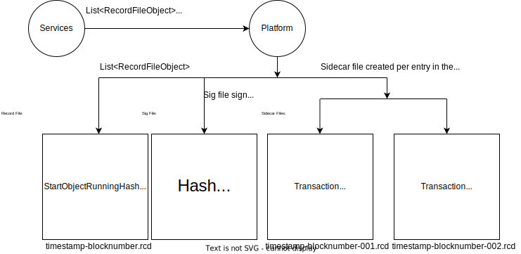

## Abstract

Updates the record file definition to be done via a protobuf.

Introduces Sidecar records - a generic way for Hedera nodes to externalise additional information about transactions that is not part of TransactionRecords.

Includes BlockNumber changes for the record files.

## Motivation

Using a protobuf definition for the record file schema is far preferable to having a custom parser or random specification someplace (currently a word doc).
Externalising verbose information about transaction executions without bloating the main TransactionRecord object with potentially unnecessary information and requiring mirror nodes to always download and process that information.

## Rationale

There are use-cases requiring a detailed and verbose output for a HAPI transaction execution. Users of Hedera should have the option to query a mirror node for this information. Meanwhile, bloating the TransactionRecords with information that would be unnecessary in most cases is not an ideal option. It is a much better design decision to create sidecar records that can be downloaded and processed only by interested parties.

**Design Goal #1**
Mirror nodes should not be required to download and process verbose transaction information. The sidecar transaction records will be externalised in separate record files.

**Design Goal #2**
One transaction can have 0, 1 or more than 1 sidecar records related to it.

**Design Goal #3**
It should be possible and relatively easy to add new types of sidecar transaction records.

## User stories

As a Hedera user, I want the to have the ability to access verbose information about transactions.

As an operator of a mirror node, I want the ability to download and process only the most important record-related information.

As an operator of a mirror node, I want the ability to download all the information about records execution that a Hedera node can provide.

## Specification

Introduce a sidecar transaction record protobuf message and a sidecar record file protobuf message to enable tracking of additional information about records execution.

### TransactionSideCarRecord

`TransactionSideCarRecord` is a protobuf which will be used to create sidecar records complementing `TransactionRecord` and storing additional information about a transaction execution.
The `TransactionSideCarRecord`s created by Hedera nodes will be externalised in a new file, part of the new RecordStream structure described bellow.

```
message TransactionSideCarRecord {
    // Consensus timestamp will be the same as the consensus timestamp of the 
    // transaction the side car is related to. This offers a convenient 
    // way to match record to sidecar. 
    Timestamp consensusTimestamp = 1;
    oneof {
      repeated ContractStateChange = 2; // Example sidecar type
      repeated ContractAction = 3; // Example sidecar type
      // Other future categories
    }
}
```

### Record Stream File Changes

A new version (V6) of the record stream file format will be created using the following protobufs:

```
message RecordFileObject {
  TransactionRecord record = 1;
  Transaction transaction = 2;
}

message RecordStreamFile {
  bytes startObjectRunningHash = 1;
  repeated RecordFileObject fileObjects = 2;
  bytes endObjectRunningHash = 3;
  uint64 blockNumber = 4;
  repeated bytes SideCarFileHash = 5; //allows multiple sidecar files to be linked to this RecordStreamFile
}

message SideCarFile {
  repeated TransactionSideCarRecord sideCarRecords = 3;
}
```

Currently Hedera nodes produce record stream files that contain a series of transactions within an interval of `hedera.recordStream.logPeriod` seconds. The record stream file (.rcd) contains a transaction record for each transaction in that file. For each record stream file there is a corresponding signature file (rcd_sig) that includes the signature generated by the node. 

A new file will be created using the SideCarFile protobuf holding all the `TransactionSideCarRecords` related to `RecordFileObject`s from the same interval of `hedera.recordStream.logPeriod` seconds.

The `SideCarFile`s will be uploaded into a separate folder. Doing so will reduce the number of rows Mirror nodes have to search in S3, reduce S3 list response size, and avoid having to filter them out locally. Probably `recordstreams/record0.0.3/sidecar`.



Platform will receive a map of number to list of sidecarrecords.

### Mirror Nodes

Mirror nodes will have the option as whether to download the side car files or not. They can download the signature files and check those like they do today, and then download the main record file like today and ignore the side car, or download the side car and main record file. In any event, mirror nodes that don’t want the side car file don’t have to download it and those that do want it, can.

## Backwards Compatibility

The added files can be ignored by clients not wishing to trace or replay smart contract transactions.

Sidecar records for prior transactions will not be created and the verbose information related to them will not be available. This reflects current practice.

## Security Implications

## How to Teach This

## Reference Implementation

## Rejected Ideas

## Open Issues

## References


## Copyright/license

This document is licensed under the Apache License, Version 2.0 -- see [LICENSE](../LICENSE) or (https://www.apache.org/licenses/LICENSE-2.0)
