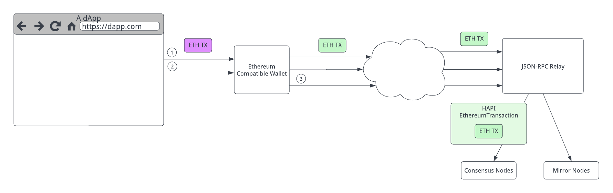

## Abstract

Define a JSON-RPC Relay for [HIP-410 Ethereum transactions](https://hips.hedera.com/HIP/hip-410.html) that implements the Ethereum JSON-RPC [standard](https://playground.open-rpc.org/?schemaUrl=https://raw.githubusercontent.com/ethereum/eth1.0-apis/assembled-spec/openrpc.json).

## Motivation

Hedera supports Ethereum compatible smart contracts. Hedera offers low predictable fees, extremely fast time to finality, and high transaction throughput. We want to make it as easy as possible for Ethereum developers to deploy to Hedera and take advantage of these incredible capabilities.

Ethereum defines a virtual machine (the EVM) and a set of JSON-RPC APIs by which clients can interact with the network and with the EVM. Wallets such as MetaMask and smart contract tooling such as Truffle make use of the JSON-RPC API. Libraries like web3.js and ethers.js work with Ethereum wallets. To simplify developer onboarding to Hedera, this HIP defines a [HIP-410 EthereumTransaction](https://hips.hedera.com/HIP/hip-410.html) relay that implements the Ethereum JSON-RPC APIs by forwarding Ethereum transactions to the consensus nodes and querying the mirror nodes. This HIP defines how such a relay can be implemented to make Hedera appear as an Ethereum compatible chain to standard Ethereum tools and applications.

Anyone can run a relay that conforms to this specification.

While this HIP specifically mentions MetaMask, it is the intention of this HIP to implement the standards in such a way as to support as many wallets, libraries, and tools as possible without having to write one-off solutions.

While this HIP will allow Ethereum wallets to work with Hedera, they still have many limitations compared with Hedera-native wallets. For example, ethereum wallets may not allow the purchase of HBAR, or the association of tokens, or key rotation, or multi-sig, or the direct use of Hedera account numbers (as noted in the specification of this HIP, Hedera account numbers have to be converted into Ethereum). For such capabilities, users may want to consider a Hedera-native wallet.

## Rationale

### Supporting Existing Ethereum Tooling

Since Hedera already supports the Ethereum EVM and Ethereum transactions, it is possible for a relay to act as an API gateway by implementing the Ethereum JSON-RPC APIs and in this way support existing tools. As Hedera bootstraps into becoming the primary deployment target for smart contracts, it is critical to reduce the friction of adoption by supporting existing tools in the Ethereum ecosystem.

### Wrapping Ethereum Transactions

[HIP-410](https://hips.hedera.com/hip/hip-410) adds support to the Hedera consensus nodes for processing Ethereum transactions directly. This support makes it possible for a relay to take raw, signed Ethereum transactions from a wallet or other tool and forward them on to the Hedera network.

### Economic Model

A JSON-RPC relay will make calls to both consensus nodes and mirror nodes, some or all of which will cost HBAR or USD to execute. There needs to be an economic model for relays for ensuring they are fairly compensated. For some applications, they may choose to run their own relay. Other applications may pay a monthly fee to the relay. Others may charge based on metering. Still others may offer a free number of uses per month and tiered pricing.

**The exact mechanism for paying a relay is outside the scope of this HIP.** A relay, or relay operator, may choose whatever mechanism works best for them.

### Connects to Consensus and Mirror Nodes

The JSON-RPC relay will connect to either consensus or mirror nodes depending on the requirements of the JSON-RPC calls. Queries will be performed against the mirror nodes or consensus nodes depending on data availability, while transactions affecting state will be performed against the consensus nodes, just as they would be for the SDK.



The above diagram shows three flows. In the first, the dApp creates a transaction to be signed by an Ethereum compatible wallet which is then sent to the JSON-RPC relay using the `eth_sendRawTransaction` API call. This transaction is wrapped by the relay and sent to the consensus nodes as a [HIP-410](https://hips.hedera.com/hip/hip-410) style HAPI Ethereum Transaction call.

The second flow shows the dApp making some other call *that does not require signing* that is routed through an Ethereum compatible wallet to the JSON-RPC relay. For example, `eth_call`.

The third flow shows calls originating from an Ethereum compatible wallet itself which also do not require signing. An example of this kind of call is `eth_getBlockByNumber`.

## User Stories

### 1. As a user, I want to use my wallet to sign some of my transactions

I am a user and I have a wallet installed. The dApp whose website I’m using has been deployed to Hedera. I want to sign transactions for this dApp using my wallet.

### 2. As a user, I want to use my wallet to transfer HBAR

I have a wallet installed and configured to work with Hedera, and I want to transfer some HBAR to another user’s account.

### 3. As a user, I want to view my HBAR balance

I have a wallet installed and configured to work with Hedera. I want to view my account balance in my wallet.

### 4. As a user, I want to use fungible tokens defined using HTS with my wallet

My Hedera account is associated with some fungible token defined through HTS. I want to add this token to my wallet so I can view my fungible account balance and transfer fungible tokens between my account and some other account on Hedera.

### 5. As a user, I want to use fungible tokens defined using ERC-20 with my wallet

Some fungible token I want to use has been defined on Hedera through the ERC-20 standard. It does not use HTS. I want to be able to view this token in my wallet, and trade it just like any other fungible token.

### 6. As a user, I want to transfer HBAR or fungible tokens with an account that has an ECDSA public key alias on the account

I have HBAR, or some other fungible tokens, and I want to trade them with an account that has an ECDSA public key as the alias on the account. I am able to easily get the address in a way that will work with Ethereum compatible wallets from an explorer or from the other user themselves (they can send me their Hedera address in an Ethereum format using their wallet, for example).

### 7. As a user, I want to transfer HBAR or fungible tokens with an account that has no alias on the account

I have HBAR, or some other fungible tokens, and I want to trade them with an account that does **not** have an alias on the account. I am able to easily get the address in a way that will work with Ethereum compatible wallets from an explorer or possibly from other wallets like HashPack.

### 8. As a user, I want a one-click solution to add a fungible token to my wallet

As a user, I want a very simple one-click solution that will add a fungible token to my wallet. For example, MetaMask requires some complex input as the token contract ID when registering a custom token. I would like my Hedera explorer of choice to be able to one-click install any HTS fungible token or smart contract token into my wallet.

### 9. As a dApp, I want to deploy contracts to Hedera using Ethereum tools

I use tools like Truffle to deploy smart contracts. I can configure my tools to use a JSON-RPC relay as the Ethereum network and submit a contract create to the network.

### 10. As a tool vendor, I can see all transactions in a block including those from HAPI

I am a tool vendor and I want to get all the smart contract calls, logs, and other data that happened in a block. I want that data to include normal HAPI `ContractCall` and `ContractCreate` calls in addition to the `EthereumTransaction` calls made by the relay. Through the JSON-RPC APIs, I should not be able to discern a difference between calls made through any relay and calls made directly using HAPI.

## Specification

### JSON-RPC Format

The [JSON-RPC specification](https://www.jsonrpc.org/specification) defines the standard format that the relay will adhere to. In the sections below, for the sake of brevity we omit the full JSON-RPC request and response payloads in favor of just documenting the request `parameters` and the response `result` or `error` fields that vary per method. The `parameters` listed are order-dependent. Below are some examples of typical requests and responses:

Request:

```json
curl https://${RELAY_ENDPOINT} -X POST -H "Content-Type: application/json" \
    -d '{"id": 1, "jsonrpc": "2.0", "method": "eth_getCode", "params": ["0x06012c8cf97bead5deae237070f9587f8e7a266d", "0x65a8db"]}'
```

Success Response:

```json
{
  "id": 1,
  "jsonrpc": "2.0",
  "result": "0x60606040..."
}
```

Error Response:

```json
{
  "id": 1,
  "jsonrpc": "2.0",
  "error": {
    "code": -32602,
    "message": "Invalid params"
  }
}
```

### Errors

The JSON-RPC Relay will use well known JSON-RPC error codes where possible. The below table lists the expected errors the relay may return:

| Name | Code | Message |
| --- | --- | --- |
| No mining work | -32000 | No mining work available yet |
| Invalid request | -32600 | Invalid request |
| Method not found | -32601 | Unsupported JSON-RPC method |
| Invalid parameters | -32602 | Invalid params |
| Internal error | -32603 | Unknown error invoking RPC |
| Parse error | -32700 | Unable to parse JSON |

### Block Number Parameter

Several functions include a `Block Number` parameter that represents the position of the block since stream start. Hedera defines a block as a grouping of transactions into a Record File in [HIP-415](https://hips.hedera.com/hip/hip-415). The block number parameter can either be a hex-encoded, non-negative integer or a string. The possible string values are:

- `latest` - The most recent block.
- `earliest`  - The very first block. Equivalent to passing the number `0`.
- `pending` - Hedera does not have pending blocks so `pending` and `latest` are equivalent.

### Transaction Types

Hedera supports a large number of [native transaction types](https://github.com/hashgraph/hedera-protobufs/blob/main/services/transaction_body.proto), but only a few of them have data that is applicable to Ethereum clients. JSON-RPC responses that relate to transactions have fields like `gas`, `gasPrice`, `input`, `nonce`, etc. that don’t apply to most Hedera transaction types. For this reason, the relay will only show `ContractCall`, `ContractCreate`, or `EthereumTransaction` transactions when returning transaction data. For example, there might be blocks with 20,000 Hedera transactions (since Hedera can do 10K TPS and blocks are currently every two seconds), but `eth_getBlockByHash` will only return the hundreds of `ContractCall`, `ContractCreate`, or `EthereumTransaction` transactions that are within that block.

### Ethereum Addresses

Ethereum transactions use a 20-byte addressing scheme. Hedera has a 24-byte addressing scheme (0.0.1234 where each element is an 8-byte signed long). Hedera also supports ECDSA (secp256k1) aliases on accounts. An “Ethereum-compliant address” in this specification is a 20-byte address, it is **not** an address on any specific Ethereum chain. In all cases where an Ethereum-compliant address is used, it will be in one of the following forms, in this order:

1. Alias encoding. If the account has a 20-byte alias set on it, this alias will be used as-is.
2. ECDSA alias encoding. If an account has an ECDSA (secp256k1) compatible key, then an alternative Ethereum-compliant address can be derived as per the algorithm defined by the Ethereum Yellow Paper.
3. Hedera account encoding. If the account has no alias matching criteria above, then the 24-byte Hedera address is converted into a 20-byte Ethereum-compliant address with the first 8 bytes being the shard number, the next 4 being the least significant bytes of the realm, followed by an 8 byte account/contract number. All bytes stored in big endian format.

This applies to account addresses and contract addresses.

### Block Hashes

Ethereum uses 32-byte hashes for blocks while Hedera uses 48-byte hashes. To compute a 32-byte Ethereum hash, take the leading 32 bytes from a 48-byte Hedera hash.

### WeiBars

The JSON-RPC API accepts and responds with gas price and value fields denoted in “WeiBars”. Please see [HIP-410](https://hips.hedera.com/hip/hip-410#value-of-gas-price-and-value-fields) for the definition of a weibar.

### Functions to Support

Ethereum does not have a rigorously defined set of APIs, nor are many of them supported by the community. Some functions, such as the various `uncle` functions, have no meaningful implementation on Hedera. The following functions **must** be supported as specified by all compliant JSON-RPC relays.


#### **eth_accounts**

We will return an empty array of accounts as the keys are held by the end users.

Parameters:

- None

Result:

- `Accounts` - An empty array `[]`.

Implementation:

The JSON-RPC relay will return a static response.


#### **eth_blockNumber**

Returns the most recent block number.

Parameters:

- None

Result:

- `Block Number` - The hex encoded, unsigned integer of the most recent block number.

Implementation:

The latest block information will be queryable via the mirror node REST API `/api/v1/blocks?limit=1&order=desc` detailed in [HIP-415](https://hips.hedera.com/hip/hip-415).


#### **eth_call**

Executes a contract call without affecting network state.

Parameters:

`Transaction Call`

- `data` - Hash of the method signature and encoded parameters.
- `from` - The 20 byte Ethereum-compliant address that originated this transaction.
- `gas` - Gas provided for the transaction execution.
- `gasPrice` - Gas price used for each paid gas.
- `maxPriorityFeePerGas` - Maximum fee in [weibars](#weibars) the sender is willing to pay per gas above the base fee.
- `maxFeePerGas` - Maximum total fee in [weibars](#weibars) the sender is willing to pay per gas.
- `to` - The 20 byte Ethereum-compliant address the transaction is directed to.
- `value` - The amount transferred in [weibars](#weibars).
- `Block Number` - See the `Block Number Parameter` section for its format.

Result:

- `value` - The return value of the contract call.

Implementation:

Initial relay implementations may choose to invoke HAPI `ContractCallLocalQuery`. Once traceability information is available to downstream systems as defined in [HIP-260](https://hips.hedera.com/hip/hip-260), relays should invoke mirror nodes to perform contract calls.


#### **eth_chainId**

Returns the configured chain ID to protect against replay attacks as noted in [EIP-155](https://eips.ethereum.org/EIPS/eip-155).

Parameters:

- None

Result:

- `Chain Id` - The current chain ID.

Implementation:

The JSON-RPC relay will return a static response. This will be a static value that is different for mainnet, testnet, previewnet, and devnet. The exact values are documented in [HIP-26](https://hips.hedera.com/hip/hip-26) under the `CHAINID` opcode.


#### **eth_coinbase**

Returns the client coinbase address. Will not be supported.

Parameters:

- N/A

Error:

- `code` -  `-32601`
- `message` - `Unsupported JSON-RPC method`

Implementation:

The JSON-RPC relay will return an error response.


#### **eth_estimateGas**

Estimates the gas needed to complete the transaction.

Parameters:

`Transaction Call`

- `data` - Hash of the method signature and encoded parameters.
- `from` - The Hedera payer account ID encoded as a 20 byte Ethereum-compliant address.
- `gas` - Gas provided for the transaction execution.
- `gasPrice` - Gas price used for each paid gas.
- `to` - The 20 byte Ethereum-compliant address of the contract to invoke.
- `value` - The amount transferred in [weibars](#weibars).

Result:

- `Gas Used` - The amount of gas used if the transaction were to be executed

Implementation:

Initial relay implementations may choose to maintain a lookup table to help provide gas price estimates. More sophisticated implementations may execute contracts based on history from the record stream, or perform statistical analysis based on the amount of gas used in previous invocations of the contract.


#### **eth_feeHistory**

Returns the base fee per gas and gas ratios.

Parameters:

- `Block count` - The number of blocks requested.
- `Newest block` - The highest number block of the range.
- `Reward percentiles` - List of percentiles used to sample from each block.

Result:

- `baseFeePerGas` - Array of block base fees per gas. Every block will have this as the actual gas price (`eth_gasPrice`).
- `gasUsedRatio` - Array of block gas used ratios. Every block will have this as hard coded to `0.5` to indicate it is neither going up or down.
- `oldestBlock` - Lowest number block in the range.
- `reward` - Array of effective priority fee per gas data. The relay may choose to calculate this or hard code it.

Implementation:

The gas price at different blocks can be retrieved from the `/api/v1/network/fees?timestamp={block.timestamp}` mirror node REST API. The exchange rate to convert the fees from tinycents to tinybars can be retrieved from the `/api/v1/network/exchangerate?timestamp={block.timestamp}` mirror node REST API.


#### **eth_gasPrice**

Returns the current price per gas.

Parameters:

- None

Result:

- `Price` - A hex-encoded integer that represents the current gas price.

Implementation:

The mirror node `/api/v1/network/fees` and `/api/v1/network/exchangerate` REST APIs will  return data the relay can use to calculate the gas price using similar logic as consensus nodes.


#### **eth_getBalance**

Return the given account’s balance.

Parameters:

- `Account` - The 20 byte Ethereum-compliant address of the account.
- `Block Number` - See the `Block Number Parameter` section for its format.

Result:

- `Balance` - The current account balance in [weibars](#weibars) or 0 if the account doesn’t exist.

Implementation:

Initial relay implementations may choose to invoke HAPI `CryptoGetAccountBalanceQuery`. Once mirror nodes can track balance information at the block level instead of the 15 minute balance file level, relays should invoke mirror nodes to query account balances via `/api/v1/accounts/{address}`.


#### **eth_getBlockByHash**

Return the block for a given block hash. [HIP-415](https://hips.hedera.com/hip/hip-415) details the block implementation.

Parameters:

- `Block Hash` - 32 byte hash of the requested block
- `Show Transaction Details Flag` - `true` returns detailed transaction information while  `false` returns only the transaction hashes. Some relay implementations may not support `true` due the number of transactions that can be contained within a Hedera block at higher TPS.

Result:

`Block` - A block object, or null when no block was found

- `baseFeePerGas` - Always zero, since there is no [EIP-1559](https://eips.ethereum.org/EIPS/eip-1559) style floating block capacity fees in Hedera.
- `difficulty` - Will return a hex encoded `0` since Hedera is not proof-of-work.
- `extraData` - Will be hardcoded to `0x`.
- `gasLimit` - The maximum gas allowed in this block.
- `gasUsed` - The cumulative gas used in this block.
- `hash` - The 32 byte block hash.
- `logsBloom` - The bloom filter for the logs within the block.
- `miner` - Will return `0x` since Hedera is not proof-of-work and multiple accounts receive block rewards.
- `mixHash` - Hardcoded to `0x`.
- `nonce` - Will return `0x` since Hedera is not proof-of-work.
- `number` - The block number.
- `parentHash` - The hash of the previous block.
- `receiptsRoot` - Will return `0x`.
- `sha3Uncles` - Hardcoded to the SHA3 computation of empty array `0x1dcc4de8dec75d7aab85b567b6ccd41ad312451b948a7413f0a142fd40d49347` since Hedera does not have an uncle concept.
- `size` - The size of this block in bytes.
- `stateRoot` - Will return `0x`.
- `timestamp` - The consensus timestamp of the first transaction in the block, with the nanoseconds part omitted.
- `totalDifficulty` - Will return a hex encoded `0` since Hedera is not proof-of-work.
- `transactions` - An array of transaction hashes or transaction objects. See `eth_getTransactionByBlockHashAndIndex` for transaction object definition. Includes only those transactions related to smart contracts, such as `ContractCall`, `ContractCreate`, and `EthereumTransaction`.
- `transactionsRoot` - Will be the same as the block `hash`.
- `uncles` - An empty array `[]` since Hedera does not have an uncle concept.

Implementation:

Any hard coded field will be provided by the relay. Non-static block information will come from the `/api/v1/blocks/{hashOrNumber}` mirror node REST API detailed in [HIP-415](https://hips.hedera.com/hip/hip-415#get-block-rest-api). The timestamp information in its response can be used to retrieve transaction details via the `/api/v1/contracts/results?timestamp=gte:{block.start}&timestamp=lte:{block.end}` mirror node REST API.

Initial relay implementations might hardcode the block `gasLimit` until throttle and block period information can be populated in the mirror node.


#### **eth_getBlockByNumber**

Return the block for a given block number. The Block implementation is detailed in a separate Block HIP.

Parameters:

- `Block Number` - See the `Block Number Parameter` section for its format.
- `Show Transaction Details Flag` - `true` returns detailed transaction information while  `false` returns only the transaction hashes. Some relay implementations may not support `true` do the number of transactions that can be contained within a Hedera block at higher TPS.

Result:

- `Block` - A block object, or null when no matching block was found. See `eth_getBlockByHash` for the block object definition.

Implementation:

The `/api/v1/blocks/{hashOrNumber}` mirror node REST API detailed in [HIP-415](https://hips.hedera.com/hip/hip-415#get-block-rest-api) will return the block information. The timestamp information in its response can be used to retrieve transaction details via the `/api/v1/contracts/results?timestamp=gte:{block.start}&timestamp=lte:{block.end}` mirror node REST API.


#### **eth_getBlockTransactionCountByHash**

Returns the number of transactions in a block, queried by hash.

Parameters:

- `Block Hash` - The 32 byte block hash.

Result:

- `Block Transaction Count` - A hex encoded count of the of transactions in the block.

Implementation:

The `/api/v1/blocks/{hashOrNumber}` mirror node REST API detailed in [HIP-415](https://hips.hedera.com/hip/hip-415#get-block-rest-api) will return the transaction count in its payload.


#### **eth_getBlockTransactionCountByNumber**

Returns the number of transactions in a block, queried by block number. The Block implementation is detailed in a separate Block HIP.

Parameters:

- `Block Number` - See the `Block Number Parameter` section for its format.

Result:

- `Block Transaction Count` - A hex encoded count of the of transactions in the block.

Implementation:

The `/api/v1/blocks/{hashOrNumber}` mirror node REST API detailed in [HIP-415](https://hips.hedera.com/hip/hip-415#get-block-rest-api) will return the transaction count in its payload.


#### **eth_getCode**

Returns the runtime bytecode associated with a contract.

Parameters:

- `Address` - The 20 byte Ethereum-compliant contract address encoded as a hex string
- `Block Number` - See the `Block Number Parameter` section for its format.

Result:

- `Bytecode` - The runtime bytecode encoded as a hex string. If address does not exist, then return `0x`.

Implementation:

Initial relay implementations may choose to invoke HAPI `ContractGetBytecodeQuery` to get the deployed bytecode. Once traceability information is available to downstream systems as defined in [HIP-260](https://hips.hedera.com/hip/hip-260), relays should first invoke `/api/v1/blocks/{number}` to get the timestamp associated with the block, then they can invoke the `/api/v1/contracts/{address}?timestamp=${block.timestamp.to}` mirror node REST API to get the deployed bytecode at the given time.


#### **eth_getLogs**

Return the logs, filtered based on the parameters.

Parameters:

`Filter`

- `address` (optional)- 20 byte Ethereum-compliant address
- `fromBlock` (optional, default is `latest`) - See the `Block Number Parameter` section for its format.
- `toBlock` (optional, default is `latest`) - See the `Block Number Parameter` section for its format.
- `topics` (optional) - Array of 32 byte topics. Topics are order-dependent.
- `blockhash` (optional) Restricts the logs returned to the single block with the 32-byte hash `blockhash`. Neither `fromBlock` nor `toBlock` are allowed when `blockhash` is present.

Result:

`Logs` - Array of log objects or an empty array if not found

- `address` - The 20 byte Ethereum-compliant contract address that generated the log
- `blockHash` - The 32 byte block hash this log is contained within.
- `blockNumber` - The block number this log is contained within.
- `data` - The non-indexed log data.
- `logIndex` - The position of the log within the block.
- `removed` - Indicates if the log has been removed. Will always be `false` for Hedera since it doesn’t have chain reorganizations.
- `topics` - An array of up to 4 indexed 32 byte topics.
- `transactionHash` - The 32 byte transaction hash.
- `transactionIndex` - The position of this transaction within the block.

Implementation:

Log information can be retrieved from either the `/api/v1/contracts/{address}/results/logs` or `/api/v1/contracts/results/logs`  mirror node REST APIs, depending upon whether `address` is populated or not. A `blockhash` can be converted to a timestamp by calling `/api/v1/blocks/{blockHashOrNumber}`. The `fromBlock` and `toBlock` can be converted to timestamps by calling `/api/v1/blocks?block.number=${fromBlock}&block.number={toBlock}`. Then the block timestamps can be passed via `timestamp=gte:{fromBlock.timestamp.from}&timestamp=lte:{toBlock.timestamp.to}` to the logs API.


#### **eth_getProof**

Hedera does not use Ethereum’s Patricia trie contract storage model, so this call will not be supported.

Parameters:

- N/A

Error:

- `code` -  `-32601`
- `message` - `Unsupported JSON-RPC method`

Implementation:

The JSON-RPC relay will return an error response.


#### **eth_getStorageAt**

Retrieves an address’ storage information.

Parameters:

- `Address` - The 20 byte Ethereum-compliant contract address encoded as a hex string
- `Storage Slot` - The storage position
- `Block Number` - See the `Block Number Parameter` section for its format.

Result:

- `Value` - The storage value.

Implementation:

Once traceability information is available to downstream systems as defined in [HIP-260](https://hips.hedera.com/hip/hip-260), relays should invoke the mirror node to return storage information. The `/api/v1/blocks/{blockNumber}` mirror node REST API maps a block number to a consensus timestamp. If the block number is `latest` or `pending`, then this API call can be omitted.

The latest contract result that occurred then be retrieved from `/api/v1/contracts/{id}/results?timestamp=lte:{block.endTimestamp}&limit=1&order=desc`. This can then be passed to `/api/v1/contracts/{id}/results/{timestamp}` to get the contract state information.


#### **eth_getTransactionByBlockHashAndIndex**

Returns transaction information by block hash and transaction index.

Parameters:

- `Block Hash` - The 32 byte block hash.
- `Transaction Index` - The position of the transaction within the block.

Result:

`Transaction` - `null` when no transaction found.

- `accessList` - Array of addresses that will be accessed. Not applicable to legacy transactions.
- `blockHash` - 32 byte hash of the containing block.
- `blockNumber` - The integer block number.
- `chainId` - The transaction’s chain ID.
- `from` - The 20 byte Ethereum-compliant address of the sender.
- `gas` - Gas provided for the transaction execution.
- `gasPrice` - Gas price used for each paid gas.
- `hash` - 32 byte hash of the transaction.
- `input` - Transaction input data.
- `maxPriorityFeePerGas` - Maximum fee in [weibars](#weibars) the sender is willing to pay per gas above the base fee.
- `maxFeePerGas` - Maximum total fee in [weibars](#weibars) the sender is willing to pay per gas.
- `nonce` - The transaction nonce for the sender.
- `r` - The 32 byte ECDSA signature r.
- `s` - The 32 byte ECDSA signature s.
- `to` - The 20 byte EVM address of the contract to invoke.
- `transactionIndex` - The position of this transaction within the block
- `type` - The Ethereum transaction type. Only legacy and [EIP-1559](https://eips.ethereum.org/EIPS/eip-1559) transaction types are currently supported.
- `v` - ECDSA recovery ID.
- `value` - The amount transferred in [weibars](#weibars).

Implementation:

The `/api/v1/contracts/results?block.hash=0x01&transaction.index=3` mirror node REST API can be used to find the consensus timestamp and contract ID of the transaction and passed to `/api/v1/contracts/{id}/results/{timestamp}` to get the contract transaction details.


#### **eth_getTransactionByBlockNumberAndIndex**

Returns transaction information by block number and transaction index.

Parameters:

- `Block Number` - See the `Block Number Parameter` section for its format.
- `Transaction Index` - The position of the transaction within the block.

Result:

- `Transaction` - `null` when no transaction found. See `eth_getTransactionByBlockHashAndIndex` for field definitions.

Implementation:

The `/api/v1/contracts/results?block.number=1&transaction.index=3` mirror node REST API can be used to find the consensus timestamp and contract ID of the transaction and passed to `/api/v1/contracts/{id}/results/{timestamp}` to get the contract transaction details.


#### **eth_getTransactionByHash**

Return the transaction for a given block hash. Block implementation is detailed in a separate [HIP-415](https://hips.hedera.com/hip/hip-415).

Parameters:

- `Transaction Hash` - 32 byte hash of the transaction encoded as a hex string

Result:

- `Transaction` - `null` when no transaction found. See `eth_getTransactionByBlockHashAndIndex` for field definitions.

Implementation:

The `/api/v1/contracts/results/{transactionIdOrHash}` mirror node REST API can be queried to retrieve the transaction information by hash.


#### **eth_getTransactionCount**

Return the number of transactions sent from an address.

Parameters:

- `Address` - The 20 byte Ethereum-compliant externally owned account address encoded as a hex string
- `Block Number` - See the `Block Number Parameter` section for its format. Only `latest` or `pending` values are supported.

Result:

- `Count` - A hex code of the integer representing the number of transactions sent from this address.

Implementation:

Account nonce depends upon [HIP-410](https://hips.hedera.com/hip/hip-410) being fully implemented. The `/api/v1/accounts/{address}` mirror node REST API can be used to find the account nonce. Historical nonce values are not supported.


#### **eth_getTransactionReceipt**

Return the receipt of a transaction by transaction hash. ****

Parameters:

- `Transaction Hash` - 32 byte hash of the transaction encoded as a hex string

Result:

`Transaction Receipt` - `null` when no transaction found.

- `blockHash` - 32 byte hash of the containing block.
- `blockNumber` - The integer block number.
- `contractAddress` - The 20 byte Ethereum-compliant contract address or null if this was not a contract creation.
- `cumulativeGasUsed` - The total amount of gas used by this block across all transactions.
- `effectiveGasPrice` - The value per gas deducted from sender.
- `from` - The 20 byte Ethereum-compliant address of the sender.
- `gasUsed` - Gas used for the transaction execution.
- `logs` - An array of logs objects.
- `logsBloom` - The 256 byte bloom filter associated with the logs for this transaction.
- `status` - `1` for success or `0` for failure.
- `to` - The 20 byte Ethereum-compliant address that is the target of this transaction
- `transactionHash` - 32 byte hash of the transaction.
- `transactionIndex` - The position of this transaction within the block
- `type` - The Ethereum transaction type. Only legacy and [EIP-1559](https://eips.ethereum.org/EIPS/eip-1559) transaction types are currently supported.

Note `root` property will not be present since it’s for a legacy version of Ethereum

Implementation:

Ethereum transaction information can be retrieved from the  `/api/v1/contracts/results/{transactionIdOrHash}` mirror node REST API.


#### **eth_getUncleByBlockHashAndIndex**

Return uncle information about a block by hash and index. Since Hedera does not have an uncle concept, this method will return an empty response.

Parameters:

- `Block Hash` - The 32 byte block hash.
- `Uncle Index` - The position of the uncle.

Result:

- `Uncle Block` - Always returns `null` to indicate not found.

Implementation:

The JSON-RPC relay will return a static response.


#### **eth_getUncleByBlockNumberAndIndex**

Return uncle information about a block by number and index. Since Hedera does not have an uncle concept, this method will return an empty response.

Parameters:

- `Block Number` - See the `Block Number Parameter` section for its format.
- `Uncle Index` - The position of the uncle.

Result:

- `Uncle Block` - Always returns `null` to indicate not found.

Implementation:

The JSON-RPC relay will return a static response.


#### **eth_getUncleCountByBlockHash**

Return the number of uncles in a block by hash. Since Hedera does not have an uncle concept, this method will return a static response.

Parameters:

- `Block Hash` - The 32 byte block hash.

Result:

- `Count` - The number of uncles in the block. Will always return `0x0`.

Implementation:

The JSON-RPC relay will return a static response.


#### **eth_getUncleCountByBlockNumber**

Return the number of uncles in a block by number. Since Hedera does not have an uncle concept, this method will return a static response.

Parameters:

- `Block Number` - See the `Block Number Parameter` section for its format.

Result:

- `Count` - The number of uncles in the block. Will always return `0x0`.

Implementation:

The JSON-RPC relay will return a static response.


#### **eth_getWork**

Returns the mining work information. Since Hedera is a proof-of-stake network, this method is not applicable.

Parameters:

- None

Error:

- `code` -  `-32000`
- `message` - `No mining work available yet`

Implementation:

The JSON-RPC relay will return a non-fatal error response.


#### **eth_hashrate**

Returns the current hash rate nodes are mining. Since Hedera is a proof-of-stake network, this method is not applicable and will return a static response.

Parameters:

- None

Result:

- `Rate` - The hashes per second. Always returns `0x0`.

Implementation:

The JSON-RPC relay will return a static response.

#### **eth_maxPriorityFeePerGas**

Returns a fee per gas that is an estimate of how much you can pay as a priority fee, or 'tip', to get a transaction included in the current block.

Parameters:

- None

Result:

- `Priority Fee` -  Hex value of the priority fee needed to be included in a block. Will always return `0x0`.

Implementation:

The JSON-RPC relay will return a static response.

#### **eth_mining**

Returns whether the client is mining. Since Hedera is a proof-of-stake network, this method is not applicable and will return a static response.

Parameters:

- None

Result:

- `Mining` - A boolean that indicates if the client is mining. Always `false`.

Implementation:

The JSON-RPC relay will return a static response.


#### **eth_protocolVersion**

Returns the current ethereum protocol version. Will not be supported as Hedera doesn’t use the Ethereum node communication protocol.

Parameters:

- None

Error:

- `code` -  `-32601`
- `message` - `Unsupported JSON-RPC method`

Implementation:

The JSON-RPC relay will return an error response.


#### **eth_sendRawTransaction**

Submits a transaction to a consensus node.

Parameters:

- `Transaction Data` - The signed transaction data.

Result:

- `Transaction Hash` - 32 byte hash of the transaction encoded as a hex string

Implementation:

A new `EthereumTransaction` HAPI will be added to consensus nodes as defined in [HIP-410](https://hips.hedera.com/hip/hip-410). This transaction will wrap the transaction data and be signed by the JSON-RPC relay.


#### **eth_sendTransaction**

Requests the node to sign and send a transaction. Will not be supported since Hedera does not store the user’s private keys.

Parameters:

- N/A

Error:

- `code` -  `-32601`
- `message` - `Unsupported JSON-RPC method`

Implementation:

The JSON-RPC relay will return an error response.


#### **eth_sign**

Requests the node to sign a message. Will not be supported since Hedera does not store the user’s private keys.

Parameters:

- N/A

Error:

- `code` -  `-32601`
- `message` - `Unsupported JSON-RPC method`

Implementation:

The JSON-RPC relay will return an error response.


#### **eth_signTransaction**

Requests the node to sign a transaction. Will not be supported since Hedera does not store the user’s private keys.

Parameters:

- N/A

Error:

- `code` -  `-32601`
- `message` - `Unsupported JSON-RPC method`

Implementation:

The JSON-RPC relay will return an error response.


#### **eth_signTypedData**

Will not be supported. Will not be supported since Hedera does not store the user’s private keys.

Parameters:

- N/A

Error:

- `code` -  `-32601`
- `message` - `Unsupported JSON-RPC method`

Implementation:

The JSON-RPC relay will return an error response.


#### **eth_submitHashrate**

Used to submit the mining hash rate. Since Hedera is a proof-of-stake network, this method is not applicable.

Parameters:

- N/A

Error:

- `code` -  `-32601`
- `message` - `Unsupported JSON-RPC method`

Implementation:

The JSON-RPC relay will return an error response.


#### **eth_submitWork**

Used for proof-of-work submission. Since Hedera is a proof-of-stake network, this method is not applicable and will return a static response.

Parameters:

- `Work Array` - The nonce, header, and digest array elements.

Result:

- `Valid` - Will always return `false`.

Implementation:

The JSON-RPC relay will return a static response.


#### **eth_syncing**

Returns the sync status of the network. Due to the nature of hashgraph, it is always up to date.

Parameters:

- None

Result:

- `Sync Status` - Will always return `false`.

Implementation:

The JSON-RPC relay will return a static response.


#### **net_listening**

Always return false as the JSON-RPC relay is not listening for connections.

Parameters:

- None

Result:

- `Boolean` - Will always return `false`.

Implementation:

The JSON-RPC relay will return a static response.


#### **net_peerCount**

Will not be supported.

Parameters:

- N/A

Error:

- `code` -  `-32601`
- `message` - `Unsupported JSON-RPC method`

Implementation:

The JSON-RPC relay will return an error response.


#### **net_version**

Will not be supported.

Parameters:

- N/A

Error:

- `code` -  `-32601`
- `message` - `Unsupported JSON-RPC method`

Implementation:

The JSON-RPC relay will return an error response.


#### **parity_nextNonce**

Will not be supported.

Parameters:

- N/A

Error:

- `code` -  `-32601`
- `message` - `Unsupported JSON-RPC method`

Implementation:

The JSON-RPC relay will return an error response.


#### **web3_client_version**

We return the JSON-RPC relay version number.

Parameters:

- None

Result:

- `String` - version of relay

Implementation:

The JSON-RPC relay will return a static response.


#### **web3_sha**

Will not be supported.

Parameters:

- N/A

Error:

- `code` -  `-32601`
- `message` - `Unsupported JSON-RPC method`

Implementation:

The JSON-RPC relay will return an error response.

#### Other

Any other JSON-RPC method not explicitly listed above will return an error code `-32601` and an error message `Unsupported JSON-RPC method`.

## Backward Compatibility

There are no sources of backward incompatibility as this HIP introduces new functionality to the Hedera ecosystem.

With consideration for Ethereum Transaction type formats - the Relay will provide compatibility for Legacy transactions with a ChainID and EIP-1559 transactions.

## Security Implications

The JSON-RPC relay does not sign or co-sign the submitter’s transactions. It is **not** a custodian. The only thing a malicious relay can do is fail to submit the user’s transaction or delay sending it. The signed user transaction contains a nonce making it impossible for the relay to execute a replay attack. A relay that sent the same request multiple times can only hurt itself. Thus, end users place some level of trust in the relay that their transaction will be forwarded onto the network, but that is all. A “trust but verify” approach should prove sufficient where the user can submit a transaction and verify its successful execution. If they are dissatisfied with the relay, they can choose another. This is no different than with other chains where there is no guarantee that a transaction submitted into the memory pool of a particular node will ever get retransmitted to the network.

A JSON-RPC relay must have an account on the network and must pay for the submission of messages. The relay must therefore have access to the private key for signing those transaction submissions. Operators wishing to run a JSON-RPC relay will need to have a strong security posture to protect that key. Since the relay is non-custodial, customer funds will **never** be at risk of a compromised or malicious relay. However, the relay operator itself may be drained of funds if the relay is compromised. Specific recommendations for securing a relay are out of scope for this HIP.

There is also a risk that wallets that are closely aligned with Ethereum’s standards may post extra transactions that may not be processable, for example to deal with the Ethereum standard way to cancel transactions and “speed up” execution in the memory pool (since with Hedera submitted transactions do not wait in a memory pool and therefore cannot be canceled or sped up!). Wallets may develop new methods to cope that may take some time for server code to properly adapt to.  Operators are encouraged to have robust monitoring of failed and rejected transactions and follow up on any observed spikes.

## How to Teach This

Existing dApps and wallets native to other networks can leverage their existing codebase to integrate with the Hedera ecosystem with minimal changes necessary. The documentation for the relay will emphasize the steps necessary for apps to port their code to take advantage of this new JSON-RPC API.

Additionally, insights will be provided through:

- Mention in an Engineering Insights session
- Demo video highlighting end to end use case

## Reference Implementation

[https://github.com/hiero-ledger/hiero-json-rpc-relay](https://github.com/hiero-ledger/hiero-json-rpc-relay)

## Rejected Ideas

- Consensus nodes to implement some or all of the JSON-RPC APIs. This was rejected since consensus nodes do not maintain historical information to respond to requests. There’s only a few that don’t request past data so it would be a large burden for nodes to maintain two sets of APIs just for a few Ethereum methods.
- The mirror node would implement every JSON-RPC API with direct calls to its database, redirecting to HAPI if it required a transaction on the network. This was not feasible because not every relay operator wanted the burden of running a mirror node and because some operations would be paid for by the relay operator.

## Open Issues

None

## References

- [JSON-RPC Specification](https://www.jsonrpc.org/specification)
- [Ethereum JSON-RPC APIs](https://eth.wiki/json-rpc/API)
- [Infura JSON-RPC APIs](https://docs.infura.io/infura/networks/ethereum/json-rpc-methods)
- [EIP-155: Simple replay attack protection](https://eips.ethereum.org/EIPS/eip-155)
- [EIP-1559: Fee market change for ETH 1.0 chain](https://eips.ethereum.org/EIPS/eip-1559)
- [HIP-26: Migrate Smart Contract Service EVM to Hyperledger Besu EVM](https://hips.hedera.com/hip/hip-26)
- [HIP-260 Smart Contract Traceability](https://hips.hedera.com/HIP/hip-260)
- [HIP-410 Wrapped Ethereum Transaction](https://hips.hedera.com/hip/hip-410)
- [HIP-415 Introduction of Blocks](https://hips.hedera.com/hip/hip-415)

## Copyright and License

This document is licensed under the Apache License, Version 2.0 -- see [LICENSE](../LICENSE) or ([https://www.apache.org/licenses/LICENSE-2.0](https://www.apache.org/licenses/LICENSE-2.0))

