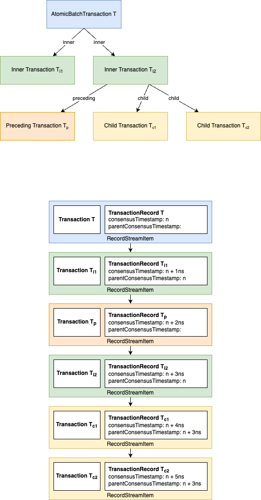

## Abstract

This HIP defines a mechanism to execute batch transactions such that a series of transactions (HAPI calls) depending on each other can be rolled into one transaction that passes the ACID test (atomicity, consistency, isolation, and durability).

## Motivation

The existing implementation of transactions in the Hedera network does not allow multiple HAPI transactions to be called in one single network transaction that would have all the ACID properties. This makes it impossible to create more complicated flows without using smart contracts (which do not support all the HAPI transactions at this point) and querying the mirror node to check the status of the previous transaction.

This approach will abstract away the need for smart contracts in certain cases, simplifying development and offering better user experiences by ensuring that all or none of the grouped transactions are applied. This feature will provide enhanced security for transactions that require an atomic execution flow.

## Rationale

Introducing a feature that allows grouped HAPI transactions to execute atomically within a single network transaction will enable use-cases for native services, thereby simplifying development workflows. It will ensure that grouped transactions are either fully applied or fully rolled back, enhancing both security and the user experience by streamlining development and preventing partial executions or inconsistencies in critical transaction flows. This will guarantee a malicious user cannot inject a new transaction in between the execution of the original transactions (cannot perform a sandwich attack).

The primary audiences for batch transactions are developers and dApps.  The ability for developers and dApps to execute atomic transactions across different services on Hedera enables more flexibility and certainty when executing complex use cases.

## User Stories

### Use Case 1: Account-bound NFTs

As a Hedera Token Service user, I want to be able to unfreeze an account, send an NFT, and freeze the account again in one ACID transaction to create an account-bound NFT collection, without using the smart contract service. This could be used to issue nontransferable NFTs as digital references or achievements.

### Use Case 2: Account-bound FTs

I want to unfreeze an account, send fungible tokens (FT), and freeze it again in one ACID transaction to create account-bound FT collections, such as game points or reputation points.

### Use Case 3: Complex Token Flows

I want to batch multiple token operations, such as wiping, minting, and transferring tokens, into one ACID transaction to avoid handling partially successful transactions.

### Use Case 4: Cross-Service Batch

I want to wipe a token, mint a token, transfer a token, and submit a topic message in one ACID transaction to enable complex flows across different Hedera services without smart contracts.

### Use Case 5: Gift Token with Mint

I want to mint and transfer tokens in one ACID transaction when gifting tokens to a user, simplifying the process and avoiding the need for separate transactions.

### Use Case 6: Revoke KYC and Wipe Tokens

I want to batch KYC granting, token wiping, and KYC revoking into one ACID transaction to avoid situations where tokens are transferred from a revoked KYC account before I can wipe them.

### Use Case 7: Batch Key Approval Workflow

As a Hedera network user managing multiple transactions with sensitive permissions, I want to enforce that a specific trusted entity (batch key holder) approves an entire batch transaction before it is submitted. This allows for a streamlined, secure approval process for high-stakes transactions, ensuring only authorized batches are executed in scenarios such as account fund transfers, asset movements, or sensitive permission updates.

## Specification

### Transaction Integrity

1. Each inner transaction within a batch should be treated as a self-contained transaction.
2. If an inner transaction fails, preceding transactions that succeeded will still incur fees, even though their effects are not committed.
3. Inner transactions are individually signed regular transactions indicating that once a person signs an inner transaction, they have agreed to its outcome.

### Batch Signatures

- Batch transactions require unique signatures for the batch itself. Inner transactions cannot be rearranged post-signature.
- When someone signs a transaction, they individually agree to the outcome, thus the individual transaction signers within the batch need not sign the batch itself.

### BatchKey Introduction

- To prevent malicious actors from tampering with a batch (e.g., removing, reordering, or adding transactions), a  `batchKey` will be introduced in the `TransactionBody`.
- The `batchKey` signals the trusted signer who can finalize the batch. This key ensures that batch transactions can only be submitted as a whole and prevents individual transactions from being executed outside the batch context.
- `batchKey` is required for all inner transactions. Any batch which contains an inner transaction without a `batchKey` set to a valid public key will be rejected.
- The top-level `AtomicBatchTransactionBody` must be signed by all `batchKey` keys specified in the included transactions. i.e. if inner transaction X sets `batchKey` X and inner transaction Y sets `batchKey` Y then their containing AtomicBatch transaction must be signed by both `batchKey` X and `batchKey` Y private keys.
- `batchKey` is not allowed to be set on a transaction that is not an inner transaction. Any top-level transaction that has a value set for `batchKey` will be rejected.

### Inner vs Outer Transactions

Inner transactions, by design:

 1. Are signed individually.
 2. Each pays for itself (node + network + service fees).
 3. Have their own payer.
 4. Are deduplicated on an individual basis. If two inner transactions within the same batch have the same `TransactionID`, the transaction will be rejected.
 5. `TransactionID` of an inner transaction has `scheduled`=`false` and `nonce`=`0`.
 6. Are authorized solely by their keys; batch keys are not used for authorization.
 7. Cannot be batch transactions. A batch transactions cannot contain another batch transaction.
 8. Cannot be network freeze transactions, but may be other privileged transactions.
 9. Must have nodeAccountID set to 0.0.0. This acts as a marker to indicate that an inner transaction is part of a batch, and it allows resubmitting a batch transaction without the need to re-sign the inner transactions. 
10. Must set batchKey.

The AtomicBatch outer transaction:

1. Has its own payer and signatures.
2. Considers inner transactions as part of its signed bytes.
3. Makes the batch payer cover node+network fees for handling the batch, excluding inner transaction fees.
4. Has deduplication based on its unique transaction ID.
5. The submitter does not need to be authorized to carry out all the inner batch transactions as with every transaction in Hedera. The submitter can be any account as long as the transaction is properly signed.
6. Must not set batchKey.
7. Must not be scheduled to run at a future time via ScheduleCreate.
8. Must contain at least one inner transaction.

### Batch Transaction Processing and Output

- The batch transaction will be processed as a single unit. If any inner transaction fails, the entire batch will fail.
- The batch transaction will return a single transaction response as usual. In general, inner transactions are not checked during pre-check.
- The batch transaction and all executed inner transactions create TransactionReceipts. In order to see response codes for inner transactions, the user must query the individual inner transactions receipts.
- Transaction records for inner transactions will have the `parentConsensusTimestamp` set to the `consensusTimestamp` of the containing AtomicBatch transaction. The `parentConsensusTimestamp` can be used to correlate all transaction records for the batch. Block streams are handled similarly.

The following diagram illustrates the relationship between the transactions and the produces record stream:



The `AtomicBatchTransaction T` has two inner transactions <code>T<sub>i1</sub></code> and <code>T<sub>i2</sub></code>.
The second inner transaction <code>T<sub>i2</sub></code> has one preceding transaction <code>T<sub>p</sub></code> and two child transactions <code>T<sub>c1</sub></code> and <code>T<sub>c1</sub></code>.
The resulting record stream is illustrated below. 
A `RecordStreamItem` is generated for each transaction and ordered according to the execution order.
The `consensusTimestamp` is counted in nanoseconds relative to the user transaction `T`.
The `parentConsensusTimestamp` is set to the `consensusTimestamp` of the parent transaction.

Block streams are handled similarly with a sequence of `BlockItems` of type `EventTransaction`, `TransactionResult`, and eventually `TransactionOutput` and `StateChanges` for each transaction.

### Batch Transaction Fees
- The cost to run a batch transaction includes fees for the AtomicBatch outer transaction and also fees for each inner transaction. Outer and inner transactions are charged separately and may have different payers. Each inner transaction is charged separately and may have a different payer from other transactions in the batch.
- The fees for inner transactions will be the same as if they were submitted individually.
- Inner transactions that are processed will be charged the regular fees for their transaction type, even if the batch fails. For example, suppose we have a batch that contains inner transactions A B and C. B fails which causes the batch to be rolled back. They are charged as follows:
    - Inner transaction A: succeeds (but is later rolled back), is charged regular fees for this transaction type
    - Inner transaction B: fails, is charged regular fees for this transaction type
    - Inner transaction C: does not run because the batch failed, is not charged any fees
- AtomicBatch outer transaction fees are charged regardless of whether the transaction succeeds or fails.

### Protobuf Changes

A batchKey will be added to the TransactionBody. In addition, the TransactionBody will include a new AtomicBatchTransactionBody. 

```protobuf
message TransactionBody {
    // Existing properties omitted.

   /**
    * The <b>entire public key</b> of the trusted batch assembler.
    *
    * Only Ed25519 and ECDSA(secp256k1) keys and hence signatures are currently supported.
    */
    Key batchKey = 73;

    oneof data {
      // Existing values omitted.

      AtomicBatchTransactionBody atomicBatch = 72;
    }
}

```

The AtomicBatchTransactionBody will contain the transaction(s) that make up the batch.

```protobuf
message AtomicBatchTransactionBody {
    repeated Transaction transactions = 1;
}

```

New ResponseCodeEnum values will be added to indicate the completion status of the batch transaction:
```protobuf
 /**
  * The list of batch transactions is empty
  */
  BATCH_LIST_EMPTY

 /**
  * The list of batch transactions contains duplicated transactions
  */
  BATCH_LIST_CONTAINS_DUPLICATES

 /**
  * The list of batch transactions contains null values
  */
  BATCH_LIST_CONTAINS_NULL_VALUES

 /**
  * An inner transaction within the batch failed
  */
  INNER_TRANSACTION_FAILED
```

### Security Enhancements

1. The batch transaction system prevents malicious actors from tampering with transactions by requiring them to be processed as a single unit.
2. A `batchKey` ensures only the trusted assembler (e.g., Alice) can create a valid batch. Nodes attempting to disassemble the batch or alter it will invalidate the transaction.

### Limits on Batch Size
- The maximum number of transactions in a batch will be limited by a configuration parameter.
- The maximum number of transactions in a batch is also limited by the maximum proceeding child transactions (50 at the moment, set in ConsensusConfig.handleMaxFollowingRecords). 
- The maximum bytes of the batch transaction must not exceed the maximum transaction size (currently 6k), including the size of the inner transactions and the batch transaction itself.
- All inner transactions must execute within the standard `transactionValidStart` and `transactionValidDuration` (typically 3 minutes) to ensure they remain valid during batch processing.
- Batch transactions are throttled in the general bucket. Each inner transaction will be checked against the throttles for that transaction type.

### MAPI (Mirror Node API)
- Update all endpoints with a transaction response to include the batch key for inner transactions
```json
{
  "transactions": [
    {
      "batch_key": {
        "_type": "ED25519",
        "key": "84e9575e7c9c3f5c553fb4c54e5dc408e41a1d58c12388bea37d7d7365320f6f"
      }
    }
  ]
}
```
- Update `/api/v1/transactions/{transactionId}` to return inner transactions when `transactionId` is the id of the batch
  transaction.
  
### SDK Design

With the addition of a new transaction, a new API class will need to be added to all SDKs. This will simply be called `BatchTransaction`.
The class will derive from `Transaction` to retain important transaction properties, while also adding properties to allow a user to add `Transaction`s to the batch.

```
class BatchTransaction : Transaction {
    /**
     * Set the list of transactions to be executed as part of this BatchTransaction.
     */
    BatchTransaction setTransactions(List<Transaction>);

    /**
     * Append a transaction to the list of transactions this BatchTransaction will execute.
     */
    BatchTransaction addTransaction(Transaction);

    /**
     * Get the list of transactions this BatchTransaction is currently configured to execute.
     */
    List<Transaction> getTransactions();

    /**
     * Get the list of transaction IDs of each inner transaction of this BatchTransaction. **NOTE**: this will return undefined data until the transaction IDs for each inner transaction actually get generated/set (i.e. this BatchTransaction has been executed). This is provided to the user as a convenience feature in case they would like to get the receipts of each individual inner transaction.
     */
    List<TransactionId> getInnerTransactionIds();
}
```

It's important to note that transactions should not be added to the `BatchTransaction` until they are fully complete and ready to be executed. This includes any necessary signatures that should be applied to the transactions.

The `BatchKey` will also need to be added to the `Transaction` class.

```
class Transaction {
    ...

    /**
     * Set the key that will sign the batch of which this Transaction is a part.
     */
    Transaction setBatchKey(Key);

    /**
     * Get the key that will sign the batch of which this Transaction is a part.
     */
    Key getBatchKey();

    ...
}
```

## Backward Compatibility

This proposal is backward compatible with existing Hedera transaction models, as it introduces a new message type for batch transactions without changing current transaction structures.

## Security Implications

Security is reinforced by ensuring that inner transactions cannot be executed outside the batch and by preventing malicious nodes from modifying batch transactions. The use of a `batchKey` ensures that only the trusted entity can assemble and submit the batch.

## Rejected Ideas

Conditional branching within batch transactions was rejected as it would introduce unnecessary complexity without significant value for the proposed use cases. Conditional branching in transaction chains determines the next transaction to execute (A or B) based on whether the previous transaction succeeded or failed.
Ex:
```bash
Tx1 --Success--> TxA
Tx1 --Failure--> TxB
```

## Open Issues

The need to return details of failed transactions when a batch fails remains an open issue, as partial failures within the batch might require specific information to be returned to the user for debugging and recovery.
