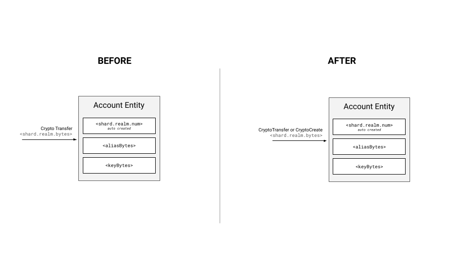

Abstract
------------------------------------------------------------------------------------------------------------------------

Formalize support for an ECDSA-derived `alias`, and permit all accounts to be created with an `alias`.

Motivation
------------------------------------------------------------------------------------------------------------------------

Each account has a system-assigned account ID of the form `shard.realm.num`, where each value is an 8-byte number.
[HIP 32](https://hips.hedera.com/hip/hip-32) defines a flow where, when transferring HBAR to an account, the "sender"
can send to an `alias` for the account instead of the account number, where the `alias` is an encoding of the public
key of the account. If there is an account with that `alias`, then the transfer succeeds. If the account does not exist,
then it will be auto-created with the public key of the account matching that of the `alias` and the transfer succeeds.

With [HIP 482](https://hips.hedera.com/hip/hip-482), Hedera now supports an integration path with Ethereum-native
wallets, where those wallets can talk with the JSON-RPC Relay, which talks to the Hedera network. These wallets work
under the assumption that all accounts are identified by a 20-byte number. If a user is using an Ethereum-native
wallet such as MetaMask, they cannot send hbars to a `shard.realm.num` account ID, they must send it to a 20-byte
address.

Every account in Hedera has an Ethereum compatible 20-byte `alias` (known as the "long zero" `alias` since it is
prefixed by many zeros), and an Ethereum-native wallet using the JSON-RPC relay **can** use that to send value to
existing accounts with no modification to the existing accounts. However, what if a user wants to transfer value
(hbars or tokens) to an account that doesn't yet exist? The Ethereum-native wallet cannot use the Hedera-specific
key encoding defined in `HIP-32` because it is Hedera-specific. Rather, they need support for a new type of alias.

In Ethereum, addresses are derived from an `ECDSA secp256k1` public key. Transferring value from one account to another
involves a crypto transfer from one derived account address to another, and the target account is "auto created"
if it did not previously exist. The holder of the `ECDSA secp256k1` key that corresponds to that derived address can
use that new account since any transaction they sign will be signed by that key. 

This HIP allows _any_ new account on Hedera to have an `ECDSA` derived `alias`, compatible with Ethereum addresses, and
permits the use of this `alias` for all operations supported by `alias` today. This HIP expands support in the
auto-create flow for `ECDSA` derived addresses to be used as the `alias`. It also adds support to `CryptoCreate`
transactions for creation with an `ECDSA` derived `alias`.

Rationale
------------------------------------------------------------------------------------------------------------------------

Fundamental in the design of the Hedera network are the concepts of _accounts_, account _identifiers_, and _keys_. These
are fundamentally different entities. Today, a user `Account` must have a key. The key for the account may be a simple
key (typically, an `ED25519` public key), or it may be a compound key, such as a list of keys all of which must sign
each transaction, or a threshold key such that N of the keys must be signed. These may be nested to create very rich and
powerful accounts requiring multiple-signatures. Further, an `Account` may change the keys on the account over time.

As previously mentioned, an `Account` also has a system-assigned account identifier of the form `shard.realm.num`, where each value is an 8-byte
number. An `Account` may also be referred to with an identifier of the form `shard.realm.alias`, where the alias is of
one of the following forms:

1. `account-num alias` - This is the Hedera account number styled as an Ethereum account hex string. The
   Hedera account number is hex encoded and the value is prefixed with zeros to form a 20 byte address. This format
   cannot be used to auto-create an account, but can be used wherever an `alias` can be used. This is sometimes
   referred to as the "long-zero" alias, since the leftmost 12 bytes are 0.
2. `key alias` - This format is created by using the bytes of a simple cryptographic public key supported by Hedera
   (such as `ED25519` or `ECDSA secp256k1`). It is not necessary for the account's key to match the `alias`, only that
   the account owner has asserted cryptographic proof of ownership of the account `alias` key in addition to the
   account key. The key is protobuf-encoded and those raw bytes are included in the `alias`.
3. `evm address alias` - This format is created by using the rightmost 20 bytes of the 32 byte `Keccak-256` hash of an
   `ECDSA secp256k1` public key. This calculation is in the manner described by the Ethereum Yellow Paper.
   Note, that the recovery id is not formally part of the public key and not included in the hash. This is
   calculated on the consensus nodes using the `ECDSA` key bytes in the `alias` provided in the auto create `CryptoTransfer` transaction.
   While both `evm address alias` and `account-num alias` are 20 byte values, they can be differentiated by the fact
   that `account-num alias` is always prefixed with 12 bytes. The likelihood of randomly generated ECDSA keys, being
   hashed, having 12 sequential zeros is very low. Those keys, should they be found, cannot be used on the network.
4. All accounts will have a derived `account-num alias` but all account _may_ have a `key alias` or `evm address alias`.

From the perspective of the Ethereum ecosystem, the `account-num alias` and `evm address alias` are both
directly usable when prefixed with `0x`. Examples of each format are noted below:
(Please NOTE: the `alias` is a binary format when encoded on-wire for protobuf. We represent the bytes as hexidecimal
ASCII for clarity in the documentation, but in reality these are raw bytes)

| Identifier Type           | Account ID Example (Protobuf)                                            | Ethereum Address Example (String)          |
|---------------------------|--------------------------------------------------------------------------|--------------------------------------------|
| Hedera Account ID         | 0.0.10                                                                   | N/A                                        |
| Hedera Account Num Alias  | 0.0.000000000000000000000000000000000000000a                             | 0x000000000000000000000000000000000000000a |
| Hedera Key Alias          | 0.0.1220d75a980182b10ab7d54bfed3c964073a0ee172f3daa62325af021a68f707511a | N/A                                        |
| EVM Address Alias         | 0.0.b794f5ea0ba39494ce839613fffba74279579268                             | 0xb794f5ea0ba39494ce839613fffba74279579268 |

It is **not** possible to specify an `account-num alias` in either crypto transfer or account creation transactions.
Any attempt to specify the alias using the `account-num alias` format will be detected and rejected by the system.
The `account-num alias` is automatically assigned to an account based on its account number, and this number is
automatically assigned by the system when the entity is created. Thus, the `account-num alias` cannot be specified.

In the extremely unlikely event that a user creates an account with an `ECDSA` key that derives to a evm address with leading zeros
which makes it indistinguishable from an `account-num alias`, the account will not be created and the transaction will be rejected.

For example, while using an Ethereum-native wallet, I may transfer to an `account-num alias` address, and if that
account exists, the transaction will succeed. if the account does not exist, the transfer will fail, since the
account could not be auto-created.

To provide greater context for this HIP some additional terms are useful:

- `Ethereum-native wallets` - wallets that utilize the Ethereum JSON-RPC APIs implemented by the JSON-RPC Relay.
  Accounts created via these wallets are `ECDSA` derived keys and use the `evm address alias` format.
- `Hedera-native wallets` - wallets that utilize the Hedera SDK or gRPC HAPI calls to interact with Hedera consensus
  and mirror nodes. Historically, accounts created via these wallets are `ED25519` based and usually identify the
  account via the `Hedera Account Id` and may support all types of `alias`.
- `Hollow account` - a partially created account which lacks a public key but does have a valid `shard.realm.num`
  ID _and_ is auto-created with an `evm address alias`. Such an account may receive assets but may not take
  part in transactions that require its signature, until it is promoted to being a "full" account.
- `auto-create` - an account creation flow in which the `key alias` or `evm address alias` that a crypto-transfer
  is addressed to is used to automatically create a new account (if none exists) without an explicit `CryptoCreate`
  transaction being submitted. We call it `hollow-create` when the `evm address alias` is used, since it results
  in the creation of a `Hollow account`. When a user sends a transaction requiring this account, then it will be
  updated to a "full" account, with the account key set to match the `evm address alias`.

### Crypto Transfers

With an Ethereum-native wallet, you can transfer the native currency (in our case, HBAR), or tokens, to an `evm address`
that does not yet exist. If nobody in the universe has the private key for that account, the value held by that account
is effectively locked until auto-renew fees drain the account or somebody is able to produce the key. If somebody does
have the keys to that account, they can access the account and control it. Since Ethereum-native wallets do not
understand the `0.0.10` style format of a Hedera account ID, it is necessary to support the creation of accounts with an
`evm address alias` to enable Ethereum-native wallet workflows for auto-creation of accounts.

### Smart Contract Integration

Every account is known to the EVM by a 20-byte address. That address *may* be the `account-num alias` or the
`evm address alias` depending on how the account was created and what type of `alias`, if any, is on the account.

| Account Key Type | Account Alias               | Address Known to the EVM    |
|------------------|-----------------------------|-----------------------------|
| ANY              | None                        | `account-num alias`         |
| ANY              | ECDSA secp256k1 `key alias` | `ECDSA` derived evm address |
| ANY              | `evm address alias`         | `evm address alias`         |

### Update Account with Alias

[HIP 32](https://hips.hedera.com/hip/hip-32) specifies:
> An account created normally has no alias. It can be given an alias with an account update, but only if that alias is
> not currently used by any other account, and only if the update transaction is signed by the private key corresponding
> to the public key in the alias.

This HIP **SUPERSEDES** `HIP-32` by removing this capability. Support for updating an account with an `alias` introduces
significant complication. If an account without an alias has already interacted with a smart contract, then it is known
to the smart contract with the "long-zero" `account-num alias` that all accounts have. If that account were to be
updated with an alias, then which evm address should be used in the EVM? For compatibility, it should use the
`account-num alias`, at least with contracts it had already interacted with. However, this may run contrary to some
expectations. While this is an important user flow we want to support, we defer this support to a future HIP. A full
specification for this capability will likely require the ability for the user to select which alias is their default,
and to specify on a per-call basis the alias they want to use when interacting with a smart contract.

User stories
------------------------------------------------------------------------------------------------------------------------

1. As a user with an `ECDSA` derived account from another chain who uses an Ethereum-compatible wallet, I would like to
   create my Hedera account using that same ECDSA public key and associated Ethereum compatible `evm address alias`.
2. As a developer, I would like to create a new account with an `evm address alias` via the `CryptoCreate` transaction.
3. As a developer, I would like to transfer HBAR or tokens to a Hedera account using their `evm address alias`.
4. As a Hedera user with an `Ethereum-native wallet`, I would like to receive HBAR or tokens in my account by sharing
   only my `evm address alias`.
5. As a Hedera user with an `Ethereum-native wallet`, I would like to send HBAR or tokens from my account to another
   account on Hedera using a valid 20-byte address.
6. As a Hedera user with a `Hedera-native wallet`,  I would like to transfer HBAR or tokens to another account using
   only the recipient's `evm address alias`.
7. As a user with an Ethereum-native wallet, I want to be able to only share my EVM public address to an exchange, and
   that exchange to create a hollow account for me by transferring funds to the address.

Specification
------------------------------------------------------------------------------------------------------------------------

This HIP proposes an expansion to the ways in which an account with an `alias` can be created and referenced to ensure
compatibility with users coming from existing chains with `ECDSA` keys.

It is thus proposed to:
- Update `CryptoCreate` transactions to support setting an alias using an `evm address alias`
- Update `CryptoTransfer` transactions to support hollow-account creation for accounts with an `evm address alias`

### HAPI Changes



Add the `alias` property to the `CryptoCreateTransactionBody` [proto file](https://github.com/hashgraph/hedera-protobufs/blob/main/services/crypto_create.proto)

```proto
message CryptoCreateTransactionBody {
	...
	/**
     * The bytes to be used as the account's alias. 
     *
     * The bytes must be formatted as the calcluated last 20 bytes of the
     * keccak-256 of the ECDSA primitive key.</li>
     *
     * All other types of keys, including but not limited to ED25519, ThresholdKey, KeyList, ContractID, and
     * delegatable_contract_id, are not supported.
     *
     * At most only one account can ever have a given alias on the network.
     */
	bytes alias = 18;
}
```

Add a new error code for cases where we use `CryptoCreate` to set the alias, but we cannot set the `alias` because
it is already used.

```proto
  /**
   * An alias that is assigned to an account or contract cannot be assigned to another account or contract.
   */
  ALIAS_ALREADY_ASSIGNED = 332;
```

### Setting `alias` with `CryptoCreate`

Today, an `alias` can only be set during a crypto transfer. This HIP adds the ability to specify the `alias` during
account creation.

#### Proof of Ownership

If the `alias` is set during `CryptoCreate`, then ownership of the `alias` **must** be proven by the caller
by signing the transaction with the key represented by the `alias`. It is not necessary for the `key` on the
newly created account to match the alias, but it **is required** for the transaction to be signed by the key
represented by the `alias`.

#### Signatures
The required signatures for various transactions are as enumerated in the following table.  
Note that the signature of the payer is left out intentionally in the table below as it is required in all cases.

| Transaction                                                                                            | Signatures needed              |
|--------------------------------------------------------------------------------------------------------|--------------------------------|
| `CryptoCreate` with <br> * `adminKey` A <br> * no `alias` <br> * `receiverSigRequired` = false         | no signature requirement       |
| `CryptoCreate` with <br> * `adminKey` A <br> * no `alias` <br> * `receiverSigRequired` = true          | signature from key A           |
| `CryptoCreate` with <br> * `adminKey` A <br> * `alias` from key A <br> * `receiverSigRequired` = false | no signature requirement       |
| `CryptoCreate` with <br> * `adminKey` A <br> * `alias` from key A <br> * `receiverSigRequired` = true  | signature from key A           |
| `CryptoCreate` with <br> * `adminKey` A <br> * `alias` from key X <br> * `receiverSigRequired` = false | signature from key X           |
| `CryptoCreate` with <br> * `adminKey` A <br> * `alias` from key X <br> * `receiverSigRequired` = true  | signature from key A and key X |

#### Validation of the `alias`

It is **not** possible to specify an `account-num alias` in `CryptoCreate` transactions. Any attempt to specify the
alias using the `account-num alias` format will be detected and rejected by the system.

##### `key alias`

Creation of a new account using `key alias` with `CrytoCreate` will not be support.

##### `evm address alias`

When an attempt is made to create a new account with `CryptoCreate` with an alias, we check whether the `key alias`
has exactly 20 bytes. Then after making sure it is not an `account-num alias`, we assume the alias is an
`evm address alias` and:

1. If there is an account with this `evm address alias` (whether because the `alias` on the `Account` is this
   `evm address alias`, or because it is a `key alias` of type `ECDSA_secp256k1` that, when derived, maps to
   this `evm address alias`), then we fail the transaction.
2. We create the account and set the alias to be the `evm address alias`

Since we reserve the `evm address alias` and since an `ECDSA_secp256k1` `key alias` checks for collisions with the
`evm address alias`, we effectively reserve the `key alias` with the corresponding `ECDSA_secp256k1` key slot as well.
This prevents collisions between compatible `key alias` and `evm address alias`.

### `CryptoTransfer` to an `evm address alias`

When a user transfers value (hbars or tokens), they may address their destination account using the standard
account ID format (`shard.realm.num`), or by using an alias format (`shard.realm.alias`). If the alias is an
`evm address alias`, then the consensus node will first check to see if such an account exists. If it does,
then it will use the normal rules for transferring the hbars or tokens (including checking `receiverSigRequired`,
and all other rules). If the account *does not* exist, then the account will be auto-created with the same rules
specified in `HIP-32`, except that no key will be present on the newly created account. An account created in this
manner will be known as a `Hollow Account` and will only be able to receive HBAR and applicable token transfers, but
cannot take part in transactions submitted by others requiring its signature.

* **UPDATE:** Initially, the `memo` of an auto-created account was set to “auto-created account," and the `memo` of a 
  hollow account was set to "lazy-created account.” This has been changed and the field is left blank now.

Since Hedera accounts require keys to ensure security, an `ECDSA` key matching the derived `evm address alias` must be
provided in a future signed transaction issued by the owner of the account to take control of the account. Due to the
nature of `ECDSA secp256k1` keys, the public key can be extracted from the signature and the signed bytes. It can then
go through the derivation function to generate the associated `evm address`, which can be compared with the `alias` to
prove the match and account ownership. This process will complete the creation of the account, taking it from a
`Hollow Account` to a normal complete account with a valid public key.

Note, in this case the final value of the account alias will remain as the `evm address alias` and not the `key alias`.

`EthereumTransaction` transactions where value is transferred  (i.e `tx.to` and `tx.value` are set) should also support
this case. This will support users of `Ethereum-native wallets` and eth dev tools who are accustomed to creating and
crediting an account's balance in one step. In this case the `tx.to` value of the RLP encoded transaction would dictate
the `evm address alias` to be used.

#### Finalization Algorithm in More Depth
As mentioned above, after a `Hollow account` has been created, it must be finalized in order for it to become a normal account.
For performance reasons transaction are processed in a multiple step workflow so that steps which can be done in parallel 
are done so.  In particular  the workflow defines `precheck`/`ingestion`, `prehandle` and `handle` steps for each transaction.  The details of what happens in each step is
listed below.  A prerequisite is that the full ECDSA key needs to be provided in order for us to be able to finalize a hollow account.

1. In `precheck`/`ingestion` we verify if the `payer` account for the transaction is `hollow`, and, if yes, we search through the sig map and try to find a matching ECDSA public key that can be used to derive the EVM address alias on the account:
    - If we find a matching key, the check passes & the transaction is accepted
    - If we don’t an `INVALID_SIGNATURE` status is returned
2. In `prehandle`, we figure out which account signatures are required (based on the transaction)
   At this point we can see if the required accounts-to-have-signed is a `hollow` account and what the account `alias` is
   If we find that there is a required account that happens to be `hollow`, we then go through all the ECDSA signatures on the transaction and we try to find a matching ECDSA public key that can be used to derive the EVM address alias
    - if we succeed, we prepare and provide the information about the <account num> and the <public key> to `handle`
    - if we fail to find a matching ECDSA signature, the transaction will be rejected
3. In `handle`, we execute the hollow accounts finalization logic, where, for each account pending finalization for which we have the information from `prehandle`, we update the account public key and create a synthetic `CryptoUpdate` transaction record

   Also, in the case of an `EthereumTransaction`, we verify if the raw ethereum transaction `sender` is a hollow account, and if yes, we finalize it with the public ECDSA key that we extract from the raw eth transaction signature.

   Note: before each finalization, we have an additional check whether we have the capacity to finalize the account in this txn (we have a limit of 3 preceeding child records)

#### Proof of Ownership

If the `alias` is used during `CryptoTransfer` as the _target_ of the transfer, then there is no need to prove that
anyone controls that account. 
If the `alias` is used during `CryptoTransfer` as the _source_ of the transfer or f an `alias` is used in the `AccountID` of the payer, 
then ownership must be asserted, just as is done for any other transaction today.  

#### Validation of the `alias`

It **is** possible to specify an `account-num alias` as the _target_ of a `CryptoTransfer` transaction. Indeed, for
Ethereum-native wallets, this is the only way to transfer value to Hedera accounts that don't have an
`evm address alias`. However, it is **impossible** to auto-create an account using the `account-num alias`. If the
account does not exist, the transfer will fail.

##### `key alias`

The `key alias` is a protobuf-encoded `Key` object. We only support `ED25519` and `ECDSA_secp256k1` keys at this time.
When an attempt is made to transfer value into an account using `CryptoTransfer` with an alias, we check whether it is
a `key alias` by checking if there are more than 20 bytes. We then:

1. Deserialize the protobuf object. If the object is not a protobuf object, we reject the transaction.
2. If the protobuf object is not an `ED25519` or `ECDSA_secp256k1` `Key`, we reject the transaction.
3. If the `Key` is an `ED25519` key:
    1. If the alias is already in use, we use that account and do not create a new one
    2. If the alias is not in use, we create a new account and use the given key as the key on the account
4. If the `Key` is an `ECDSA_secp256k1` key:
    1. If the alias is already in use, we use that account and do not create a new one
    2. If the derived `evm address` from the key is already in use, we use that account and do not create a new one
    3. If the alias is not in use, we create a new account and use the given key as the key on the account.

If we do create a new account from `CryptoTransfer`, and the `alias` is an `ECDSA_secp256k1`
key, then we reserve in the aliases for **both** the raw protobuf-encoded `Key` bytes **and** the derived evm address.
Essentially, this allows the account created with an `ECDSA_secp256k1` to be addressed by that alias, the
`evm address alias`, and the `account-num alias`.

##### `evm address alias`

When an attempt is made to transfer value to an account with an alias with `CryptoTransfer`, we check whether the alias
has exactly 20 bytes. Then after making sure it is not an `account-num alias`, we assume the alias is an
`evm address alias` and:

1. If there is an account with this `evm address alias` (whether because the `alias` on the `Account` is this
   `evm address alias`, or because it is a `key alias` of type `ECDSA_secp256k1` that, when derived, maps to
   this `evm address alias`), then we use that account and do not create a new one.
2. Otherwise, we create a `Hollow account` and set the `alias` to be the `evm address alias`

Since we reserve the `evm address alias` and since an `ECDSA_secp256k1` `key alias` checks for collisions with the
`evm address alias`, we effectively reserve the `key alias` with the corresponding `ECDSA_secp256k1` key slot as well.
This prevents collisions between compatible `key alias` and `evm address alias`.

Fees and Throttles
------------------------------------------------------------------------------------------------------------------------
### Fees for `Hollow Accounts`
The fees required for the `CryptoCreate` and `CryptoUpdate` transactions are both collected at the moment of the account **creation**.

For HAPI transactions, we create the synthetic `CryptoCreate` and `CryptoUpdate` transactions and use the fee calculator to compute the fees required in tinybars.

For EVM transfers, we create the synthetic `CryptoCreate` and `CryptoUpdate` transactions and use the fee calculator to compute the fees required in tinybars, 
then we convert the tinybars to gas using the current fee schedule.

### Throttles

We have the following throttles defined:

- `ContractCall` - **350/sec**
- `CryptoCreate` - **2/sec**
- `CryptoTransfer` - **10k/sec**
- `contracts.maxGasPerSec` - **15 million**
- `contracts.enforceCreationThrottle` - a flag that controls whether the in-EVM creations are being throttled --- **currently set to `false`**

Each hollow account creation gas fee is **~600K gas**, so in the worst case, with the `contracts.enforceCreationThrottle` set to `false`, 
the maximum hollow accounts per sec would be ~ 15 000 000 / 600 000 = ~25 hollow accounts/sec 

| Creation type                                                                                                                                     | Note                                                                                                                                                                                                                               | What happens in Ethereum                                                              | What happens in Hedera                                                                          | What Throttles apply                                                  |
|---------------------------------------------------------------------------------------------------------------------------------------------------|------------------------------------------------------------------------------------------------------------------------------------------------------------------------------------------------------------------------------------|---------------------------------------------------------------------------------------|-------------------------------------------------------------------------------------------------|-----------------------------------------------------------------------|
| HAPI `CryptoTransfer`                                                                                                                             | Throttled on precheck level by counting the implicit creations                                                                                                                                                                     | Not available in Ethereum                                                             | A hollow account is created                                                                     | throttled by CryptoCreate throttle defined in throttles.json is 2/sec |
| HAPI `CryptoCreate`                                                                                                                               | Hollow accounts can not be created with a `CryptoCreate` transaction                                                                                                                                                               | Not available in Ethereum                                                             | A non-hollow account is created. A normal account creation fee is charged                       | CryptoCreate throttle defined in throttles.json is 2/sec              |
| Transfer via top-level `EthereumTransaction`                                                                                                      | - MetaMask sends an `eth_estimateGas` query prior to sending the transfer <br> - The JSON-RPC Relay is configured to return the correct gas estimate based on whether the `receiver` account already exists or needs to be created | 21k gas required, can create account                                                  | 21k gas required for transfer to existing account. 600K gas required to create a hollow account | ~25/sec (as explained above)                                          |
| Transfer via the internal EVM `call` Solidity operation                                                                                           | The sender can specify how much gas to forward for the `call` operation                                                                                                                                                            | 25k gas required internally by the EVM for account creation                           | 600k gas required internally by the EVM to create a hollow account                              | ~25/sec (as explained above)                                          |
| Transfer via a function call to the `HTS precompiled contract`                                                                                    | Precompiled contracts are executed outside of the EVM                                                                                                                                                                              | Not available in Ethereum                                                             | ~600k gas required per hollow account creation                                                  | ~25/sec (as explained above)                                          |
| Transfer via the internal EVM `send/transfer` operations                                                                                          | The sender can not specify how much gas to forward for the call operation. The EVM always forwards exactly 2300 gas                                                                                                                | The internal EVM `send`/`transfer` operations are considered bad practice In Ethereum | Not supported because only 2300 gas is forwarded by the EVM                                     | Not supported 0/sec                                                   |


Backwards Compatibility
------------------------------------------------------------------------------------------------------------------------

Existing accounts are unaffected by the expansion and the alias field on the transaction protobuf is already
supported.

`CryptoTransfer` auto-account creation is not impacted and will still support the provision of the public key. 

### Mirror Node Implications

The Mirror Node can already ingest account creation transactions with alias values. This will only increase the
applicable parent transactions that can cause this flow. Where it was limited to CryptoTransfer it will now include
CryptoCreate, and in both cases it will now support `evm address` formatted aliases.

The following table describes how the `alias` and `evm address` fields will appear depending on how the alias was given during account creation.
A guiding principle is that the `evm address` field will be shown as the address as it appears to the evm.

| Given Account Alias                               | Resultant Evm Address                | Derived |
|---------------------------------------------------|--------------------------------------|---------|
| `evm address`                                     | `evm address`                        | False   |
| ECDSA secp256k1 `key alias`                       | derived `evm address` from given key | True    |
| Any other alias - ED25519, mutlisig, complex etc. | associated `account-num alias`       | True    |


### Wallet/Exchange Implications

With the suggested changes, the alias property of an account will become more applicable and will need greater
visibility.

To provide greater web3 user scenario support Wallets & Exchanges should:

- Display the account alias property of an account
- Create an ECDSA based account with alias when full smart contract support is desired
- Accept the use of an alias as an account identifier in HBAR and token transfers
- Accept the use of an alias during account creation
- Add support to check if an account exists with a given alias

### Performance Implications

`CryptoCreate` transactions will see extra bytes for every account created with an alias.

The size of the bytes in each case depends on the governing account key type. For an `ECDSA` based account the alias
will always be a valid Ethereum address and will be 20 bytes long. 

Overall, we anticipate no significant performance impact from this feature.

Security Implications
------------------------------------------------------------------------------------------------------------------------

The `hollow-create` account flow requires additional checks be added to ensure transactions involving an account with
only an `alias` and no key (i.e. Hollow accounts) are not processed. The `CryptoCreate` flow must verify the transaction
is signed by the key represented by the alias (`evm address alias`).

How to Teach This
------------------------------------------------------------------------------------------------------------------------

- Additional documentation on protobufs
- SDK examples should be written to highlight
    - `CryptoCreate` alias setting using an `evm address alias`
    - `CryptoTransfer` alias setting using an `evm address alias`
- Doc site tutorials utilizing SDKs should be written to highlight alias setting and the hollow account creation flow.
  - User level documentation on how to discover the 20-byte alias of any given account (either the `account num alias`
    or the `evm address alias` following the table above in this specification to match what the EVM would see for that
    account), and how to use that to transfer value using different wallets to different accounts.

Reference Implementation
------------------------------------------------------------------------------------------------------------------------

The reference implementation must be complete before any HIP is given the status of “Final”. The final implementation
must include test code and documentation.

Rejected Ideas
------------------------------------------------------------------------------------------------------------------------

> A special reserved `ECDSA` based `aliasKey` on all accounts. This would have ensured only a single key was used on
> contract interactions.

If an account has a single alias, and if that alias can only be set during account creation, then there is no need for
an additional field. If we want to support adding an alias to an existing account, or have multiple aliases, then we
have to deal with the additional complexity of deciding what alias to use with contracts. We may find there is no
simple answer, and the user will want to assign different aliases for different contracts. Since there is a lot of
design work to be done for this, we are taking it out of scope for this HIP, and allow a subsequent HIP to define this.

> A special reserved `ECDSA` based `aliasKey` and an additional `evmAlias`. This would have provided complete separation
> of all EVM interactions with Hedera account keys.

For the same reasons as above, this is not required if we only have a single alias per account and the alias can only
be set when the account is created. So we defer this discussion to a future HIP.

> The ability to call `CryptoCreate` with just the `evm address alias` and not the public key.
 
This feature could be added, but there is not sufficient understanding at this time as to why it makes sense. You can
use a `CryptoTransfer` to auto-create without a key, otherwise, supply the key. This feature is not harmful, but not
useful either. It isn't clear why anyone would pay to create an account that doesn't have value. And if it does have
value, it gets it through a `CryptoTransfer`, which auto-creates the account.

> The network automatically sets the alias if the key on the account is an `ECDSA` key.

If the user creates an account using `CryptoCreate`, and the `Key` on the account is an `ECDSA_secp256k1` key, we
will **not** automatically set the alias on the account either as a `key alias` or an `evm address alias`. Since the
setting of an alias is non-reversible, this decision should be explicit by the user. If a wallet is creating the
account on behalf of the user, then the wallet can ensure that both the `key` and `alias` are set if it is desired.

> For an account created via the `hollow-create` flow, a query call to a network node results in the key extraction
> and mapping via a child `CryptoUpdate` transaction

Only paid transactions cause a `Hollow accout` to be upgraded to a full account. If the paid transaction is due to
a paid query, then it will cause the account to be upgraded.

> The deployment of contracts with aliases via HAPI transactions

The ContractCreateTransaction HAPI call does not support an `alias` field and thus contracts created in this manner will not have aliases.  
The only way a hollow account can be promoted to a contract is via the CREATE and CREATE2 calls available through the evm.  

> Creation of new accounts using `key alias` when calling `CryptoCreate`

We considered the possibility of allowing the `key alias` to be set on an account when calling `CryptoCreate`. This idea was
rejected because it offered no additional utility to the end user.

Open Issues
------------------------------------------------------------------------------------------------------------------------

None.

References
------------------------------------------------------------------------------------------------------------------------

- [Auto Account Creation](https://hips.hedera.com/HIP/hip-32.html)
- [ECRECOVER Precompiled Contract](https://ethereum.github.io/execution-specs/autoapi/ethereum/frontier/vm/precompiled_contracts/ecrecover/index.html)
- [Ethereum Yellow Paper](https://ethereum.github.io/yellowpaper/paper.pdf)

Copyright/license
------------------------------------------------------------------------------------------------------------------------

This document is licensed under the Apache License, Version 2.0 – see [LICENSE](https://hips.hedera.com/LICENSE) or (https://www.apache.org/licenses/LICENSE-2.0)
