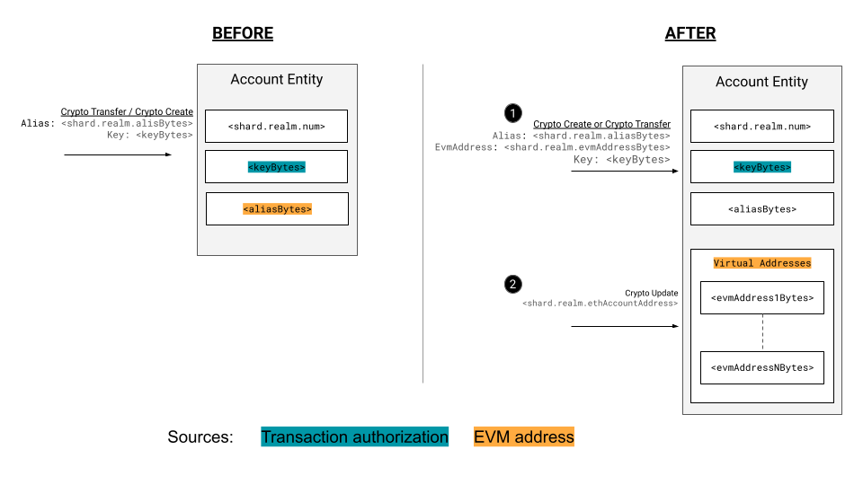
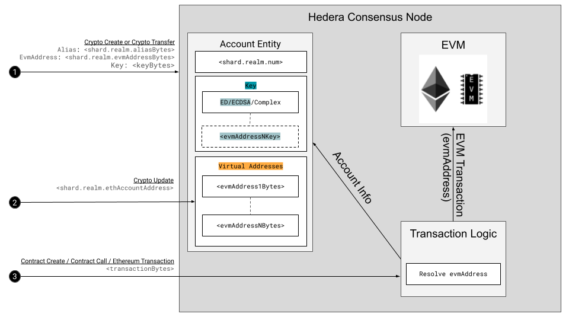

## Abstract

The Hedera Smart Contract Service (HSCS) supports the execution of EVM transactions in a fast and cheap manner, while striving for strict EVM equivalency. 
Hedera also supports a rich set of "native" APIs (the HAPI or Hedera API). At times, Hedera and Ethereum have made different design decisions. 
To support EVM equivalency on Hedera, this HIP proposes a solution to one of these design points. 

In Hedera, accounts are persistent entities with keys, and those keys can rotate over time. 
In Ethereum, keys and accounts are synonymous, and the only way to rotate keys is to rotate accounts. 
This HIP proposes a new concept, that of "Virtual Addresses", which bridge the conceptual gap between Hedera's view of accounts, and Ethereum's.

For easy reference new and clarifying terms are listed below.

- **ETH contracts**: An EVM contract currently deployed to Ethereum or other EVM compatible ledgers in which a maintainer does not have to change code in any way before deploying to Hedera. This code may include the use of precompile contract operations such as `ECRECOVER`.

- **Hedera contracts**: Smart Contracts implemented with Hedera-specific extensions such as HTS integration.

- **Hedera address**: Also known as the `long-zero` address (as noted in [HIP 583](https://hips.hedera.com/hip/hip-583)) account identifier, this is the result of encoding the `<shard>.<realm>.<num>` integer values into a 20 byte hex format to be conformant with `ECDSA` public addresses.

- **Alias**: An account alias can be an `ECDSA`/`ED25519` public key (per [HIP 32](https://hips.hedera.com/hip/hip-32)). Notably, in the past the alias was sometimes used to refer to an `ECDSA` public address, however, it should solely refer to a public key. 

- **Virtual Addresses**: a list of ECDSA public addresses that are stored on the account entity and serve as the account identifier on the EVM for transactions.


Most of the challenges experienced to date around account interactions with smart contracts on the EVM can be summarized into 4 points.

1. **Account type compatibility**: All Hedera accounts are not equally EVM compatible. Currently only accounts with an `ECDSA` public key and an `ECDSA` alias are fully EVM compatible. This is due to the underlying `ECDSA` signature type which allows for EVM account address (public address - as noted in [HIP 583](https://hips.hedera.com/hip/hip-583)) calculation. This negatively affects smart contract adoption for all other account types and results in EVM experience inconsistencies.
2. **Account identifier mismatches**: EVM addresses currently differ for accounts with and without an ECDSA public key alias. Accounts with an `ECDSA` public key alias will have a public address when interacting with the EVM. Accounts without an `ECDSA` public key alias will have their Hedera address used. In both cases the address is potentially stored in the contract state and utilized for future operation matching. 
3. **Potential feature and asset loss**: An account created with a ECDSA public key that has a corresponding public key alias where the account public key (tied to a cryptographic signing key) rotates no longer conforms to the EVM signature assumptions. That is smart contracts that extract the public address from the transaction signature will not be able to confirm that the sender address matches the extracted public address - this is the `ECRECOVER` precompile flow. This may result in loss of smart contract balance and permissions as smart contracts may no longer behave as expected.
4. **Complicated flows**: Education around the current EVM address possibilities is confusing and sometimes relies on uninformed users adopting complex technical solutions. This spans from the fundamental ethos difference where Ethereum holds that `Account ⇒ ECDSA public key ⇒ evmAddress` with a focus on `evmAddress`, whereas Hedera notes that Accounts contain a public key and an `evmAddress` with a focus on the Account.

The above has contributed to complicated Smart Contract considerations and slow adoption. 

This HIP proposes a way to rationalize a Hedera account with its features and identifiers together with standard EVM features and account identifiers. This presents a step towards EVM equivalence over EVM compatibility.

## Motivation

We want all accounts to be fully Smart Contract and EVM compatible without sacrificing Hedera feature functionality. 

Users familiar with EVMs should be able to maintain their standard EVM expectations (EVM equivalence) but be presented with additional possibilities unique to the Hedera network.

This should be with no little to no overhead for users, minimal efforts to devs and with no possibility of loss of assets in any migrations.

## Rationale

On Hedera a complete and functioning account can be identified at a point in time by 
- an account identifier `shard.realm.num` (dictated by the next available entity counter)
- a modifiable cryptographic public signing key
- an optional static public key account identifier i.e. alias.

This differs from the EVM view where an account can always be identified by a single public address (as noted in [HIP 583](https://hips.hedera.com/hip/hip-583)) derived from an ECDSA cryptographic public signing key. Here, it is not possible to dissociate an account from its public key as you can in Hedera. 

This has made it challenging when a Hedera account needs to be represented on the EVM or when an EVM operation that relies on the public key to public address mapping is expected on the Hedera network. The alias concept from [HIP 32](https://hips.hedera.com/hip/hip-32) was modified to help alleviate this issue by providing a source for the EVM address that an account would adopt when executing EVM transactions. However, this had its limitations as it was not originally intended to encompass EVM address logic which is fundamentally based on `ECDSA` keys and calculations of EVM account state.

In exploration of the challenges, the goal became to appropriately design a concept that encompassed both consistent identification but also maintained the expected cryptography requirement of `ECDSA` keys that is engrained in the `EVM` as defined by the Ethereum Yellow paper. For EVM equivalence, an account requires the ability to be identified in advance based on an `ECDSA` public key derived public address, and the ability to sign transactions submitted with that `ECDSA` key.

Notably, Hedera has provided a broader vision which allows pre-identification for both simple `ED25519` and `ECDSA` key types and allows for signing with simple or complex signatures natively.

It was also noted that due to Hedera's support of key rotation and multiple keys, enterprises and security minded users would not want to give up this ability solely to gain full EVM compatibility.

**Thus, the proposed solution is to allow an account to contain 1 or more `evmAddress` values for ECDSA keys it owns that dictate how an account appears on the EVM. These addresses will be known as Virtual Addresses.**

These `evmAddress` values map to `ECDSA` key pairs a user must prove ownership of. Ownership is proved by having the ECDSA private key sign the transaction that adds the ECDSA public key to the account. This dissociates the notion of account entity, public key and public address to allow for a clear separation of concern between Ethereum and Hedera styled development and user experiences.



The above diagram illustrates the sources of EVM identity and how they connect with key authorization.
Initially public keys and aliases are tightly nit, changes in key values break expectations of EVM authorization checks on the alias derived address, therefore limiting an accounts key rotation options.
With Virtual Addresses, keys remain the signing permission authority and can be changed but Virtual Addresses (not tied to the alias) provide the value for a transactions EVM address. 
This separates account identification logic allowing the preservation of EVM logic and assumptions, whiles allowing users to still capitalize on added Hedera features.

## User stories

1. As a user with non `ECDSA` keys invoking smart contracts I want my account to have a predictable address value when represented on the `EVM`.
2. As a user with `ECDSA` keys invoking smart contracts regardless of alias value I want my account to have a predictable address value on the EVM as I would on Ethereum.
3. As an existing user with an `ECDSA` key but no alias I want to gain compatibility with smart contracts utilizing `ECRECOVER` as I would be on Ethereum.
4. As an existing user without an `ECDSA` key I want to interact with smart contracts that utilize `ECRECOVER` whiles still maintaining my existing key for signing.
5. As an existing user I want to utilize Hedera key rotation functionality without losing compatibility with `ECRECOVER` or changing the Ethereum public address viewed by the `EVM`.
6. As a user I want to be able to control the value of the account address the `EVM` will observe based on the `ECDSA` key pairs I own.
7. As a Hedera user, I want to add multiple EVM addresses to my existing account without needing to create a new Hedera account every time.
  
## Specification

To resolve the issue of account EVM compatibility and identification the proposal is to add a list of Virtual Addresses to a Hedera account that are responsible for `EVM` address logic.

To achieve this

1. Hedera accounts can have a list of `evmAddress` values known as “Virtual Address” which govern the address the EVM observes for a given account transaction.
2. The Hedera network will process ownership by extracting the public key from the signature and comparing the calculated public address to the `evmAddress` passed in on addition of the virtual address and will maintain an  `evmAddress` → `accountId` map thereafter.
3. Hedera Accounts can add, disable and remove virtual address entries as desired. Additionally, accounts can update their default virtual address.
4. Each virtual address will have its corresponding nonce tracked and stored in state.
5. The address seen by the EVM per transaction is either the default Hedera address or a verified virtual address specified.
6. User accounts with a simple `ECDSA` key will be migrated to accounts with a single virtual address 
7. Developers can utilize `HAPI` to specify EVM address overrides and retrieve account virtual address information.
8. Users with non-simple `ECDSA` keys can utilize any `evmAddress` matching `ECDSA` key in their wallets when interacting with smart contracts to be `ECRECOVER` compatible. In some cases they may be able to authorize transaction submission.
9. Users can optionally update their simple account key structure to support signing of transactions using the matching ECDSA key pair that maps to an `evmAddress` added.
10. Contract accounts may utilize the `evmAddress` to store their address in accordance with `CREATE` and `CREATE2` EVM operations



The above diagram illustrates how an account may be created/updated to contain virtual addresses and how thesed details will be considered at transaction time when a node determines what account may be used for an EVM call.

Step 1: Alice submits a CryptoCreate or CryptoTransfer transaction specifying the public address of her ECDSA key pair and signing the transaction with her ECDSA private key. The result in both cases is that the network creates a new account with an assigned AccountId and a single virtual address.

Step 2: Alice may submit a CryptoUpdate to add or remove a virtual address. She may also perform a key update by specifying a public key (that maps to one of her virtual addresses) to be held in addition to her current key in a threshold key.

Step 3: Alice may submit a ContractCreate or ContractCall transaction for which the network will consult her account to determine the appropriate address to provide to the EVM.

## HAPI Changes

Proto messages will need to be updated to represent the virtual address info in submissions and in record files exported

A `VirtualAddress` message proto captures the evm address and whether it’s the default on the account 

```protobuf
message VirtualAddress {
    /**
    * The 20-byte EVM address that is derived from the keccak-256 hash of a ECDSA_SECP256K1 primitive key.
    */
    bytes address = 1;

    /**
    * Flag if this address should now be set or is the default address on the account
    */
    bool is_default = 2;
}

```

Update `AccountID` with `evm_address` to separate it from `alias`

```protobuf
message AccountID {
    ...
	
	oneof account {
        ...
        /**
        * The ethereum account 20-byte EVM address to be used initially in place of the public key bytes. This EVM
        * address may be either the encoded form of the shard.realm.num or the keccak-256 hash of a ECDSA_SECP256K1 primitive key.
        *
        * If a transaction lazily-creates this account, a subsequent transaction will be required containing the public key bytes
        * that map to the EVM address bytes. Lazy account creates will only support the keccak-256 hash of a ECDSA_SECP256K1 primitive key form.
        */
        bytes evm_address = 5;
    }
}
```

Expose the virtual addresses in a `CryptoGetInfo` response by updating `AccountInfo`

```protobuf
message AccountInfo {
    ...
      
    message VirtualAddressInfo {
        /**
         * A virtual address entry.
         */
        VirtualAddress virtual_address = 1;

        /**
         * The ethereum transaction nonce associated with this virtual address.
         */
        int64 nonce = 2;
    }
  
    /**
    * List of virtual addresses each of which is an EVM address that maps to an ECDSA key pair a user must prove ownership of and their corresponding nonce value. 
    * The size will be bounded.
    */
    repeated VirtualAddressInfo virtual_addresses = 24;
}
```
Note: Initially the number of virtual address an account can hold will be bounded first to 1, with an eventual expansion to 3 to support override scenarios and a final maximum of 10 as required. Future community use cases requiring unbounded support may update this HIP to explore and support unbounded cases.

Add the evm address to `CryptoCreateTransactionBody` to support the lazy create flow and separate it from alias

```protobuf
message CryptoCreateTransactionBody {
	...

	/**
	 * EOA 20-byte address to create that is derived from the keccak-256 hash of a ECDSA_SECP256K1 primitive key.
	 */
	bytes evm_address = 20;
}
```

Add `virtual_address_update` to `CryptoUpdateTransactionBody` to support the addition and removal of virtual addresses

```protobuf
message CryptoUpdateTransactionBody {
    ...

    oneof virtual_address_update {
        /**
        * The virtual address to be added.
        */
        VirtualAddress add = 20;

        /**
        * The 20-byte EVM address of the virtual address that is being disabled and therefore removed from active use on the account.
        */
        bytes disable = 21;

        /**
        * The 20-byte EVM address of the virtual address that is being removed from the account.
        */
        bytes remove = 22;

        /**
        * The virtual address to be updated.
        */
        VirtualAddress update = 20;
    }
}
```

Update `ContractCreateTransactionBody` and `ContractCallTransactionBody` to support overriding the default virtual address

```protobuf
message ContractCreateTransactionBody {
    ...
    /**
    * The 20-byte EVM address (differs from account default) to use for the given transaction. This address must be owned by the account.
    */
    bytes virtual_address_override = 21;
}

message ContractCallTransactionBody {
	...
    /**
    * The 20-byte EVM address (differs from account default) to use for the given transaction. This address must be owned by the account.
    */
	bytes virtual_address_override = 5;
}
```

Update `ContractFunctionResult` with a map tracking all contract nonce updates during transaction execution

```protobuf
message ContractFunctionResult {
    ...
    /**
    * Map used to track contract nonces for all contracts that have participated in the transaction.
    * The keys would have the different contract IDs and the values are the new nonce values.
    */
    map<ContractID, int64> contract_nonces = 14;
  
}
```

Update the `TranscationRecord` to expose a new virtual address update when not present in the transaction 

```protobuf
message TransactionRecord {
    ...

    /**
    * The new default EVM address of the account created by this transaction.
    * This field is populated only when the EVM address is not specified in the related transaction body.
    */
    bytes evm_address = 21;
}
```

The following is a table of HAPI proto inputs and outputs to show case new/modified transaction calls and how details are exposed in record files

| Transaction Type | Inputs (all keys and address map to valid ECDSA keys) | Account Exists | Record Output  (VirtualAddressUpdate) | Description |
| --- | --- | --- | --- | --- |
| ContractCreate | virtual_address_override | - | - | Contract create transaction with an override for the virtual address to be used |
|  |  |  |  |  |
| ContractCall | virtual_address_override | - | - | Contract call transaction with an override for the virtual address to be used |
|  |  |  |  |  |
| CryptoCreate | alias | N | evm_address = new | auto-create non-existing account with new virtual address. The provided virtual address will serve as the default virtual address for the account. |
|  | key | N | evm_address = new | normal create non-existing account with new virtual address. The provided virtual address will serve as the default virtual address for the account. |
|  | evm_address | N |  | lazy-create non-existing account with new virtual address. The provided virtual address will serve as the default virtual address for the account. |
|  |  |  |  |  |
| CryptoTransfer | accountId.alias | N | evm_address = new | transfer to non-existing account (auto-create with new virtual address). The provided virtual address will serve as the default virtual address for the account. |
|  | accountId.alias | Y | - | transfer to existing |
|  | accountId.evmAddress | N | evm_address = new | transfer to non-existing account (lazy-create with new virtual address). The provided virtual address will serve as the default virtual address for the account. |
|  | accountId.evmAddress | Y | - | transfer to existing |
|  |  |  |  |  |
| CryptoUpdate | virtual_address_update.add.evmAddress = new, (optional) virtualAddress.isDefault = true | Y | - | Add virtual address to existing account. Pull details from transaction body (not populating record preserves space) |
|  | virtual_address_update.disable = old | Y | - | Disable virtual address on existing account. Pull details from transaction body (not populating record preserves space) |
|  | virtual_address_update.remove = old | Y | - | Remove virtual address from existing account. Pull details from transaction body (not populating record preserves space) |
|  |  |  |  |  |
| EthereumTransaction | ethereum_data (tx.to = new) | N | evm_address = new | lazy-create non-existing account.The provided virtual address will serve as the default virtual address for the account. |

### Update Account state

The `HederaAccount` will need to be updated to support a list of 20-byte EVM address values and the default virtual address.

A matching set of change should be made to `MerkleAccountState`

```java
public interface HederaAccount {
	...

	Set<ByteString> getVirtualAddresses();

	void setVirtualAddresses(Set<ByteString> virtualAddresses);

	ByteString getDefaultVirtualAddress;

	void setDefaultVirtualAddress(ByteString virtualAddress);

    void setVirtualAddressNonce(ByteString virtualAddress, long nonce);

    long getVirtualAddressNonce(ByteString virtualAddress);

}
```

Note: To support a larger number of virtual addresses on query an additional `CryptoGetAccountVirtualAddressesQuery` query type may be added to support a paid retrieval of the full list of virtual addresses.

```protobuf
message AccountGetVirtualAddressesQuery {
    ...
    QueryHeader header = 1;

    /**
     * The account instance for which the virtual records should be retrieved
     */
    AccountID accountID = 2;
}

message AccountGetVirtualAddressesResponse {
    ...
    ResponseHeader header = 1;

    message VirtualAddressInfo {
      /**
      * A virtual address entry.
      */
      VirtualAddress virtual_address = 1;

      /**
      * The ethereum transaction nonce associated with this virtual address.
      */
      int64 nonce = 2;
    }

    /**
     * List of virtual addresses each of which is an EVM address that maps to an ECDSA key pair a user must prove ownership of and their corresponding nonce value.
     */
    repeated VirtualAddressInfo virtual_addresses = 2;
}
```

### Virtual address creation

The process of adding a virtual address requires authentication of the account, storage of the address and the update of a map to allow for easy searching using the address.

- Add a new  `evmAddress` → `accountId`  map, for easy account lookups
- Account creation
    - `CryptoCreate` transactions with a simple ECDSA key will have its signature examined, the public key extracted from the signature and a corresponding Ethereum public address `evmAddress` calculated. For cases where a separate address is to be set the desired virtual address may be pulled from `CryptoCreateTransaction.evm_address`.
    - `CryptoTransfer` transactions to an Ethereum public address `evmAddress` will utilize the `lazy-create` flow and create a Hollow account with a single virtual address.
    - In both transaction type cases the `evmAddress` → `accountId` map is consulted for an existence check. Should the virtual address be absent then creation may be attempted and the map should be updated with the `evmAddress`
    - Future transactions utilizing an `evmAddress` will verify a valid entry in the map or fail with an appropriate response code.
- Contract
    - `ContractCall` / `ContractCreate` smart contract transactions that result in new contract creation should add an Ethereum public address `evmAddress` for `CREATE` & `CREATE2` to `contract.account.virtualAddresses`. Contract addresses are calculated by the ledger based on internal state.
    - Contracts may only have 1 virtual address entry to ensure immutability in accordance with the Ethereum yellow paper. The network should prevent the update of a contracts virtual addresses.
- Export virtual address added in record for account and contract transactions

Note: Ethereum address values from know tools (such as Truffle and Hardhat) that have been exposed will be captured by a property file to prevent users from accidentally creating accounts with these breached addresses.

Note2: Account fee logic will incorporate the extra virtual address property to be stored in state.

### Support virtual address list modification

The list of virtual addresses should support the ability to add, disable and remove entries.

To add a virtual address an account would submit a `CryptoUpdateTransactionBody` with a `virtual_address_update.add` containing the desired evmAddress. The transaction must be signed by the ECDSA private key that maps to the evm address being added.

To disable a virtual address an account would submit a `CryptoUpdateTransactionBody` with a `virtual_address_update.disable` containing the existing evmAddress. The transaction must be signed by the ECDSA private key that maps to the evm address being disabled.

To remove a virtual address an account would submit a `CryptoUpdateTransactionBody` with a `virtual_address_update.remove` containing the existing evmAddress. The transaction must be signed by the ECDSA private key that maps to the evm address being removed.

Note: Initially virtual addresses will only support addition. With maturity of the feature the ability to disable and eventually remove a virtual address will be explored.

### Transaction EVM address value

The network will determine the appropriate Ethereum public address `evmAddress` per transaction based on the following logic

1. If no override `virtual_address_override` is provided
    1. If a non null `defaultEvmAddress` exists it is provided to the EVM
    2. If no `defaultEvmAddress` is present the Hedera address is provided to the EVM
2. If an override `virtual_address_override` is provided
    1. the `account.virtual_addresses` is verified for `evmAddress` presence
        1. If verified, transaction processing continues
        2. If not present the transaction fails
    2. The `evmAddress` → `accountId` is verified for an entry 
        1. If verified, transaction processing continues
        2. If not present the transaction fails 

### Alias to Virtual Account Migration

To dissociate the alias concept from EVM public addresses and to reduce the overhead on users the network should perform a state migration for accounts and contracts

#### Aliased accounts

Migrate accounts with ECDSA aliases or hollow accounts

First migrate accounts with an explicit alias
1. An `evmAddress` → `accountId` map is created to resolve future virtual address references
2. Traverse all alias accounts from `alias` -> `accountId` map
3. If `alias` is not an ECDSA key or 20 byte address `evmAddress` or if `accountId` is not for type `ACCOUNT` then skip
4. If alias is an ECDSA key calculate the 20-byte `evmAddress` public address value
5. Check if `evmAddress` → `accountId` map contains an entry. If present skip
6. Perform `CryptoUpdate` with `virtual_address_update.add.evm_address = evmAddress` and `virtual_address_update.add.is_default = true`
7. Migrate the `ethereum_nonce` of the account to the nonce of the virtual address
8. Add `evmAddress` to `evmAddress` → `accountId` map
9. Check `alias` → `accountId` map for an entry. If present remove the `evmAddress` from the `alias` → `accountId` map

Post migration the account creation logic should only update the  `alias` → `accountId` map with public keys and no longer utilize add the 20 byte address values. Additionally, no ECDSA based account should have a `account.alias` with a public address format.

Note: In the migration, the first account with a specific key will be assigned the virtual address, all other accounts with the same key will be skipped.

#### Contracts

Migrate contracts with valid `CREATE` or `CREATE2` addresses

1. Traverse all contract accounts
2. Check `contract.alias`
3. If `contract.alias` is a Hedera address or empty then skip
4. Migrate the `ethereum_nonce` of the contract to the nonce of the virtual address
5. Add `evmAddress` to `evmAddress` → `accountId` map
6. Check `alias` → `accountId` map for an entry. If present remove the `evmAddress` from the `alias` → `accountId` map

#### Optionally ECDSA accounts without an alias

1. Traverse all accounts in ASC order of AccountID
2. If `account.key` is not a simple ECDSA key skip
3. Calculate the 20-byte `evmAddress` public address value
4. Check if `evmAddress` → `accountId` map contains an entry. If present skip
5. Perform `CryptoUpdate` with `virtual_address_update.add.evm_address = evmAddress` and `virtual_address_update.add.is_default = true`
6. Migrate the `ethereum_nonce` of the account to the nonce of the virtual address
7. Add `evmAddress` to `evmAddress` → `accountId` map

Note: This migration will not be performed initially and will be done at some later stage.
Note 2: This migration must be done after aliases or hollow account migration above.

### Connect to Hedera via Virtual Address ECDSA key

An account should be searchable by its virtual addresses fi applicable.

Search by `evmAddress` will be supported by consulting the `evmAddress` → `AccountId` map on queries. Similarly, if an `ECDSA` public key is provided instead, the network should support extraction of the public address and subsequent search by the retrieved value. This will expand account import options in wallets and allow for account info retrieval in more scenarios.

## Transaction signing with matching simple key

There will be cases where users may have a simple key (`ECDSA` or `ED25519`) that does not correlate to the virtual address used in a transaction that requires `ECDSA` key signing. In this case users may want to utilize their virtual address key whiles maintaining the existing simple key(s) they have on their account.

To support such mobility cases, where the security implications make sense a user may update their simple key to a 1 of n threshold key. In this way users can sign transactions with their initial simple key or their desired `ECDSA` simple key that maps to an evmAddress.

For example an early adopter of Hedera will most certainly have an `ED25519` key on their account. In this way they would not be able to successfully call smart contract transactions that utilize `ECRECOVER`. With the addition of a virtual address they are 1 step closer to being able to support this scenario but still do not match the `ECDSA` key signing requirements. In this case the user may update their `ED25519` key to a 1 of 2 threshold key where transactions may be signed by either the `ED25519`  or `ECDSA` private key the user has control over.

In this scenario it can be seen as a safe security modification, however this should be up to the discretion of the user.

Note: This scenario is reserved for simple key cases only. It is strongly advised that users do not modify complex keys to be a 1 of n in which the complex key is on one of the options as this dilutes the original security architecture.

## Contract account virtual address

With the addition of virtual addresses and the separation of alias, network logic allows a contract account to represent its contract address with its virtual address.

## Community product impacts

### SDK Impacts

To support these updates the SDK will need to update the available methods on some transactions

1. `CryptoUpdate` transactions will need support to add/disable/remove and specify default `evmAddress`.
    
    ```java
    new CryptoUpdate
    	.addVirtualAddress('0x...') // String
    	.disableVirtualAddress('0x...') // String
    	.removeVirtualAddress('0x...') // String
    	.setDefaultVirtualAddress('0x...'); // String
    ```
    
2. `ContractCreate`/`ContractCall` will require the ability to specify the desired `evmAddress` per transaction. Note this may also be an accounts Hedera address to support migration cases.
    
    ```java
    new ContractCreate
    	.setVirtualAddressOverride('0x...'); // String
    
    new ContractCall
    	.setVirtualAddressOverride('0x...'); // String
    ```
    
Note: This does not impact the final contract address, which will be dictated by `CREATE` or `CREATE2` operations.

### Mirror Node Impacts

As the historic ledger of Hedera, the Mirror Node will require additional steps and updated assumptions to support Virtual Addresses.

1. Aliases will be simplified in their format as post migration they will always have a simple `ECDSA`/`ED25519` key value. That is the alias returned in `CryptoCreate` records will no longer take the format of a public address and will always be the protobuf value of a simple key. In this way some DB or service considerations may be simplified. 
2. Accounts will observe a new property `virtualAddressesList`. This will be a set of 20-byte hex addresses the account is associated with, with each value mapping to the same AccountId. 
3. To support search, the Mirror Node should support a `evmAddress` → `accountId` lookup. Utilizing the current table strategy a current and history table could be employed i.e. `account_virtual_addresses` and `account_virtual_addresses_history`. 
    
    ```sql
    create type virtual_address_status as enum ('ACTIVE', 'DISABLED', 'DELETED');

    create table if not exists account_virtual_address (
        evm_address         bytea null,
        id                  int not null,
        modified_timestamp  bigint not null,
        status              virtual_address_status not null default 'ACTIVE',
        primary key (id, modified_timestamp, evm_address)
    );
    ```
4. Update entity table with a `default_virtual_address` column to capture the default virtual address.
5. To expose this the Mirror Node should update  `api/v1/accounts/{idOrAliasOrEvmAddress}` to list both the Hedera Address (`long-zero`) and its virtual addresses. This will disambiguate the potential addresses. Additionally, the endpoint should support search via Hedera or evm address.
    
    ```json
    {
      accounts: '0.0.1',
      ...,
      hederaAddress: '0x0...1',
      virtualAddresses: [
        {
          evmAddress: '0x2...3',
          isDefault: false
        },
        {
          evmAddress: '0x4...5',
          isDefault: true
        }
      ]
    }
    ```

Note: Should the network need to expand a larger number of virtual addresses an additional `api/v1/accounts/<accountId>/virtualAddresses` endpoint may be added to encompass an endpoint that supports paging the full list of virtual addresses.

note 2: The REST API should only display active i.e. non disabled virtual addresses associated with an account.

### Wallet/Exchange Impacts

Wallets and exchanges continue to serve as the entry point for account user creation. In this way they should utilize new functionality for their purposes and to allow users to transact easily

1. Search accounts by virtual / Hedera address using Mirror Node or SDK.
2. Import `ECDSA` private keys. In the past ED keys were the main type but with an influx of users from EVM chains `ECDSA` support will be important.
3. Transfer to virtual / Hedera address using SDK or JSON RPC relay.
4. Expose account details Hedera address and `virtualAddresses`.

Multiple personas exist for which wallets need to explore support to ensure vibrancy of the smart contract scenarios.

An additional option exists for wallets that use a seed phrase to generate keys i.e HDWalllet - the same seed phrase can create both an `ED25519` and an `ECDSA` key. In this way wallets may create a new account, establish a 1 of 2 threshold key in which users may utilize any key to sign. This provides users with options, namely `ECRECOVER` support from creation. Additionally, users can recover both keys that may be regularly utilized.

Notably, wallets may also explore ETH native flows by supporting RLP transaction encoding and utilizing the HAPI `EthereumTransaction`. This would increase their support across other chain DApps which could now be pointed to Hedera and allow for in wallet and native scenarios that are faster, cheaper and more scalable on Hedera.

### Mirror Node Explorer Impacts

The Mirror Node explorers will continue to provide for many the go to source of account and ledger details. In this way the explorers should support

- Search by virtual / Hedera address - utilize the Mirror Node
- Expose account details Hedera address and `virtualAddresses`

## Backwards Compatibility

This HIP builds upon HIP 584 and also restores HIP 32’s consistency.

Accounts identifiers and feature applicability are unrestrained to apply in more scenarios with less crossover.

## Security Implications

The addition and removal of virtual addresses relies on the current Hedera methodology of signing transactions with the account private key. As such the network is able to confirm ownership of the evmAddress. Additionally, the ledger will ensure uniqueness of evmAddress and will ensure only 1 account will have the address.

Additionally, the use of an evmAddress provides no authorization for Hedera transaction functionality. 

As such the ledger and the EVM maintain their authorization capabilities. 

As always users and developers are responsible for key hygiene and proper storage of keys.

## How to Teach This

- Additional documentation on protobufs
- SDK examples should be written to highlight
    - `Crypto`Update to add and remove virtual addresses
- Mirror Node
    - Open API spec should be updated for `/api/v1/accounts/{accountIdOrEVmAddress}`
    - DB documentation should be updated to highlight new table(s)
- Doc site tutorials utilizing SDKs should be written to highlight alias setting and the lazy account creation flow.

## Reference Implementation


## Rejected Ideas

The continuous conflict of pure Ethereum account matra vs Hedera Account layout resulted in multiple ideas being considered but ultimately rejected. These included

- A special reserved `ECDSA` based `aliasKey` on all accounts. This would have ensured only a single key was used on contract interactions.
- A special reserved `ECDSA` based `aliasKey` and an additional `evmAlias`. This would have provided complete separation of all EVM interactions with Hedera account keys.
- Requiring nested signing similar tot he relay in which an out HAPI transaction has the Hedera signatures and an inner EVM transaction has the appropriate transaction with the EC public address

## Open Issues

- Should virtual address transfer between accounts be supported? In this way an account could remove an address and on a separate account add the same virtual address?
- Should `ETH contracts` be better phrased as `EVM contracts`?


## References

- [ECRECOVER Precompiled Contract](https://ethereum.github.io/execution-specs/autoapi/ethereum/frontier/vm/precompiled_contracts/ecrecover/index.html)
- [Ethereum Yellow Paper](https://ethereum.github.io/yellowpaper/paper.pdf)

## Copyright/license

This document is licensed under the Apache License, Version 2.0 -- see [LICENSE](../LICENSE) or (https://www.apache.org/licenses/LICENSE-2.0)
