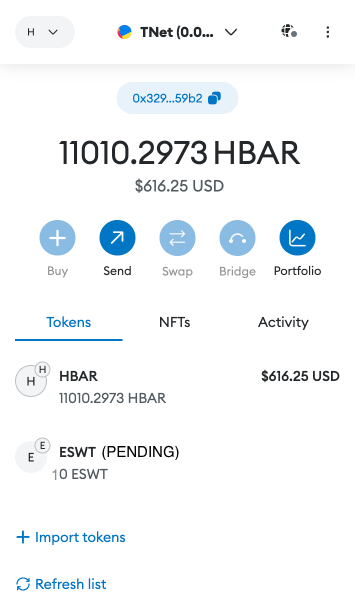
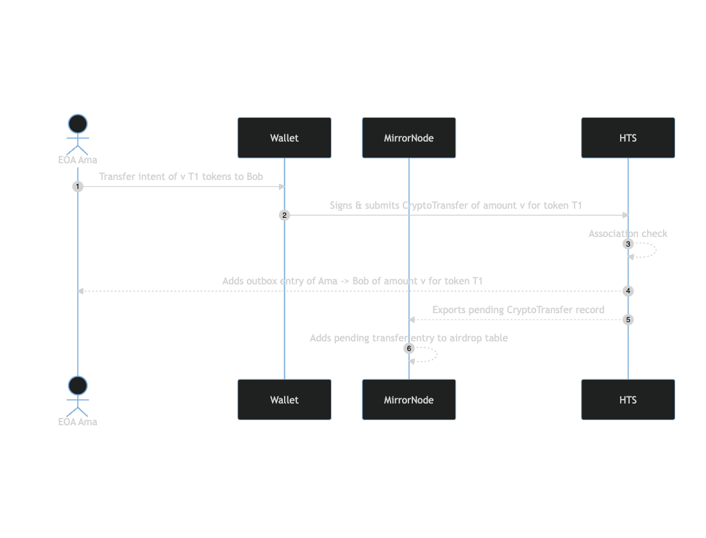
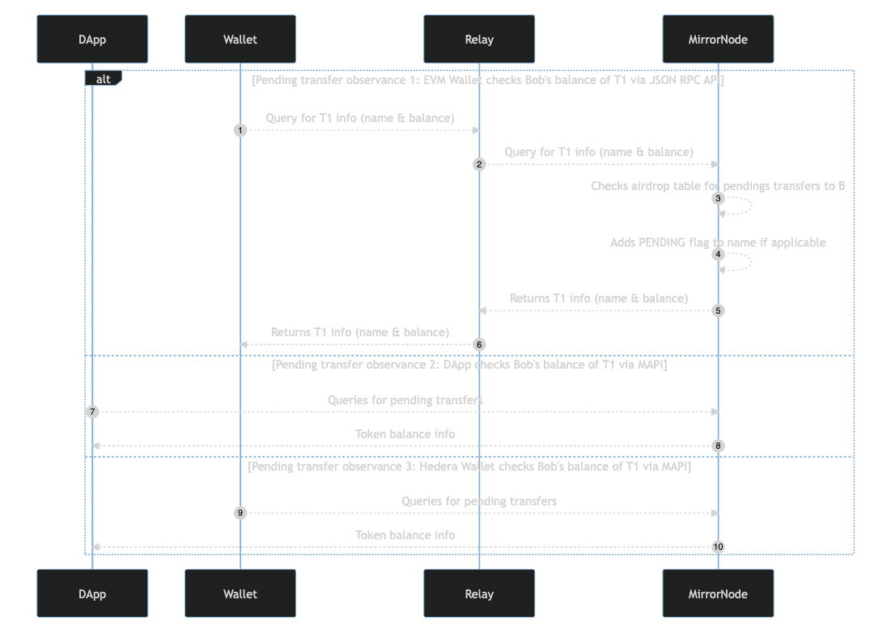

## Abstract

Users on the Hedera network have the ability to control the token classes (Fungible and Non-Fungible tokens) that can be added to their balance. A user must first associate with a token class before they may receive token value of that token from others. This differs from other networks where users may send token value to any account without restrictions - in short, airdrops are currently not supported on the Hedera network without a user first associating with a token. For some, this serves as a fundamental account protection feature when noting potential financial and legal implications, for others, this serves as an extra user step required before receiving desired tokens. 

[HIP 655](https://github.com/hiero-ledger/hiero-improvement-proposals/pull/655) suggested the token outbox concept to track a sending users intent to airdrop tokens to a receiving account (EOA or contract) that has not yet associated with the token class. It also noted an inbox which would hold non-assocaited tokens in a separate location from an accounts main balance.

This outbox gives a mapping that may be used to enable the simulation of the airdrop transfer concept that web3 users are familiar with by the introduction on pending transfers. A network can communicate a senders commitment to transfer a token to a potential recipient i.e pending transfers. An intended recipient maintains account sovereignty as the network enforces the association requirement before a receiver takes ownership of the tokens. Tokens in an outbox are conceptually pending token transfers or offers to the desired recipient until they accept or reject the intent. Upon acceptance the intended token value will be transfered to the recipient and credit their balance. Additionally, support for association and transfer of tokens in an atomic operation will allow the seamless ability to take ownership and transfer from your pending balance.

## Motivation

Retail users from other EVM chains do not have a concept of token association. As such, many are used to receiving unsolicited tokens and viewing them in their balance collection. Similarly, senders are not used to coordinating token association in advance. This currently provides friction and may serve as a blocker to retail user adoption of users coming from other chains. EVM native wallets and tools make integration more challenging with more advanced chains as they are unable to surface up the additional complexity and details offered by the Hedera network e.g. token assocaitions, account properties.

Notably, the Hedera network offers an established paradigm to transparently and securely associate with HTS tokens prior to receiving token value. This ensures sovereignty of accounts and allows them to take explicit actions of token ownership which may have financial and legal consequences. Account also offer auto assocaition slots to open their balance up to recieve non-associated tokens. However, achieving this state requires additional steps by users adn DApps and requires they have already onboarded and are knowledgeable of Hedera features on top of EVM features

To support the desired seamless transferability of HTS tokens in DeFi scenarios and maintain account sovereignty the network could capture the transfer intent from a sender to any account without prior association. 

## Rationale

To achieve EVM equivalence on Hedera it's necessary to reduce the frictions EVM native users face in adopting the network. 
Token association though a user protective feature offers an extra step in a users journey to take part in token scenarios. 
Additionally, the inability to expose advanced Hedera features in EVM tools such as EVM native wallets makes the Hedera feature prohibitive to users who are limited to ERC token functionality.
By providing a pathway to maintain ERC like token behviour and Hedera account soveriegnty, users from EVM chains may more easily adopt the Hedera network for the decentralized token scearios they are accustomed to.

## User stories

1. As a token holder I want to be able to send tokens to any account on the network without their prior association with the token (i.e. airdrop).
2. As the sender of an attempted airdrop I want to be able to query my account for all unaccepted pending transfers.
3. As the intended recipient of a pending transfer I do not want to receive tokens before I have associated with the token class, the network should hold pending tokens in state outside of my balance for liability reasons.
4. As the intended recipient of a pending transfer I want to be able to query all the pending transfers targetting my account.
5. As the intended recipient of a pending transfer I want to be able to accept the intent by issuing a `TokenAssociate` transaction.
6. As the intended recipient of a pending transfer I want to be able to reject a pending token transfer.
7. As the intended recipient of a pending transfer I want to be able to transfer tokens immediately without having to associate and transfer individually. In transferring I want to both accept and transfer value in one transaction.
8. As the intended recipient of multiple pending transfers of a single token class, I want to be able to accept all pending transfers in one operation without having to accept multiple transfer intents.
9. As the intended recipient of multiple pending transfers of a single token class, I want to be able to reject all pending transfers in one operation without having to reject multiple transfer intents.
  
## Specification

An end to end pending transfer flow would take the following form in an EVM native HTS token transfer scenario.

1. A Hedera account `A` with a balance of an HTS token with symbol `ESWT` initiates a transfer to account `B`.
2. Account `A` will receive a successful confirmation from the network. Accounts `A`’s outbox will store the intended transfer details and account `B`’s balance will see no change.
3. Account `B` using an EVM native (JSON RPC API consuming) tool to query for Token `ESWT` balance will observe a pending token listing they can act upon (Accept or Transfer). 
    - A pending transfer may surface up to a user in a manner similar to the following illustration, indicating a “PENDING” status to the token.

        

    - From here account `B` could take standard steps to view token details on an explorer of choice. Explorers can then take the step to showcase TokenAssociate functionality to allow a user to accept or reject the token thus removing the PENDING nature of the listing.
4. Account `B` may 
    1. Do nothing, in which case the token remains in account `A`’s outbox.
    2. Reject the pending transfer in which case account `A`’s outbox entry will be cleared and the pending note on Account `B`’s token will also be removed
    3. Accept the pending transfer by associating at which point the network carries out the intended transfer debiting account `A`’s balance and crediting account `B`’s balance
    4. Transfer a value up to the intending pending transfer value of token `A`, at which point the network carries out the intended transfer debiting account `A`’s balance and crediting account `B`’s balance and recipient of account B’s transfer

A similar flow with Hedera native tools would have the benefit of being able to expose the pending nature of the transfer in a users wallet. A Hedera wallet would also be able to carry out association in app.

To ensure the integrity of accounts and feature behaviour some requirements emerge from the above

1. A senders balance must remain the same even after the transfer attempt, as the transfer results in a promise and not yet an actual transfer.
2. A sender cannot withdraw the airdrop once sent. 
3. A sender commits to paying token rent for the period of time in which it is promised to the recipient.
4. A sender commits to paying account rent to maintain the validaity of their pending transfer to the recipient till such a time as rent & expiry on the system are implemented.
5. An intended recipients balance must not increase until the transfer is accepted
6. An intended recipients perception on the token must not change unless they accept, reject the token or if the token expires. Doing otherwise may inadvertently give the concept of lost value should a user see a pending transfer that is later removed.
7. Associating with a token accepts all the airdrops of that token type from applicable outboxes

To achieve the user stories, requirements and desired  easy UX, a cross product approach between the consensus node, mirror node, SDKs, explorers, relay, wallets and DApps is required to ensure a good end to end UX for developers and DeFi DApp users.


### Protobuf

Pending transfers will resemble normal transfers and are therefore already supported by the network. However, recipients of pending transfers need to be able to accept, reject or immediately transfer.

- Transfer - The existing `CryptoTransfer` HAPI transaction will support airdrop transfer transactions

    To expose an intended transfer the TransactionRecord proto can be expanded to include a `pendingTransfer` value

    ```protobuf
    message TransactionRecord {
        /**
        * The crypto transfer resulted in a pending transfer. With this flag mirror nodes can capture the intended transfer in the transaction body and update the users outbox detail without updating balance.
        */
        bool pendingTransfer = 22;
    }
    ```

    Should a sending account reach the max outbox capacity the sender will receive a new response code
    ```protobuf
    enum ResponseCodeEnum {
        ...

        /**
        * The senders outbox size has reached its capacity
        */
        MAX_OUTBOX_SIZE = 333;
    }
    ```
- Accept: Associating with a token is essentially the same as accepting as it captures the intent to possess a balance of the token class, therefore it makes sense that the act of associating implies acceptance. Accepting a pending transfer will bring the token balance into the receiving accounts balance by issuing a child `CryptoTransfer` with matching details for the intended transfer.
- Reject: A new `TokenPendingTransferReject` HAPI transaction is suggested to capture a users rejection of the pending transfer.
    
    ```protobuf
    message TokenPendingTransferRejectTransactionBody {
        /**
         * The intended recipient of the token transfer
         */
        AccountID sender = 1;
    
        /**
         * The token classes with pending transfers.
         * Tokens with no pending transfer will be ignored with a no-op but will still impact cost
         */
        repeated TokenId = 2;
    }
    ```

    The submission of a `TokenPendingTransferRejectTransactionBody` will trigger a failed child `CryptoTransfer` HAPI transaction with the details of the transfer.
    ```protobuf
    enum ResponseCodeEnum {
        ...

        /**
        * The senders outbox size has reached its capacity
        */
        REJECTED_AIRDROP = 334;
    }
    ```


Notably, an account that has sent pending transfers must maintain a balance in excess of the sum of their promised value to potential recipients. As such the system should reject attempts to debit an account if it leaves the balance unable to satisfy pending transfers. To expose this an additional error response will be added.

```protobuf
enum ResponseCodeEnum {
	...

    /**
    * The senders balance should they carry out this transfer will result in a balance that is insufficient in satisfying outstanding pending transfers
    */
    INSUFFICIENT_EFFECTIVE_BALANCE = 335;
}
```

Accounts will have the ability to send a maximum number of pending transfers in accordance with consensus node state properties. The max number will be default to support most users and use cases. However, accounts that may want to create bulk pending transfers exceeding that max can submit a `CryptoUpdate` to update their account property `max_token_outbox_entry_size` to increase their limit.

```protobuf
message CryptoUpdateTransactionBody {
    ...

    /**
     * The maximum number of pending transfers an account may have per token-account
     */
    google.protobuf.Int32Value max_token_outbox_entry_size = 19;
}
```

### Consensus Node

#### Transfer

On transfer of an airdrop the network must charge enough HBAR to cover the rent of a token for the standard rent periods (currently 3 months), however, in initiating an airdrop a sender will be liable for all rent until the user accepts or rejects. This ensures that senders are periodically charged rent appropriately but also that recipients don’t have tokens disappear prior to acceptance or rejection.

A sending account may only initiate a single pending transfer per recipient account per token. Subsequent attempts to transfer a token to a receiving account you already have a pending transfer with will be rejected.

Notably, the network nodes will have the additonal task of ensuring a sender maintains enough balance to honour the transfer in the future. To accomplish this on debit the service logic must confirm

- The remaining FT balance is enough to cover all FT pending transfers in the senders outbox.
- The NFT serial is not one of the NFT pending transfers in the senders outbox.

Note, pending transfers for tokens with custom fees will have limited support. Since the custom fees of a token can't be expressed within many EVM tools and interfaces it cannot be assured that receivers appreciate the impacts of accepting a token or future transfers of the token on their balance.
Initially there will be no support, eventually it may be clear how to include tokens with non fallback custom fees. 

#### Outbox State

The consensus node will have to add into state the concept of an outbox per sender.
A collection of outboxes with a single outbox per sender will be necessary to capture intended airdrops.
The outbox must also capture the intended recipients and the token (FT or NFT) value intended for transfer.

The outbox may utilize the `TokenTransferList` object in it's mapping to ensure normal transfer details are captured.
An initial max capacity of 255 entries per sending account in the outbox may be set. This is a merkle tree optimization until further data informs greater size.

The HBAR fee for a transfer should include a component to factor the cost of maintaining the pending transfer in the outbox state as well as the merkle tree traversing needed on certain transfers.

Upon handling
- a pending transfer, a node would add an entry from the sender mapped to the recipient with the intended token and its amount or serial number(s).
- a pending transfers acceptance via associate, a node would remove the entry and emit a synthetic success `CryptoTransfer` from the sender to the recipient with the token amount. A synthetic `CryptoTransfer` will be scheduled by the system for all  pending transfers of the token class.
- a pending transfers rejection, a node would remove the entry and emit a synthetic failed `CryptoTransfer` from the sender to the recipient with the token amounts and an error of `REJECTED_AIRDROP`. A synthetic `CryptoTransfer` will be scheduled by the system for all pending transfers of the token class.

#### Token Associate

The `TokenAssocaite` transaction on the network signifies a user is willing to maintain a balance for a token class and accept transfers of that token value from then on. With this logic, any pending transfers for an associated account that has not set `receiverSigRequired` will no longer be held in outbox and will be executed by the network.

To ensure fair execution the pendings transfer transactions will be executed by the system over time. By carrying out a token associate a user will enable the execution of all the pending transfers for a token class across sending accounts. If a user had 2 pending transfers for a token class from different senders, a token association will schedule the execution of both pending transfers.

To take ownership of a token an account can issue a `HRC719.associate()` execution initiated by a DApp or an explicit `TokenAssociate` via an SDK.

#### System Contracts

HTS system contracts will need to support the new `TokenAirdropReject` transaction to ensure the feature is exposed via smart contract functions

| selector      | function                                      |
| ------------- | --------------------------------------------- |
| 0x1023653d    | rejectPendingTokens(address[] memory tokenClasses) |

Note, the ability to query for any users pending transfers is not made available at the consensus level. Instead, developers must query the Mirror Node or DApp for the aggregated information. For smart contracts this highlights the opportunity for an oracle or better yet potential DApp explorer features to enable web3 users.

*Synthetic state*

For HTS token contract queries using IERC interface methods, additional logic will be needed to present the pending transfer state. Should the method selector match `IERC20.name()` or `IERC721.name()` and `tx.origin` be an intended receiver of a pending transfer, the call query logic will append an `(PENDING)` suffix. This is intended to inform users that the token was airdropped and requires further action to add it to their balance.

Notably, the consensus node HAPI will not support the ability to query the network outbox of senders. All outbox details will be exposed to the mirror node where queries should be pointed.


### SDK

The SDKs must support the new HAPI transaction to reject an airdrop

- `TokenPendingTransferReject` transaction - exposes  `TokenPendingTransferRejectTransactionBody` proto

### Mirror Node

In line with its role as the historical source the Mirror Node will serve as the main source of outbox details. To provide visibility to pending transfer details the Mirror Node will require extensions to existing REST APIs

*New Endpoints*

- `api/v1/accounts/{senderIdOrEvmAddress}/outbox` - getOutboxList
    - potential query filters - `token`, `recipientIdOrEvmAddress`, (`status` - if support for rejected)
    ```json
    {"outbox": [
        {
            "token_id": "0.0.111", 
            "recipient_account": "0.0.222",
            "amount": 333
        },
        {
            "token_id": "0.0.444", 
            "recipient_account": "0.0.222",
            "amount": 555
        },
        {
            "token_id": "0.0.666", 
            "recipient_account": "0.0.777",
            "amount": 888
        }
    ]}
    ```
- `api/v1/accounts/{senderIdOrEvmAddress}/outbox/{recipientIdOrEvmAddress}` - getOutboxByRecipientId
    - potential query filters - `token`, `recipientIdOrEvmAddress`, (`status` - if support for rejected)
    ```json
    {
        "outbox": [
            {
                "token_id": "0.0.111", 
                "recipient_account": "0.0.222",
                "amount": 333
            },
            {
                "token_id": "0.0.444", 
                "recipient_account": "0.0.222",
                "amount": 555
            },
            {
                "token_id": "0.0.666", 
                "recipient_account": "0.0.222",
                "amount": 888
            }
        ]
    }
    ```
- `api/v1/accounts/{recipientIdOrEvmAddress}/pendingtransfers` - getPendingTransferList
    - potential query filters - token
    ```json
    {
        "pending_transfers": [
            {
                "token_id": "0.0.111", 
                "sender_account": "0.0.222",
                "amount": 333
            },
            {
                "token_id": "0.0.444", 
                "sender_account": "0.0.222",
                "amount": 555
            },
            {
                "token_id": "0.0.666", 
                "sender_account": "0.0.777",
                "amount": 888
            }
        ]
    }
    ```

*Existing Endpoints*
- `api/v1/accounts/{senderIdOrEvmAddress}/tokens` - It may be possible to extend the API to display a users pending transfers
    - potential query filters - pending = (true|false). `token_account` entries with pending status would be filtered out from normal queries and users would have to explicitly set `pending=true` to see pending token classes.

#### Web3 Module
*ERC Balance Queries*

The existing `contracts/call` query support for `IERC20.balanceOf()` and `IERC721.balanceOf()` functions should be extended to support tokens that are in pending transfer status in a senders outbox. Therefore, on appropriate contract state query functions the db querying logic should include pending transfers to report balance.

The nanosecond level accuracy of outbox changes and exposure via APIs will facilitate rich outbox management DApps and wallets.

*ERC Name Queries*

To ensure that users are made aware of the pending nature of an airdropped token, the existing `contracts/call` query support for `IERC20.name()` and `IERC721.name()` functions must be extended with consideration of the outbox. If a token is in an outbox an extra postFix text must be added to the token name

For token queries where `tx.from` is an intended receiver in an outbox entry the `IERC20.name()` and `IERC721.name()` logic will append a ` (PENDING)` suffix to inform wallet users that the airdropped token they see listed is not in their wallet but is pending and requires action.

### Hedera Native Explorer & Wallets

Hedera native tools may consume the Mirror Node APIs and SDK methods to bring visibility and support to accounts

Some notable operations include
- Display a user outbox
- Display a users pending transfers
- Support a users ability to reject an airdrop
- Support a user ability to accept an airdrop

 
### DApps
Additional steps may be taken by DApps to more easily settle pending token transfers

In an account page or section a DApp may 
- query tokens and display to the user pending tokens.
- support token association - `HRC719.associate()`
- support pending token transfer rejection via `HRC.rejectPendingTokens(address[])`
- token listing in a compatible wallet e.g. **[wallet_watchAsset](https://docs.metamask.io/wallet/reference/wallet_watchasset/)** if supported

***
The following sequence diagram illustrates the components involved in supporting the initial pending transfer creation from Ama to Bob.



The following sequence diagram illustrates the components involved in supporting the observance of the pending transfer from Ama to Bob through DApps or Wallet like tools (e.g. Metamask, Hashpack, Blade, ethersjs…). Queries may be made via the JSON RPC API or via the Mirror Node API (MAPI)



The following sequence diagram illustrates the components involved in final state of a the pending transfer from Ama to Bob. Note, the implementation of rent in the future will slightly modify the pathways. One such completion flow is where Bob sends some token value to another EOA Carol without first associating.


## Backwards Compatibility

This approach makes no modifications to existing state or transactions. Rather, it extends functionality allowing `TokenAssociate` to serve the acceptance purpose and `CryptoTransfer` to be used for pending transfers

## Security Implications

This flow adds manageable complexity to the network but complexity nonetheless.

### Storage

The addition of a Token outbox for all pending transfers increases the state footprint and work to be done by nodes. 
However, the outbox capacity and restrictions on the number of entreis per sender and reciever serve to limit the potential bloat of the outbox.

### Fees

- Pending transfers must factor in the cost of outbox state modifications. They should also consider account rent for a valid period as part of the fee.
- Token association must factor in the cost of outbox state modifications
- Atomic transfers must factor in the cost of outbox state modifications and association in addition to the transfer

### Throttles

- A per second pending transfers throttle across the network may be considerd for addition
- A per second token associate across the network must factor in associates that may modify outbox state.

System transactions
- The automatic acceptance of all pending airdrops will have to be done in a scalable and manageable manner. That is, if a user has 100 pending transfers of 1 token type and associates with the token, the automated transfers of the other 99 must be spread out across system transactions.

## How to Teach This

- Additional documentation
- Doc site tutorials

## Reference Implementation


## Rejected Ideas

1. Open all token slots for accounts created via the auto-account creation path
2. Auto associate tokens upon transfer for account created via auto account creation
3. Remote token assocaiton limitation ont he network with the abilityt to opt-in for restricted association
4. Open a small number of slots by default at the time of account creation and disable rent fo tokens until we reach a bigger threshold on account
5. Token inbox / token airdrop HIP 655
6. Escrow account holding value as an intermediate once a pending transfer is created.
7. Escrow smart contract holding value as an intermediate once a pending transfer is created.
8. Delayed transfers credit capability after accepting a pending transfers.
9. A large default outbox size per account. Instead accounts can increase their size.


## Open Issues
 
- [ ] How should rents truly be managed? We want to avoid potential recipients observing a pending transfer and it disappearing, however, that means enforcing the sender account remains valid until we design rent?
- [ ] Timed offers - should pending offers ("airdrop attempts) be valid for a period of time? Might this alleviate the possibility of maxed outboxes but also incentivize users to act on pending transfers. It would reduce the memory state also. In this case should a pending transfer expire the outbox entry would be removed and no longer show up in recipient balances as Pending. Token name would need to adopt "EXPIRES DD//MM/YYYY" as a suffix.
- [ ] Should `TokenDissociate` be reused instead of adding a new `TokenPendingTransferReject` transaction type


## References

- [HIP 655](https://github.com/hiero-ledger/hiero-improvement-proposals/pull/655)
- [ERC20](https://github.com/OpenZeppelin/openzeppelin-contracts/blob/master/contracts/token/ERC20/ERC20.sol)
- [ERC721](https://github.com/OpenZeppelin/openzeppelin-contracts/blob/master/contracts/token/ERC721/ERC721.sol)
- [IHederaTokenService](https://github.com/hashgraph/hedera-smart-contracts/blob/main/contracts/hts-precompile/IHederaTokenService.sol)
- https://docs.metamask.io/wallet/reference/wallet_watchasset/

## Copyright/license

This document is licensed under the Apache License, Version 2.0 -- see [LICENSE](../LICENSE) or (https://www.apache.org/licenses/LICENSE-2.0)
