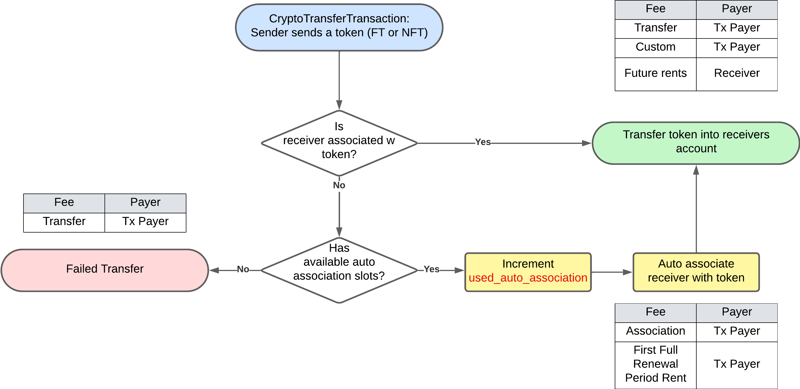
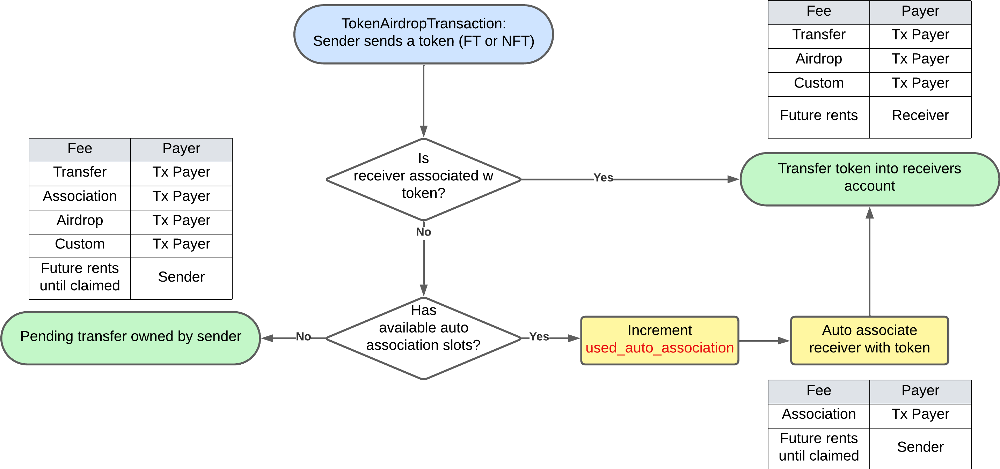
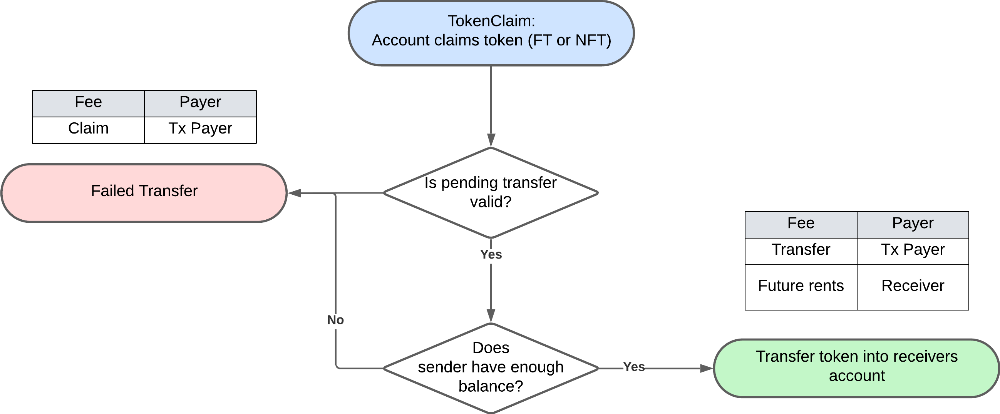
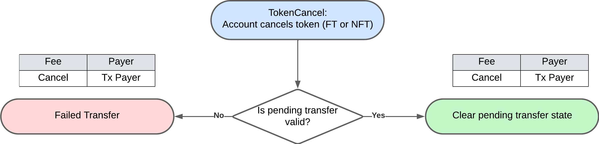
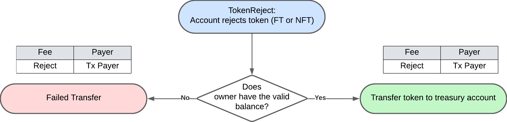

## Abstract

This HIP enables frictionless airdrops of both fungible and non-fungible tokens by removing the
requirement to pre-associate tokens with the receiver's account, and by allowing the sender to
create associations on the receiver's account automatically at transfer time by paying for any
token-associations created as a result of the airdrop. The sovereignty of account holders who do not
wish to receive unsolicited tokens is preserved by supporting the concept of pending token transfers
to such an account. Potential token receivers may claim their token airdrop while available if
desired and airdrop senders may cancel their sent airdrop should they change their mind.

With this HIP, accounts will no longer prepay for unused token association slots. Association fees
will be charged for those slots only when a token is actually associated with an account.

This HIP also introduces the concept of token rejection. Here an undesired token class value is
returned to the treasury with all custom fees waived.

In summary
- Accounts will no longer prepay for unused token association slots. 
- Association fees will be charged for those slots only when a token is actually associated with an account.
- Accounts can designate the desire to receive any airdrop by setting their account auto token association configuration to unlimited (-1).
- Automatically created accounts using public keys or EVM addresses will be configured to receive unlimited airdrops.
- Token senders may avoid errors on airdrop transfer attempts by utilizing the `TokenAirdrop` transaction.
- Intended airdrop receiver accounts can choose to accept a token airdrop by utilizing the `TokenClaimAirdrop` transaction.
- Airdrop sender accounts can change their mind and cancel a pending airdrop transfer by utilizing the `TokenCancelAirdrop` transaction.
- Token holders can get rid of unwanted tokens without paying exorbitant and potentially malicious fees regardless of how they acquired the token (manual or automatic association) by utilizing the `TokenReject` transaction, except where token freeze or pause status are in effect.

## Motivation

The concept of `token associations` was added to Hedera to protect the network and its
users. [HIP-23](https://hips.hedera.com/hip/hip-23) lists some of the reasons for introducing token
associations.

However, mandatory token pre-association — where a recipient must associate the token-type before
receiving a token — contributes significant friction for many web3 use cases, especially those where
the user has a reasonable desire to receive a token without taking any action. There has been a
strong ask from the community to reduce this friction in a cost effective and intuitive manner.

Users who wish to *airdrop* (send unsolicited) tokens encounter friction in several ways:

- They must convince users to pre-associate with their token, which is a poor user experience for
  users who wish to hold the token.
- If they attempt to airdrop tokens widely, many transactions will simply fail because many accounts
  have not pre-associated with the token.

Users who wish to receive airdrops:

- Must prepay for auto association slots, which are expensive, even when not filled.
- Users must hold HBAR in order to accept an airdrop (to pay for the association), making it
  difficult in many workflows to create and pre-populate accounts with tokens.

Retail users from other EVM chains are surprised because other chains do not have the concept of
token association. As such, users are accustomed to receiving unsolicited tokens and viewing them in
their wallet. Non-Hedera wallets have no native method for understanding token association.
Similarly, senders are not used to coordinating token association in advance. This currently
provides friction and may serve as a blocker to adoption by developers coming from other chains.

Equally there are many voices in the web3 community and from other networks that want to be able to
be in control of what lands in their wallet. Many users have no desire to see their wallets flooded
with unwanted tokens. For some users the legal and financial implications of these unrequested
tokens is undesirable and the management of the tokens is an unwanted burden. An unwanted airdrop is
referred to as *spam*.

## Rationale

This HIP improves the user experience by enabling airdrops and enhancing token association workflows
on Hedera, while still protecting users and network nodes against security attacks and spam.

### Terminology

- **Token Airdrop**: Sending an unsolicited token to one or more accounts, often without the account
  owner having pre-associated with the token.
- **Sender**: The account sending tokens
- **Receiver**: The account receiving tokens
- **Slot**: Each account may define the number of auto-associations it will accept. Each of these is
  referred to as a “slot”.
- **Spam**: Unwanted airdrops of tokens
- **Association renewal credit**: When computing fees for account renewal, a *renewal credit* is
  worth 1 auto-renew period of payment for an association.
- **Airdrop-fee**: An additional airdrop specific fee, used to deter indiscriminate spam
- **Token Airdrop claim**: An additional transaction type enabling a receiver to obtain tokens in
  pending state from a sender
- **Token Airdrop cancel**: An additional transaction type enabling a sender to remove a previously
  intended transfer from state
- **Token reject**: An additional transaction allowing any user to send a token balance back to the
  token treasury without paying custom fees

### Receiver’s Automatic Token Association Choice: Zero, Limited, or Unlimited

Every account in Hedera may have zero or more token associations. An association indicates that the
account is capable of holding tokens of the associated type. For example, if an account is
associated with a fungible Fruit token, then it can hold a balance of Fruit tokens. If an account is
associated with a non-fungible Space Wombats token, then it can hold any number of Space Wombats. If
the account does not have a Fruit association, or a Space Wombat association, then it can hold
neither of those kinds of tokens.

Accounts have a property, `max_auto_associations` that keeps track of the maximum number of
automatic associations allowed by the account. Internally, the node software keeps track of
automatic and manual associations separately, so that manually associating does not reduce the
number of available auto association *slots*. Today, the user pays for each `max_auto_associations`
slot, even if there is not an association. The value for `max_auto_associations` is limited to
non-negative numbers. `0` means no automatic associations are allowed. If `max_auto_associations` is
a positive number, then only that many automatic associations are permitted. A separate
property, `used_auto_associations`, keeps track of how many automatic associations were used.
If `max_auto_associations` is some number, and then later is switched to a number N, such that N
is < `used_auto_associations`, then no new automatic associations are possible. Manual associations
are always possible, regardless of the values of `max_auto_associations`
and  `used_auto_associations`. This current logic is confusing and not fully transparent.

This HIP changes this behavior in the following ways:

- The value `-1` is now permitted for `max_auto_associations`, and this value means “unlimited”.
- The account holder no longer prepays for unused slots regardless of the setting
  for `max_auto_associations`. Slots are only paid for when used, and are initially paid for by the
  sender during automatic associations. The account is responsible for covering rent for each
  association after the first auto-renewal period. `used_auto_associations` is incremented every
  time an auto-association is made.
- The default value for `max_auto_associations` for new automatically-created accounts will now be
  -1. This means, if an account is created automatically (by performing a token transfer to an alias
  that does not yet exist, see [HIP-583](https://hips.hedera.com/hip/hip-583)), then the automatically created account is configured
  with unlimited automatic token associations. Accounts created by using the
  [AccountCreateTransaction](https://docs.hedera.com/hedera/sdks-and-apis/sdks/accounts-and-hbar/create-an-account) (HAPI: [CryptoCreate](https://github.com/hashgraph/hedera-protobufs/blob/main/services/crypto_create.proto))
  will continue to have a `max_auto_associations` default of 0. Accounts created before this feature
  is released will remain unchanged.

> ⚠️ Currently `max_auto_associations` designates an accounts openness to automatically associate with a token
regardless of its properties e.g freeze or pause token properties. This scope is too broad for some cases and 
may change in future. A future HIP may describe how it is possible to refine `max_auto_associations` and narrow
the definition to specify when an account does not want to auto associate if the token has a freeze or pause key.
Accounts are encouraged to be observant if they want to associate with a token that has a freeze or pause key.
Wallets and explorers are also encouraged to highlight such token properties to users for awareness.

### Crypto Transfers

Normal crypto-transfers remain the same as today, with one difference. If Account A sends a token to
Account B, and Account B is not associated with that token but has an available auto-association
slot, then Account A will pay for that association and the first auto-renewal period’s rent, in
addition to the typical transfer costs. In summary previously the receiver would pay for an
association in advance, not the payer of the transaction.



> ⚠️ A consensus node will now output a preceding TokenAssociate record when a user is automatically associated.

### Airdrops

Airdrops are similar to crypto transfers, but differ in one fundamental way - when an airdrop is
performed and the receiver does not have available or automatic association slots, rather than
failing, the transfer will be kept in state as a *pending transfer*. To represent this new semantic,
there will be a new `TokenAirdropTransaction` meant for use specifically by those attempting an
airdrop, with the following semantics:



> ⚠️ `TokenAirdropTransaction` from accounts will not support tokens with custom fallback fees that
> require the receiver to pay the fallback fee. An exception exists for treasury accounts for which
> custom fees are not assessed and therefore fallback fees are not applicable.

When a sender airdrops a token, if the receiver’s account is already associated with the token, then
it is effectively treated as a normal crypto transfer, except that an airdrop transaction fee is
assessed. This fee exists for all uses of `TokenAirdropTransaction` as a spam-deterrent fee.

If the receiver’s account is **not** associated with the token, but has available auto-association
slots, then one of the slots is taken (i.e. `used_auto_associations` is incremented) and the
transaction payer will pay for the association fee. They also pay a fee representing the price of a
full auto-renewal period’s rent. This is done to make sure the receiver has time to dissociate from
the token before renewal takes place. For example, if the airdrop was to happen the minute before
account renewal, the token would not be included in renewal because it has already been pre-paid by
the sender for one full renewal period. Thus, the receiver always has at least one full renewal
period to dissociate from any tokens they do not want to own.

If the receiver’s account is **not** associated with the token, and they have **no** free
auto-association slots, then the airdrop transfer neither succeeds nor fails.

In this case a *pending transfer* is created and held in state. Tokens in the pending transfer are
not deducted from the sender, nor are they credited to the receiver, until the receiver *claims* the
airdrop. If the receiver never claims the airdrop, then the sender continues to pay for it forever,
or until their account expires, is deleted, or the sender *cancels* the pending transfer.

All pending transfers sent by an account must be canceled before the account can be deleted.

At the time a token transfer is stored as a *pending transfer*, any custom fees are assessed and
stored. If a token A has custom fees of 1 HBAR, and the sender sends that token, the fee of 1 HBAR
is assessed at the time of the TokenAirdrop transaction. Even if the custom fee is changed to 100
HBAR between the time the transaction is stored and claimed, no additional custom fee will be
assessed to the sender. Additionally, no refund of custom fees from the network to the payer will be
provided should the sender cancel the pending transfer.

When the sender’s account is renewed, each pending transfer owned by the sender is taken into
account and paid for as part of the renewal process. This is in addition to the regular rent due as
a result of the token balance owned by the sender. If the sender’s account expires and cannot be
renewed, then all pending transfers for that sender are canceled. Any attempt to claim a missing or
canceled pending transfer, or a pending transfer from an expired or deleted sender account, will
fail. Conceptually, each pending transaction is immediately canceled at the time the account
expired.

### Token Claim Airdrop

To support a users ability to claim a pending transfer a new `TokenClaimAirdrop` transaction will be
introduced. When a receiver claims a token, the `TokenClaimAirdrop` transaction **must** be signed by
the receiver, in addition to the transaction payer (who may be the same as the receiver). In
essence, if an account has no free auto-association slots, then it behaves as though
receiver-sig-required were true *for airdrops*. That is, the receiver must sign the transaction to
receive the airdrop. 
This transaction also serves as an explicit desire to assocaite with the token, as such the `TokenClaim`
transaction record may be processed as the equivalent of a `TokenAssociate` and a `CryptoTransfer`.



### Token Cancel Airdrop

A sender may cancel pending transfers for a low nominal fee using the new `TokenCancelAirdrop`
transaction. A receiver can also choose to just ignore pending transfers. It is expected that
wallets may build special user workflows into their apps to allow customers to ignore pending
transfers. Since pending transfers are paid for by the sender, the receiver may choose to 
simply filter them out in their wallet software.




### Zero-Balance Accounts

The ability for account with 0 cryptocurrency value to receive token transfers is an import DeFi
experience. Post this HIP zero balance accounts could receive tokens in the following ways:

- A sender may send a token to an unused EVM address (alias) and the account will be auto-created
  without any HBAR balance. It will also be created with `max_auto_associations` set to `-1`,
  permitting unlimited auto-associations. Subsequent transfers of any token to this account with no
  hbars will succeed.
- A wallet or other entity can create an account with `max_auto_associations` set to `-1`. Tokens
  can then be transferred into the account without the account owning any hbars.
- An existing account can change `max_auto_associations` to `-1`, and then subsequent token
  transfers into the account do not charge the account.
- An account with no open auto-association slots can receive airdrops but must send
  a `TokenClaimAirdropTransaction`, which requires a payer. If the account has zero hbars, then it
  can still claim the transfer if someone else is willing to pay for that transaction. For example,
  a Dapp could be the payer on the transaction. Both the Dapp and the account must sign the
  transaction.

### Token Reject

Today, if an account holds no balance (or no serial) of a token type, then the account can be
dissociated from the token. However, tokens may have hefty custom fees for transferring a token. A
user may not be able or willing to pay those fees, but cannot dissociate without doing so,
effectively forcing them to pay for auto-renewal of tokens they do not want.

This can be a significant security concern. A token with custom fees could be used by a token
spammer to airdrop a token to all users with a custom fee that will charge the users some HBAR or
other tokens in order to get rid of the token — essentially creating a “ransom” token. To prevent
this, we introduce the new `TokenRejectTransaction`.

Any token (fungible or non-fungible) that is not frozen or paused can be rejected, whether it was created through automatic or
manual association, and no matter how long the token was held. A rejected token is transferred back
to the token treasury, and all custom fees on the token are waived. The payer of the transaction
will only pay the appropriate fees for the HAPI transaction type.



> ⚠️ When a token is rejected, we **do not** decrement `used_auto_associations`. That field tracks
> the total number of times auto-associations have been made, not the current number of token types on
> the account that were auto-associated.

> ⚠️ `receiver_sig_required` is ignored on the treasury account when the `TokenReject` is handled.
> Reject will always work with no assessed custom fees.

> ⚠️ Token rejection is not supported if a token is frozen or an account is paused on the token.

### Example

A company called GameCo wants to airdrop tokens (e.g., unique NFTs to commemorate a specific event)
to everyone who attended a game. They can send those NFTs (say, GameNFT) to every attendee without
explicit signatures from the thousands of attendees. GameCo will pay all required fees to perform
this airdrop. Alice, Bob, Carol, and Dave all attended this game.

Alice has an account with unlimited auto-associations. When GameCo drops the GameNFT into her
account, it is immediately associated and transferred. Alice now owns a GameNFT.

Bob has an account with a fixed number of auto-associations, but the number of auto-associations
he’s received is less than his fixed max, so he has an open slot. When GameCo drops the GameNFT into
his account, it is immediately associated and transferred. Bob now owns a GameNFT.

Carol has an account with auto-associations disabled. She has no open slots. When GameCo drops the
GameNFT into her account, she does not immediately receive it. Her wallet alerts her to a new
airdrop. She decides she wants this token. For a nominal fee, she signs a transaction to accept this
airdrop. Her account is associated with GameNFT and a serial is transferred to her account. Carol
now owns a GameNFT.

Dave also has an account with no open slots. When GameCo drops the GameNFT into his account, he does
not immediately receive it. His wallet alerts him to a new airdrop, but Dave doesn’t want it. He
tells his wallet to ignore this airdrop. A couple days later, Dave regrets his decision. He checks,
and the airdrop is still available, so he decides to claim it. If he wanted to, he could have
ignored this airdrop until GameCo canceled the airdrop.

At any time after they've received GameNFT token value, Alice, Bob, Carol or Dave could change their
mind and reject the token back to the GameNFT token treasury account.

> A wallet may or may not provide the functionality described in this HIP. It is outside the scope
> of the HIP to define how wallets will handle pending transfers. The described scenario is one
> possible workflow.

## User stories

### Crypto Transfer User Stories (Existing Implementation)

#### Sender

1. As an hts-token-sender, I want to send the token using the CryptoTransfer transaction to a
   receiver who has associated with this token.
2. As an hts-token-sender, I want to send the token using the CryptoTransfer transaction to a
   receiver who has not associated with this token but has an open auto-association slot.
3. As an hts-token-sender, I understand my call will fail if I attempt to send an HTS token using
   the CryptoTransfer transaction to a receiver who has not associated with this token and has no
   open auto-association slot.
4. As an hts-token-sender I want to cover the custom fees (fixed, fractional, and royalty excluding
   fallback) of a transfer to an account that is already associated with a token to reduce the
   friction by a receiving account.
5. As an hts-token-sender I want to cover the fees (association & rent until the end of the first
   full auto renewal period) of a transfer that consumes an automatic token slot to reduce the
   friction by a receiving account.

#### Receiver

1. As a receiver with no open auto association slots, I don’t want to receive any tokens from a
   sender using CryptoTransfer to transfer tokens which I have not previously associated with.
2. As a receiver with open auto association slots, I want to automatically receive tokens from a
   sender using CryptoTransfers to transfer tokens I have not previously associated with.
3. As a user with receiver signature required enabled, if I have NOT signed the transaction, 
   transfers sent to me will fail regardless of open slots.
4. As a user with receiver signature required enabled, if I have signed the transaction, transfers 
   sent to me will fail if I don't have open slots, otherwise I will receive it.

### Token Airdrop User Stories

#### Sender

1. As an hts-token-airdrop-sender, I want to airdrop a token to a receiver who has already
   associated with the token. I expect this should work exactly like the crypto transfer.
2. As an hts-token-airdrop-sender, I want to airdrop a token to a receiver who has not associated
   with the token but has an open autoAssociation slot. I expect this should work exactly like the
   cryptoTransfer.
3. As an hts-token-airdrop-sender, I want to airdrop a token to a receiver who has not associated
   with the token and has no open autoAssociation slots. I expect this transfer will be marked as
   pending so that the receiver can claim at any time if it is still available at that time.
4. As an hts-token-airdrop-sender I want to cover the custom fees (fixed, fractional, and royalty
   excluding fallback) of an airdrop to an account that is already associated with a token to reduce
   the friction by a receiving account
5. As an hts-token-airdrop-sender I want to cover the fees (custom, association & rent until the end
   of the first full auto renewal period) of an airdrop that consumes an automatic token slot to
   reduce the friction for a receiving account
6. As an hts-token-airdrop-sender I want to cover the fees (airdrop, custom, association & rent
   until the end of the first full auto renewal period) of an airdrop that results in a pending
   transfer to reduce the friction by the intended receiving account.
7. As an airdrop-sender I want to cancel pending token transfers that I initiated and are still
   unclaimed by the receiver.
8. As a token treasury account holder, I want to airdrop tokens with custom fallback fees. I
   understand as the token treasury that custom fees are not assessed to me and therefore the
   fallback fee will not be applicable.

#### Receiver

1. As a receiver, I want to be able to query to see if I have any pending airdrops targeted for my
   account.
2. As a receiver who has pending airdrops, I want to be able to claim the airdrops using a Claim API. 
   I expect to receive this airdrop without paying for association fee and custom fee. I understand 
   that if the token is deleted or if the sender does not have this token in their account when I claim
   it, then the claim request will fail, but the pending transfer will continue to exist. I understand 
   that if they have cancelled the pending airdrop, this claim request will fail.
3. As a receiver who claims a token airdrop I will only be responsible for the transaction
   submission fee. No custom fees will be assessed to me as part of this transfer.
4. As a user with receiver signature required enabled, if I have NOT signed the transaction, 
   airdrop sent to me will go to pending regardless of open slots. 
5. As a user with receiver signature required enabled, if I have signed the transaction, 
   airdrop sent to me will go to pending if I don't have open slots, otherwise I will receive 
   the airdrop.

### General Airdrop User Stories
1. As account owner for an account created by an EVM tool my experience with airdrops on Hedera is
   identical to that on Ethereum
2. As a network user I want to be able to accurately query the mirror node for all pending
   transactions sent to an account
3. As a network user I want to be able to accurately query the mirror node for all outstanding
   airdrops sent by an account
4. As an explorer user I want my explorer to show me search or view all pending transactions and
   outstanding to my accounts
5. As a DApp developer I want to expose airdrop HAPI functionality and pending transfers state
   information to my users
6. As a HAPI developer I want to be able to query the cost of an airdrop transactions in HBAR
7. As a DApp developer I want to be able to query the cost of an airdrop transactions in gas

### General User Stories
1. As an hts-token-holder I want to be able to reject unwanted tokens (regardless of how they were
   obtained) by sending them back to the treasury account and not having to pay any custom fees.
2. As a non-hedera-centric wallet user, I want to obtain an auto-created account (by EVM address or
   public key) that is able to receive unsolicited tokens. I understand this account will
   have `maxAutomaticAssociations` set to -1 implying unlimited automatic associations.
3. As a wallet user I want my wallet to show me all pending transactions to my account
4. As an account that has open auto association slots, I only pay for the fees and rent for used
    association slots. I no longer pay for unused association slots.

### FAQ

<dl>
<dt>Q: I am sending a crypto transfer, but I don’t want to pay for auto-association. What can I do?</dt>
<dd>A: Each transaction has a `transactionFee` which represents the maximum transaction fee the user
  is willing to pay for that transaction. If it is set low enough, then the transaction will fail
  instead of transferring the token in the event an association was required. The user still has to
  pay node and network fees for the transaction, but the transfer itself will not go through and the
  client will not be charged for the crypto transfer itself.</dd>
<dt>Q: If I have `maxAutomaticAssociations` set to `0`, and someone airdrops me an NFT, have
    I received it?</dt>
<dd>A: No. In this case, it is *pending*, and you can only receive it by sending a “claim” transaction.
  When you claim it, the record stream will contain a claim transaction and a token association record
  entry and a crypto transfer record entry, so that in the record stream, the association and token
  transfer are both expressed as they normally would be.</dd>
</dl>

## Specification

From the user perspective, this HIP introduces the following concepts:

- Supporting an explicit unlimited number of automatic token associations
  when `maxAutomaticAssociations` = -1
- Defaulting the maximum automatic associations to -1 (unlimited) for auto-created accounts
- Associating the token-types automatically when a token instance is sent to an account and a slot
  is available. Calculating and charging the sender for all appropriate fees.
- Implement new airdrop HAPIs, `TokenAirdrop`, `TokenCancelAirdrop` used by airdrop sender’s to send
  airdrops and reclaim pending airdrops, and `TokenClaimAirdrop` used by an account to claim a
  pending airdrop.
- Implement new `TokenReject` transaction that allows a token-holder to reject a token and send it
  back to the token's treasury without any extraordinary fees such as custom fees and disassociate
  from the token.
- Maintenance of the number of token-association-credits in an account so that an account is not
  charged for the token-association during the first full auto-renewal period. The network will
  award a rent credit for a token holder for at least one full auto renewal period upon automatic
  association.
- Maintenance of a state including the collection of pending token transfers issued by token
  airdrops.

### HAPI (Hedera API)

#### Account Creation

Note: the only change to this API is in the specification, which now allows for -1.

```protobuf
message CryptoCreateTransactionBody {

//    ...

    /**
     * The maximum number of tokens that can be auto-associated with the account.<br/>
     * If this is less than or equal to `used_auto_associations`, or 0, then this account
     * MUST manually associate with a token before transacting in that token.<br/>
     * This value MAY also be `-1` to indicate no limit.<br/>
     * This value MUST NOT be less than `-1`.
     */
    int32 max_automatic_token_associations = 14;
}
```

#### Account Update

Note: the only change to this API is in the specification, which now allows for -1.

```protobuf
message CryptoUpdateTransactionBody {

//    ...

    /**
     * If set, modify the maximum number of tokens that can be auto-associated with the
     * account.<br/>
     * If this is set and less than or equal to `used_auto_associations`, or 0, then this account
     * MUST manually associate with a token before transacting in that token.<br/>
     * This value MAY also be `-1` to indicate no limit.<br/>
     * This value MUST NOT be less than `-1`.
     */
    google.protobuf.Int32Value max_automatic_token_associations = 15;
}
```

#### Contract Creation

Note: the only change to this API is in the specification, which now allows for -1.

```protobuf
message ContractCreateTransactionBody {

//    ...

    /**
     * The maximum number of tokens that can be auto-associated with the contract.<br/>
     * If this is less than or equal to `used_auto_associations`, or 0, then this contract
     * MUST manually associate with a token before transacting in that token.<br/>
     * This value MAY also be `-1` to indicate no limit.<br/>
     * This value MUST NOT be less than `-1`.<br/>
     * By default this value is 0 for contracts.
     */
    int32 max_automatic_token_associations = 14;
}
```

#### Contract Update

Note: the only change to this API is in the specification, which now allows for -1.

```protobuf
message ContractUpdateTransactionBody {

//    ...

    /**
     * If set, modify the maximum number of tokens that can be auto-associated with the
     * contract.<br/>
     * If this is set and less than or equal to `used_auto_associations`, or 0, then this contract
     * MUST manually associate with a token before transacting in that token.<br/>
     * This value MAY also be `-1` to indicate no limit.<br/>
     * This value MUST NOT be less than `-1`.
     */
    google.protobuf.Int32Value max_automatic_token_associations = 11;
}
```

#### Airdrop

```protobuf
/**
 * Airdrops one or more tokens to one or more accounts.
 *
 * ### Effects
 * This distributes tokens from the balance of one or more sending account(s) to the balance
 * of one or more recipient accounts. Accounts MAY receive the tokens in one of four ways.
 *
 *  - An account already associated to the token to be distributed SHALL receive the
 *    airdropped tokens immediately to the recipient account balance.<br/>
 *    The fee for this transfer SHALL include the transfer, the airdrop fee, and any custom fees.
 *  - An account with available automatic association slots SHALL be automatically
 *    associated to the token, and SHALL immediately receive the airdropped tokens to the
 *    recipient account balance.<br/>
 *    The fee for this transfer SHALL include the transfer, the association, the cost to renew
 *    that association once, the airdrop fee, and any custom fees.
 *  - An account with "receiver signature required" set SHALL have a "Pending Airdrop" created
 *    and must claim that airdrop with a `claimAirdrop` transaction.<br/>
 *    The fee for this transfer SHALL include the transfer, the association, the cost to renew
 *    that association once, the airdrop fee, and any custom fees. If the pending airdrop is not
 *    claimed immediately, the `sender` SHALL pay the cost to renew the token association, and
 *    the cost to maintain the pending airdrop, until the pending airdrop is claimed or cancelled.
 *  - An account with no available automatic association slots SHALL have a "Pending Airdrop"
 *    created and must claim that airdrop with a `claimAirdrop` transaction.<br/>
 *    The fee for this transfer SHALL include the transfer, the association, the cost to renew
 *    that association once, the airdrop fee, and any custom fees. If the pending airdrop is not
 *    claimed immediately, the `sender` SHALL pay the cost to renew the token association, and
 *    the cost to maintain the pending airdrop, until the pending airdrop is claimed or cancelled.
 *
 * If an airdrop would create a pending airdrop for a fungible/common token, and a pending airdrop
 * for the same sender, receiver, and token already exists, the existing pending airdrop
 * SHALL be updated to add the new amount to the existing airdrop, rather than creating a new
 * pending airdrop.
 *
 * Any airdrop that completes immediately SHALL be irreversible. Any airdrop that results in a
 * "Pending Airdrop" MAY be canceled via a `cancelAirdrop` transaction.
 *
 * All transfer fees (including custom fees and royalties), as well as the rent cost for the
 * first auto-renewal period for any automatic-association slot occupied by the airdropped
 * tokens, SHALL be charged to the account paying for this transaction.
 *
 * ### Record Stream Effects
 * - Each successful transfer SHALL be recorded in `token_transfer_list` for the transaction record.
 * - Each successful transfer that consumes an automatic association slot SHALL populate the
 *   `automatic_token_associations` field for the record.
 * - Each pending transfer _created_ SHALL be added to the `new_pending_airdrops` field for the record.
 * - Each pending transfer _updated_ SHALL be added to the `new_pending_airdrops` field for the record.
 */ 
message TokenAirdropTransactionBody {
    /**
     * A list of token transfers representing one or more airdrops.<br/>
     * The sender for each transfer MUST have sufficient balance to complete the transfers.
     * <p>
     * All token transfers MUST successfully transfer tokens or create a pending airdrop
     * for this transaction to succeed.<br/>
     * This list MUST contain between 1 and 10 transfers, inclusive.
     * <p>
     * <blockquote>Note that each transfer of fungible/common tokens requires both a debit and
     * a credit, so each _fungible_ token transfer MUST have _balanced_ entries in the
     * TokenTransferList for that transfer.</blockquote>
     */
    repeated TokenTransferList token_transfers = 1;
}
```

TokenAirdrop transaction will support the transfers of value in a similar manner to CryptoTransfer
with the difference of only supporting tokens (no HBAR transfer support) and supporting the
resulting pending transfer state where a CryptoTransfer would have failed due to the lack of
association options.

However, it is important to have a separate HAPI transaction type for a few reasons

- the ability to call out the potential separate behaviours based on maxAutomaticAssociation,
  whereby transfer can end up in a pending transfer state or a consumption of an association slot.
- cleaner conceptual understanding
- naming allows the grouping of functionality with Cancel and Claim which complete the pending
  state a TokenAirdrop may creates
- explicit specification in record stream.
- improved developer experience

Similar restrictions around transfer list and aggregation across sender and receiver from
CryptoTransfer will be applied to TokenAirdrop e.g. max 10 transfers per transaction

At the time of this HIP `TokenAirdropTransaction` will not be supported by the Scheduled
Transaction Service. A future HIP may explore this support.

#### Pending Airdrop

```protobuf
/**
 * A unique, composite, identifier for a pending airdrop.
 *
 * Each pending airdrop SHALL be uniquely identified by a PendingAirdropId.
 * A PendingAirdropId SHALL be recorded when created and MUST be provided in any transaction
 * that would modify that pending airdrop (such as a `claimAirdrop` or `cancelAirdrop`).
 */
message PendingAirdropId {
    /**
     * A sending account.<br/>
     * This is the account that initiated, and SHALL fund, this pending airdrop.<br/>
     * This field is REQUIRED.
     */
    AccountID sender_id = 1;

    /**
     * A receiving account.<br/>
     * This is the ID of the account that SHALL receive the airdrop.<br/>
     * This field is REQUIRED.
     */
    AccountID receiver_id = 2;

    oneof token_reference {
        /**
         * A token ID.<br/>
         * This is the type of token for a fungible/common token airdrop.<br/>
         * This field is REQUIRED for a fungible/common token and MUST NOT be used for a
         * non-fungible/unique token.
         */
        TokenID fungible_token_type = 3;

        /**
         * The id of a single NFT, consisting of a Token ID and serial number.<br/>
         * This is the type of token for a non-fungible/unique token airdrop.<br/>
         * This field is REQUIRED for a non-fungible/unique token and MUST NOT be used for a
         * fungible/common token.
         */
        NftID non_fungible_token = 4;
    }
}

/**
 * A single pending airdrop value.
 *
 * This message SHALL record the airdrop amount for a fungible/common token.<br/>
 * This message SHOULD be null for a non-fungible/unique token.<br/>
 * If a non-null `PendingAirdropValue` is set for a non-fungible/unique token, the amount
 * field MUST be `0`.
 *
 * It is RECOMMENDED that implementations store pending airdrop information as a key-value map
 * from `PendingAirdropId` to `PendingAirdropValue`, with a `null` value used for non-fungible
 * pending airdrops.
 */
message PendingAirdropValue {
    /**
     * An amount to transfer for fungible/common tokens.<br/>
     * This is expressed in the smallest available units for that token
     * (i.e. 10<sup>-`decimals`</sup> whole tokens).<br/>
     * This amount SHALL be transferred from the sender to the receiver, if claimed.<br/>
     * If the token is a fungible/common token, this value MUST be strictly greater than `0`.
     * If the token is a non-fungible/unique token, this message SHOULD NOT be set, and if
     * set, this field MUST be `0`.
     */
    uint64 amount = 1;
}

/**
 * A record of a new pending airdrop.
 */
message PendingAirdropRecord {
    /**
     * A unique, composite, identifier for a pending airdrop.
     * This field is REQUIRED.
     */
    PendingAirdropId pending_airdrop_id = 1;

    /**
     * A single pending airdrop amount.<br/>
     * If the pending airdrop is for a fungible/common token this field is REQUIRED
     * and SHALL be the current amount of tokens offered.<br/>
     * If the pending airdrop is for a non-fungible/unique token, this field SHALL NOT
     * be set.
     */
    PendingAirdropValue pending_airdrop_value = 2;
}
```

#### Cancel

```protobuf
/**
 * Token cancel airdrop<br/>
 * Remove one or more pending airdrops from state on behalf of the sender(s)
 * for each airdrop.<br/>
 *
 * Each pending airdrop canceled SHALL be removed from state and SHALL NOT be available to claim.
 *
 * Each cancellation SHALL be represented in the transaction body and SHALL NOT be restated
 * in the transaction record.<br/>
 * All cancellations MUST succeed for this transaction to succeed.
 *
 * ### Transaction Record Effects
 * - This transaction SHALL NOT produce additional output in the transaction record.
 */
message TokenCancelAirdropTransactionBody {
    /**
     * A list of one or more pending airdrop identifiers.<br/>
     * This transaction MUST be signed by the account referenced by a `sender_id` for
     * each entry in this list.
     * <p>
     * This list MUST contain between 1 and 10 entries, inclusive.
     * This list MUST NOT have any duplicate entries.<br/>
     */
    repeated PendingAirdropId pending_airdrops = 1;
}
```

#### Claim

```protobuf
/**
 * Token claim airdrop<br/>
 * Complete one or more pending transfers on behalf of the recipient(s) for each airdrop.<br/> 
 * The sender MUST have sufficient balance to fulfill the airdrop at the time of claim. If the
 * sender does not have sufficient balance, the claim SHALL fail.
 * 
 * Each pending airdrop successfully claimed SHALL be removed from state and SHALL NOT be available
 * to claim again.
 * 
 * Each claim SHALL be represented in the transaction body and SHALL NOT be restated
 * in the transaction record.<br/>
 * All claims MUST succeed for this transaction to succeed.
 *
 * ### Transaction Record Effects
 * - Each successful claim SHALL result in a transfer of tokens. Each such transfer SHALL be recorded in `token_transfer_list` for the transaction record.
 */
message TokenClaimAirdropTransactionBody {
    /**
     * A list of one or more pending airdrop identifiers.<br/>
     * This transaction MUST be signed by the account referenced in the `receiver_id` for
     * each entry in this list.
     * <p>
     * This list MUST contain between 1 and 10 entries, inclusive.<br/>
     * This list MUST NOT have any duplicate entries.
     */
    repeated PendingAirdropId pending_airdrops = 1;
}
```

#### HederaFunctionality

```protobuf
enum HederaFunctionality {

//    ...

    /**
     * Airdrops one or more tokens to one or more accounts.
     */
    TokenAirdrop = 94;

    /**
     * Remove one or more pending airdrops from state on behalf of the sender(s)
     * for each airdrop.
     */
    TokenCancelAirdrop = 95;

    /**
     * Complete one or more pending transfers on behalf of the recipient(s)
     * for each airdrop.
     */
    TokenClaimAirdrop = 96;
}
```

#### TransactionBody

```protobuf
message TransactionBody {

//    ...

    /**
     * Airdrops one or more tokens to one or more accounts.
     */
    TokenAirdropTransactionBody tokenAirdrop = 58;

    /**
     * Remove one or more pending airdrops from state on behalf of the sender(s)
     * for each airdrop.
     */
    TokenCancelAirdropTransactionBody tokenCancelAirdrop = 59;

    /**
     * Complete one or more pending transfers on behalf of the recipient(s)
     * for each airdrop.
     */
    TokenClaimAirdropTransactionBody tokenClaimAirdrop = 60;
}
```

#### TransactionRecord

```protobuf
message TransactionRecord {

 //   ...

    /**
     * A list of token transfers.<br/>
     * Each transfer completed SHALL emit an entry in this list.
     */
    repeated TokenTransferList tokenTransferLists = 11;

//    ...

    /**
     * A list of token associations.<br/>
     * Each transfer that creates an implicit token association SHALL emit
     * an entry in this list.
     */
    repeated TokenAssociation automatic_token_associations = 14;

//    ...

    /**
     * A list of pending token airdrops.</br>
     * Each pending airdrop represents a single requested transfer from a
     * sending account to a recipient account. These pending transfers are
     * issued unilaterally by the sending account, and MUST be claimed by the
     * recipient account before the transfer MAY complete.<br/>
     * A sender MAY cancel a pending airdrop before it is claimed.<br/>
     * An airdrop transaction SHALL emit a pending airdrop when the recipient has no
     * available automatic association slots available or when the recipient
     * has set `receiver_sig_required`.<br/>
     */
    repeated PendingAirdropRecord new_pending_airdrops = 22;
}
```

> The TransactionRecord proto will expose the state changes regarding pending airdrops that have
> been added to state due to a `TokenAirdrop` transaction. Claimed tokens from a `TokenClaimAirdrop`
> transaction will appear in the transaction record in the existing `tokenTransferLists` property.
> Canceled pending tokens from a `TokenCancelAirdrop` transaction will not be exposed in the
> transaction record as they are captured in the `TokenCancelAirdrop` transaction body.

Below are a some example scenarios to highlight how the transaction record will expose state changes
across `TokenAirdrop`, `TokenClaim` and `TokenCancel`.

Scenario 1:
1. If Alice airdrops with the following transfer breakout:

   - 5 FTs of token T1 to Bob, where Bob is already associated with T1
   - NFT serial 1 & 2 of T2 to Bob who is associated with token T2
   - 10 FTs of token T3 to Carol, where Carol is not associated with T3 but has available
     association slots
   - NFT serials 3 & 4 of T4 to Carol, where Carol is not associated with T4 but has available
     association slots
   - 10 FTs of token T5 to Dave, where Dave is not associated with T5 and has no available
     association slots
   - NFT serial 5 & 6 of T6 to Dave, where Dave is not associated with T6 and has no available
     association slots
   - 20 FTs of token T7 to Eric, where Eric is not associated with T7 and has no available
     association slots
   - NFT serials 7 & 8 of T8 to Eric, where Eric is not associated with T8 and has no available
     association slots

    The record file emitted from a consensus node will contain:

    `tokenTransferLists` containing

   - Alice debit of 5 T1 tokens → Bob credit of 5 T1 tokens
   - Alice debit of NFT serials 1 & 2 of token T2 → Bob credit of NFT serials 1 & 2 of token T2
   - Alice debit of 10 T3 tokens → Carol credit of 10 T3 tokens
   - Alice debit of NFT serials 3 & 4 of token T4 → Carol credit of NFT serials 3 & 4 of token T4

    `automatic_token_associations` containing

   - Carol's automatic association with token T3
   - Carol's automatic association with token T4

    `new_pending_airdrops` containing

   - Alice intent to transfer 10 T5 tokens to Dave
   - Alice intent to transfer NFT serials 5 & 6 of token T6 to Dave
   - Alice intent to transfer 20 T7 tokens to Eric
   - Alice intent to transfer NFT serials 7 & 8 of token T8 to Eric

2. Then Alice makes additional airdrop with the following transfer breakout:
   - 5 FTs of token T5 to Dave, where Dave is not associated with T5 and has no available association slots

   The record file emitted from a consensus node will contain:

   `tokenTransferLists`  will be empty
   `automatic_token_associations`  will be empty
   `new_pending_airdrops` containing
    - Alice intent to transfer 5 T5 tokens to Dave

Note: In the separate airdrop transactions Alice had split her intended transfers to Dave in two but in the
resulting pending state they will be combined. TokenAirdrops may be combined in an additive
fashion. It is not possible to subtract. For this a sender may cancel and reissue their airdrop.
Multiple TokenAirdrops for same NFT serial are not possible.

Scenario 2: If Dave submits a TokenClaim for token T5 and a Token claim of serial 5 of T6

`tokenTransferLists`

- Alice debit of 15 T5 tokens → Dave credit of 15 T5 tokens
- Alice debit of NFT serial 5 of token T6 → Dave credit of NFT serial 5 of token T6

`automatic_token_associations` will be empty, but Dave will be associated to token T5 and token T6,
meaning that successful TokenClaim acts like explicit token association if needed

`new_pending_airdrops` will be empty, details are in transaction body

Note: NFT serial 6 of T6 is left in pending airdrop, but all of the pending fungible amount of T5
was transferred.

Scenario 3: Alice submits a TokenCancelAirdrop for token T7 and a TokenCancelAirdrop of serial 7 of T8

`tokenTransferLists` will be empty

`automatic_token_associations` will be empty

`new_pending_airdrops` will be empty, details are in transaction body

Note: NFT serial 8 of T8 is left in pending airdrop, and none of the pending fungible amount of T7
was transferred.

#### Reject

```protobuf
/**
 * Reject undesired token(s).<br/>
 * Transfer one or more token balances held by the requesting account to
 * the treasury for each token type.<br/>
 * Each transfer SHALL be one of the following
 * - A single non-fungible/unique token.
 * - The full balance held for a fungible/common token type.
 *
 * A single tokenReject transaction SHALL support a maximum of 10 transfers.
 *
 * ### Transaction Record Effects
 * - Each successful transfer from `payer` to `treasury` SHALL be recorded in
 * `token_transfer_list` for the transaction record.
 */
message TokenRejectTransactionBody {
    /**
     * An account holding the tokens to be rejected.<br/>
     * If set, this account MUST sign this transaction.
     * If not set, the payer for this transaction SHALL be the account rejecting tokens.
     */
    AccountID owner = 1;

    /**
     * A list of one or more token rejections.<br/>
     * On success each rejected token serial number or balance SHALL be
     * transferred from the requesting account to the treasury account for that
     * token type.<br/>
     * After rejection the requesting account SHALL continue to be associated
     * with the token.<br/>
     * If dissociation is desired then a separate TokenDissociate transaction
     * MUST be submitted to remove the association.
     */
    repeated TokenReference rejections = 2;
}

/**
 * A union token identifier.
 *
 * Identify a fungible/common token type, or a single non-fungible/unique token serial.
 */
message TokenReference {
    oneof token_identifier {
        /**
         * A fungible/common token type.
         */
        TokenID fungible_token = 1;

        /**
         * A single specific serialized non-fungible/unique token.
         */
        NftID nft = 2;
    }
}


enum HederaFunctionality {

//    ...

    /**
     * Transfer one or more token balances held by the requesting account to
     * the treasury for each token type.
     */
    TokenReject = 93;
}

message TransactionBody {

//    ...

    /**
     * A transaction body to "reject" undesired tokens.<br/>
     * This transaction will transfer one or more tokens or token
     * balances held by the requesting account to the treasury
     * for each token type.
     * <p>
     * Each transfer MUST be one of the following:
     * <ul>
     *   <li>A single non-fungible/unique token.</li>
     *   <li>The full balance held for a fungible/common
     *       token type.</li>
     * </ul>
     * When complete, the requesting account SHALL NOT hold the
     * rejected tokens.<br/>
     * Custom fees and royalties defined for the tokens rejected
     * SHALL NOT be charged for this transaction.
     */
    TokenRejectTransactionBody tokenReject = 57;
}

message SchedulableTransactionBody {

//    ...

    /**
     * A transaction body to "reject" undesired tokens.<br/>
     * This transaction will transfer one or more tokens or token
     * balances held by the requesting account to the treasury
     * for each token type.
     * <p>
     * Each transfer MUST be one of the following:
     * <ul>
     *   <li>A single non-fungible/unique token.</li>
     *   <li>The full balance held for a fungible/common
     *       token type.</li>
     * </ul>
     * When complete, the requesting account SHALL NOT hold the
     * rejected tokens.<br/>
     * Custom fees and royalties defined for the tokens rejected
     * SHALL NOT be charged for this transaction.
     */
    TokenRejectTransactionBody tokenReject = 45;
}
```

#### Token Service

```protobuf
service TokenService {

//    ...

    /**
     * Airdrop one or more tokens to one or more accounts.<br/>
     * This distributes tokens from the balance of one or more sending account(s) to the balance
     * of one or more recipient accounts. Accounts will receive the tokens in one of four ways.
     * <ul>
     *   <li>An account already associated to the token to be distributed SHALL receive the
     *       airdropped tokens immediately to the recipient account balance.</li>
     *   <li>An account with available automatic association slots SHALL be automatically
     *       associated to the token, and SHALL immediately receive the airdropped tokens to the
     *       recipient account balance.</li>
     *   <li>An account with "receiver signature required" set SHALL have a "Pending Airdrop"
     *       created and MUST claim that airdrop with a `claimAirdrop` transaction.</li>
     *   <li>An account with no available automatic association slots SHALL have a
     *       "Pending Airdrop" created and MUST claim that airdrop with a `claimAirdrop`
     *       transaction. </li>
     * </ul>
     * Any airdrop that completes immediately SHALL be irreversible. Any airdrop that results in a
     * "Pending Airdrop" MAY be canceled via a `cancelAirdrop` transaction.<br/>
     * All transfer fees (including custom fees and royalties), as well as the rent cost for the
     * first auto-renewal period for any automatic-association slot occupied by the airdropped
     * tokens, SHALL be charged to the account submitting this transaction.
     */
    rpc airdropTokens (Transaction) returns (TransactionResponse);

    /**
     * Cancel one or more pending airdrops.<br/>
     * This transaction MUST be signed by _each_ account *sending* an airdrop to be canceled.
     */
    rpc cancelAirdrop (Transaction) returns (TransactionResponse);

    /**
     * Claim one or more pending airdrops.<br/>
     * This transaction MUST be signed by _each_ account *receiving* an airdrop to be claimed.<br>
     * If a Sender lacks sufficient balance to fulfill the airdrop at the time the claim is made,
     * that claim SHALL fail.
     */
    rpc claimAirdrop (Transaction) returns (TransactionResponse);

    /**
     * Reject one or more tokens.<br/>
     * This transaction SHALL transfer the full balance of one or more tokens from the requesting
     * account to the treasury for each token. This transfer SHALL NOT charge any custom fee or
     * royalty defined for the token(s) to be rejected.<br/>
     * <h3>Effects on success</h3>
     * <ul>
     *   <li>If the rejected token is fungible/common, the requesting account SHALL have a balance
     *       of 0 for the rejected token. The treasury balance SHALL increase by the amount that
     *       the requesting account decreased.</li>
     *   <li>If the rejected token is non-fungible/unique the requesting account SHALL NOT hold
     *       the specific serialized token that is rejected. The treasury account SHALL hold each
     *       specific serialized token that was rejected.</li>
     * </li>
     */
    rpc rejectToken (Transaction) returns (TransactionResponse);
}
```

### Account Airdrop Defaults

The introduction of airdrop support status requires accounts to specify their level of appetite for
airdrops at account creation time.

To support potential varied DeFi personas the default status will rely on the account creation type

- User-created accounts
    - If the maximum  `maxAutomaticAssociations` value is present in the transaction there is no
      need for the ledger to choose the default configuration for these accounts. Wallets and SDK
      users can control whether they want to create `frictionless airdrop enabled` accounts or
      airdrop disabled accounts.
    - If the `maxAutomaticAssociations` value is not present in the transaction the network will
      choose conservatively to make these accounts `spam-free`.
- Auto-created accounts
    - Any auto-created account (such as a hollow account) will default to
      be `frictionless-airdrop enabled` in which `maxAutomaticAssociations` is set to -1.

Contracts by default will be spam-free in nature. To create a `frictionless-airdrop enabled`
contract, the `maxAutomaticAssociations` can be set during a `ContractCreate` HAPI transaction and
will require a valid admin key to ensure balance and associations can be managed.

In future the network could adopt a system contract function that supports maxAutoAssociation
changes

### System Contract Functions

HTS system contracts will need to support the new airdrop related transactions to ensure the feature
is exposed via smart contract functions. Additionally, redirect functions will be provided to ensure
optimal UX in which EOAs can initiate transactions through a DApp that affect their account.

New system contract functions to be included to the `IHederaTokenService` interface.

| Function Selector Hash |                                                               Function Signature                                                               | HAPI Transaction |    Response    |                                 |
|------------------------|------------------------------------------------------------------------------------------------------------------------------------------------|------------------|----------------|---------------------------------|
| `0x2f348119`           | `function airdropTokens(TokenTransferList[] memory tokenTransfers) external returns (int64 responseCode)`                                      | TokenAirdrop     | `ResponseCode` | The response code from the call |
| `0x012ebcaf`           | `function cancelAirdrops(PendingAirdrop[] memory pendingAirdrops) external returns (int64 responseCode)`                                       | TokenCancel      | `ResponseCode` | The response code from the call |
| `0x05961641`           | `function claimAirdrops(PendingAirdrop[] memory pendingAirdrops) external returns (int64 responseCode)`                                        | TokenClaim       | `ResponseCode` | The response code from the call |
| `0xebd595e0`           | `function rejectTokens(address rejectingAaddress, address[] memory ftAddresses,  NftID[] memory nftIDs) external returns (int64 responseCode)` | TokenReject      | `ResponseCode` | The response code from the call |

New system contract functions to be included for a new `IHRC904` interface.
> ⚠️ Note that Proxy Contract logic is used here, so the contract address should be the Hedera Entity on note, such as the HTS token address is used for HTS functions and the Account EVM address for HAS (Hedera Account Service) functions.

| Function Selector Hash |                                               Function Signature                                                | HAPI Transaction | Responsible service |    Response    |                                 |
|------------------------|-----------------------------------------------------------------------------------------------------------------|------------------|---------------------|----------------|---------------------------------|
| `0xcef5b705`           | `function cancelAirdropFT(address receiverAddress) external returns (int64 responseCode)`                       | TokenCancel      | HTS                 | `ResponseCode` | The response code from the call |
| `0xad4917cf`           | `function cancelAirdropNFT(address receiverAddress, int64 serialNumber) external returns (int64 responseCode)`  | TokenCancel      | HTS                 | `ResponseCode` | The response code from the call |
| `0xa83bc5b2`           | `function claimAirdropFT(address senderAddress) external returns (int64 responseCode)`                          | TokenClaim       | HTS                 | `ResponseCode` | The response code from the call |
| `0x63ada5d7`           | `function claimAirdropNFT(address senderAddress, int64 serialNumber) external returns (int64 responseCode)`     | TokenClaim       | HTS                 | `ResponseCode` | The response code from the call |
| `0x76c6b391`           | `function rejectTokenFT() external returns (int64 responseCode)`                                                | TokenReject      | HTS                 | `ResponseCode` | The response code from the call |
| `0xa869c78a`           | `function rejectTokenNFTs(int64[] memory serialNumbers) external returns (int64 responseCode)`                  | TokenReject      | HTS                 | `ResponseCode` | The response code from the call |
| `0xf5677e99`           | `function setUnlimitedAutomaticAssociations(bool enableAutoAssociations) external returns (int64 responseCode)` | CryptoUpdate     | HAS                 | `ResponseCode` | The response code from the call |

To increase API reuse and for consistency the input objects will closely match the HAPI protobuf objects.
We will introduce the following new structures to support the new functionality:

`PendingAirdrop` - A struct that represents a pending airdrop request.

```solidity
struct PendingAirdrop {
    address sender;
    address receiver;

    address token;
    //The NFT serial number field is populated only for the NFT type
    int64 serial;
}
```

`NftID` - A struct that represents the Nft serial to be rejected.

```solidity
struct NftID {
    address nft;
    int64 serial;
}
```

### SDK

The SDKs must support the new HAPI transactions

- `TokenAirdrop` transaction - exposes `TokenAirdropTransactionBody` proto
- `TokenCancel` transaction - exposes `TokenCancelAirdropTransactionBody` proto
- `TokenClaim` transaction - exposes `TokenClaimAirdropTransactionBody` proto
- `TokenReject` transaction - exposes `TokenRejectTransactionBody` proto
- `Token?Flow` that supports rejection and dissociation to make it easier for devs

The SDKs must update the `TransactionRecord` to return the following information
- `new_pending_airdrops`

### MAPI (Mirror Node API)

- New `/api/v1/accounts/{senderIdOrEvmAddress}/airdrops/outstanding` - List of outstanding airdrops
  sent by `senderIdOrEvmAddress` which have not been claimed by recipients

    ```json
       {
            "airdrops": [
                {
                    "amount": 333,
                    "receiver_id": "0.0.999",
                    "sender_id": "0.0.222",
                    "serial_number": null,
                    "timestamp": {
                       "from": "1111111111.111111111",
                       "to": null
                    },
                    "token_id": "0.0.111"
                },
                {
                    "amount": 555,
                    "receiver_id": "0.0.999",
                    "sender_id": "0.0.222",
                    "serial_number": null,
                    "timestamp": {
                       "from": "1111111111.111111112",
                       "to": null
                    },
                    "token_id": "0.0.444"
                },
                {
                    "amount": null,
                    "receiver_id": "0.0.999",
                    "sender_id": "0.0.222",
                    "serial_number": 888,
                    "timestamp": {
                       "from": "1111111111.111111113",
                       "to": null
                    },
                    "token_id": "0.0.666"
                }
            ],
            "links": {
                "next": null
            }
        }
    ```
    - `limit` - The maximum number of airdrops to return in the response. Defaults to `25` with a
      max of `100`.
    - `order` - The direction to sort the items in the response. Can be `asc` or `desc` with a
      default of `asc`.
    - `receiver.id` - The receiver account the outstanding airdrop was intended for.
    - `serialnumber` - The specific serial number associated with airdrop.
      Supports `eq`, `gt`, `gte`, `lt`, and `lte` operators. Only one occurrence is allowed.
    - `token.id` - The token ID this airdrop is associated with. Supports `eq`, `gt`, `gte`, `lt`,
      and `lte` operators. Only one occurrence is allowed.


- New `/api/v1/accounts/{receiverIdOrEvmAddress}/airdrops/pending`) - List of pending airdrops
  that `receiverIdOrEvmAddress` has not yet claimed.
    ```json
       {
            "airdrops": [
                {
                    "amount": 333,
                    "receiver_id": "0.0.999",
                    "sender_id": "0.0.222",
                    "serial_number": null,
                    "timestamp": {
                       "from": "1111111111.111111111",
                       "to": null
                    },
                    "token_id": "0.0.111"
                },
                {
                    "amount": 555,
                    "receiver_id": "0.0.999",
                    "sender_id": "0.0.222",
                    "serial_number": null,
                    "timestamp": {
                       "from": "1111111111.111111112",
                       "to": null
                    },
                    "token_id": "0.0.444"
                },
                {
                    "amount": null,
                    "receiver_id": "0.0.999",
                    "sender_id": "0.0.222",
                    "serial_number": 888,
                    "timestamp": {
                       "from": "1111111111.111111113",
                       "to": null
                    },
                    "token_id": "0.0.666"
                }
            ],
            "links": {
                "next": null
            }
        }
    ```
    - `limit` - The maximum number of airdrops to return in the response. Defaults to `25` with a
      max of `100`.
    - `order` - The direction to sort the items in the response. Can be `asc` or `desc` with a
      default of `asc`.
    - `sender.id` - The sender account that initiated the pending airdrop.
    - `serialnumber` - The specific serial number associated with airdrop.
      Supports `eq`, `gt`, `gte`, `lt`, and `lte` operators. Only one occurrence is allowed.
    - `token.id` - The token ID this airdrop is associated with. Supports `eq`, `gt`, `gte`, `lt`,
      and `lte` operators. Only one occurrence is allowed.

### Mirror Node Explorer

As one of the main UIs for users on the network, explorers have the opportunity to surface account
properties and provide easy management functionality. Explorers may consider

- supporting the ability to set `maxAutomaticAssociations` via a `CryptoUpdate` across multiple wallets
- highlighting a users current airdrop account status (unlimited, limited or no airdrops) on the
  account page
- exposing pending airdrops on the account page. Explorers could add additional logic to inform
  potential recipients if the sender has the balance to support the pending transfer
- supporting the ability to execute `TokenClaim` transaction via multiple wallets
- supporting the ability to execute `TokenReject` transaction via multiple wallets
- Educational tool tips around the presence of a freeze or pause key on a token and its impact to a user.

### Wallets consideration

Wallet software should:

- propose appropriate defaults airdrop disabled (`maxAutomaticAssociations` = 0) or airdrop-enabled
  accounts(`maxAutomaticAssociations` = -1) during account creation to enable their users
  preferences
- provide means for users to change the type of the account from spam-free to airdrop-enabled or
  vice versa by setting `maxAutomaticAssociations`
- highlighting a users current airdrop account status (unlimited, limited or no airdrops) on the
  account page
- provide mechanisms for users to see the pending tokens which were targeted to their accounts
- supporting the ability to execute `TokenClaim` transaction
- supporting the ability to execute `TokenReject` transaction
- expose outstanding airdrops for which an account has sent that have yet to be claimed.
- Educational tool tips around pending transfer logic to help educate users. Especially noting
  pending is not guaranteed
- Educational tool tips around the presence of a freeze or pause key on a token and its impact to a user.

## Backwards Compatibility

### Grandfathering existing accounts

Probably the biggest debate about this HIP will be around what is the right behavior for the
existing accounts. During the integration of this HIP we propose the following:

- If an account has zero `maxAutomaticAssociations` slots, then we can infer that the account holder
  wanted an airdrop disabled account. Therefore, the network will leave this setting to be as it is.
- If an account has a one or more `maxAutomaticAssociations` slots, then we can infer that the
  account holder is willing/interested in receiving some unsolicited tokens in their account.
  Therefore, the network will leave this setting to be as it is.

Overall no state migration will be carried out and the network will leave this setting to be as it is.

We encourage the community to weigh in on this proposal.

### Fees and Payments

Any software attempting to pay for auto association slots will now be charged less (i.e. they will
not be charged for auto association slots). This should work, although it may be surprising.

Any software attempting to send an unassociated token to an account with free auto-association slots
will now be charged more than they had been previously, and those transactions may now fail.

## Security Implications

- **Node security** Since this HIP still maintains the concept of token-associations at the ledger
  level and since somebody (initially the sender and later the recipient) always pays for the
  resources used by the token-associations, there is no additional security risk to the nodes.
- **User security** Similar to most other layer-1 networks, any newly created account can now
  receive unsolicited airdrop tokens. Scammers typically use these as a vehicle to defraud innocent
  users. Account holders will need to be vigilant about the tokens that show up in their account,
  and `reject` unwanted tokens as necessary. Wallets can help by providing useful UI for the users
  to know what tokens have been airdropped to the user, and provide a useful way to reject some or
  all of them.

## How to Teach This

For a HIP that adds new functionality or changes interface behaviors, it is helpful to include a
section on how to teach users, new and experienced, how to apply the HIP to their work.

## Reference Implementation

The reference implementation must be complete before any HIP is given the status of “Final”. The
final implementation must include test code and documentation.

## Rejected Ideas

Throughout the discussion of a HIP, various ideas will be proposed which are not accepted. Those
rejected ideas should be recorded along with the reasoning as to why they were rejected. This both
helps record the thought process behind the final version of the HIP as well as preventing people
from bringing up the same rejected idea again in subsequent discussions.

In a way, this section can be thought of as a breakout section of the Rationale section that focuses
specifically on why certain ideas were not ultimately pursued.

## Open Issues

- Should we expose pending transfers through the JSON RPC Relay through custom endpoints?
- Should we enable TokenAirdrops via EVM transfers for web3 parity
    - We could change the default IERC.transfer() when applied to an HTS token to be TokenAirdrop

## References

- [HIP-23: Make the need for token association opt-in](https://hips.hedera.com/hip/hip-23)
- [HIP-367: Unlimited Token Associations Per Account](https://hips.hedera.com/hip/hip-367)
- [HIP-583: Auto-created (hollow) Accounts](https://hips.hedera.com/hip/hip-583)
- [HIP-655: Token airdrops without explicit associations](https://github.com/hiero-ledger/hiero-improvement-proposals/pull/655)
- [HIP-777: Pending Token Transfers](https://github.com/hiero-ledger/hiero-improvement-proposals/pull/777)

## Copyright/license

This document is licensed under the Apache License, Version 2.0 -- see [LICENSE](../LICENSE)
or (https://www.apache.org/licenses/LICENSE-2.0)
